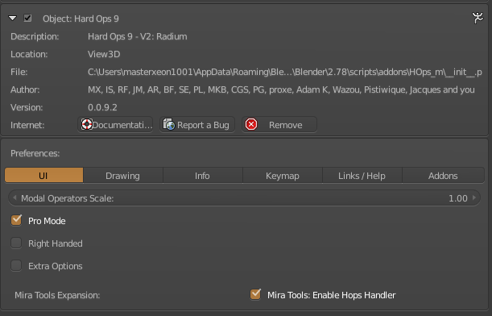
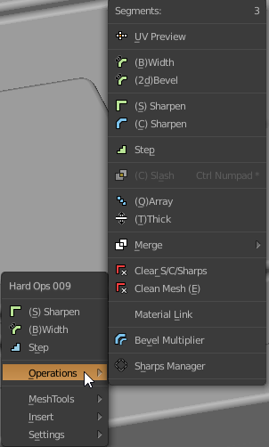

### 2d Bevel

# What is 2d Bevel?

2d Bevel is a modified version of [bwidth](bwidth.md) that is specialized for 2d shapes.

---

## 2d Bevel in action

In the following example I used the knife followed with bevel to face deletion in order to put some spacing in the model. Afterwards I used the 2d bevel then [tThick](tthick.md).

> 90% of the time this tool is followed with [tThick](tthick.md)

---

## 2d Bevel use cases

Bevelling 2d shapes -

It's important to note that useless geo gets dissolved. Same with [cleanMesh(E)](cleanmesh), it is not recommended to be used in places where the geometry is specific.

After initial setup it is able to also be adjusted via bwidth.

---

## Enabling 2d Bevel

This option may be pro level option. So if it is not seen in operations, enable pro mode in [preferences](preferences).

