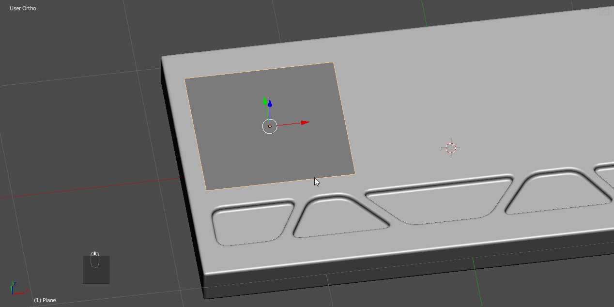
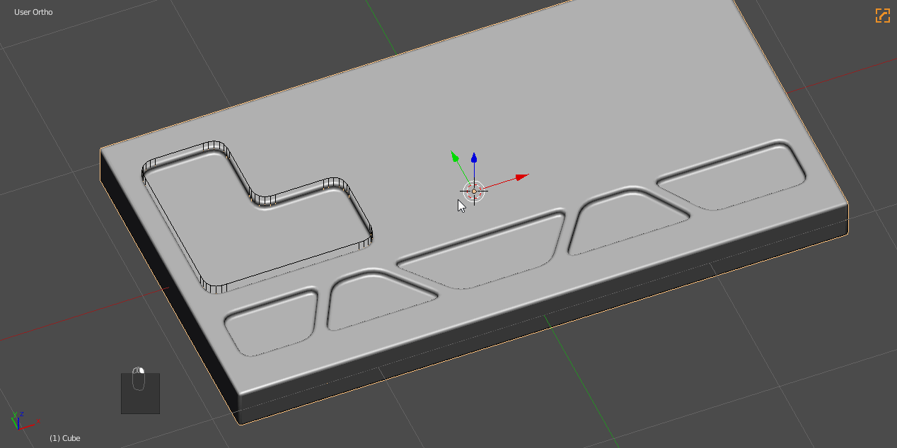
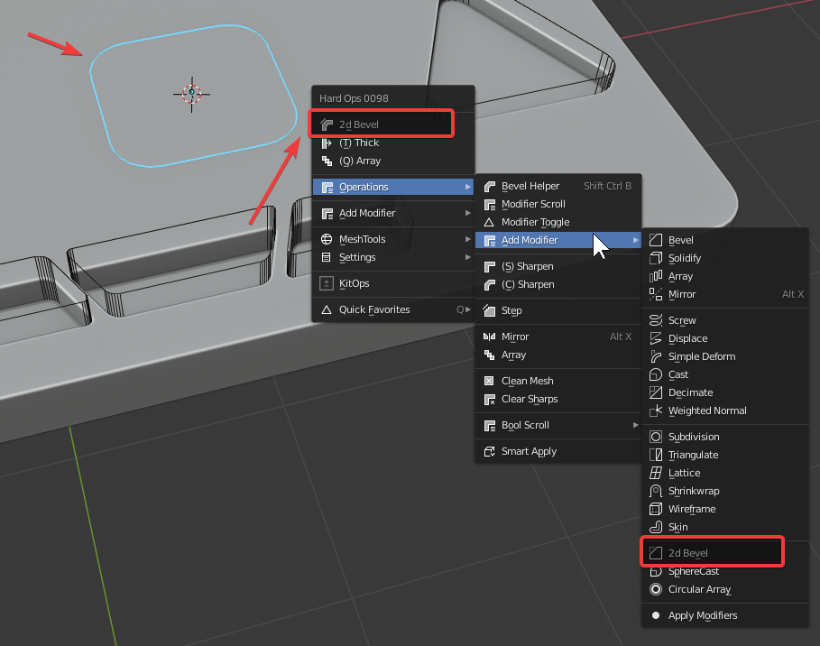

### 2d Bevel

# What is 2d Bevel?

2d Bevel is a modified version of [bwidth](bwidth.md) that is specialized for 2d shapes.

It adds a bevel mod that is set to verts. This works best with faces containing no interior verts between points.

---

## 2d Bevel in action

In the following example I used the knife followed with bevel to face deletion in order to put some spacing in the model. Afterwards I used the 2d bevel then [tThick](tthick.md).

> 90% of the time this tool is followed up with [tThick](tthick.md)

---

## 2d Bevel w/ [hopsTool](hopsTool.md)

2d bevel is also in the [hopsTool](hopsTool.md) system as well. This can be adjusted with the dots that show up while holding ctrl in [hopsTool](hopsTool.md).

---

## 2d Bevel use cases

Bevelling 2d shapes -

It's important to note that useless geo gets dissolved. Same with [cleanMesh](cleanmesh), it is not recommended to be used in places where the geometry is specific.

After initial setup it is able to also be adjusted via bwidth or [hopsTool](hopsTool.md).

---

## Finding 2d Bevel

2d Bevel is found in the Q menu that comes up with planes. Or objects with 1 dimension equaling 0.

