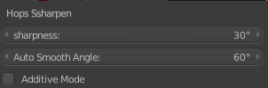
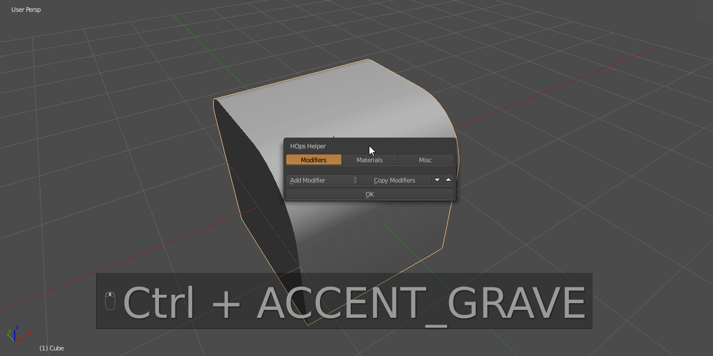

## SSharpen

Soft Sharpener is the basic sharpenig tool, it apply hard edges and correct weight to Your active selected model.

### sSharpen use cases

- calculating ssharps on meshes

- recalculating ssharps on meshes

Recalculation is done via the F6 menu that is available after running the operator.

### SSharpen F6 options

1. sharpness
   * edge angle to witch sharpening is applied - default 30

2. auto smooth angle
   * value for autosmoouth angle for selected object - default

3. additive mode
   * ON - apply defined sharpness and keeps other already existing sharp edges
   * OFF - clears all sharp edges before applying its own sharpness

## Advanced sSharpen

sSharpen is also used as a non destructive updater for cSharpen.

In situations where the mesh modelling is done manually via the user in edit mode sometimes it is optimal to refresh the sharpening information.

sSharpen goes deeper than the initial use case and usability. In the Hard Ops Helper ctrl + tilda there is options for adjusting the behavior before tool usage.

This can come in handy for situations where you are using the boolean and bevel with low segements which normally would be caught in csharpen.
