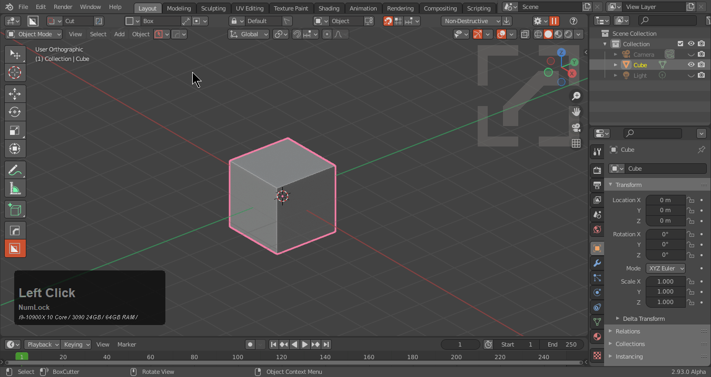
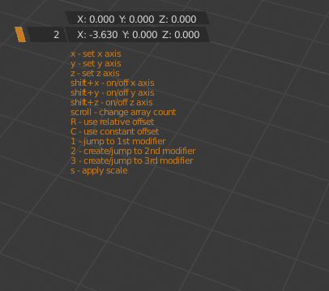
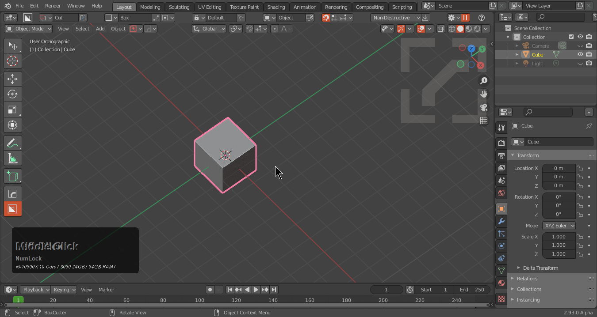
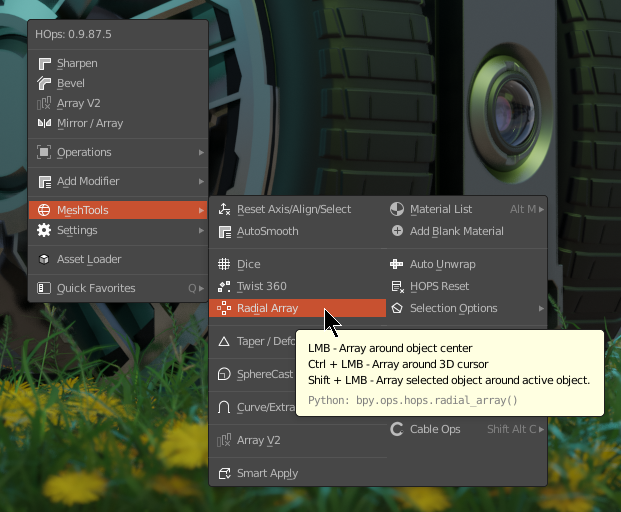

### Array Systems

## Array (active-tool)

Array is the upgraded version of Qarray going in the same direction as mirror but is still a work in progress.
When launched it will bring up a gizmo for user interaction. It is important to make sure gizmos are not disabled before starting.

> An active tool is a tool that remains open as a state until it is ended. The array gizmos will persist across object selections and sessions until exited. To exit Array you can right click or press W to exit it like any other active tool. Also escape for array also works.

Using array from the modifier options uses the classic modal array and operations and main menu uses the active tool version.

---

# QArray (modal)

>QArray is the classic modal for arraying objects. There is an active tool version available but this one remains since the behavior is more optimized for fast editing.

Array will allow users to add or modify an array modifier on an object.

Array also works on multiple objects.

Of course press <kbd>H</kbd> for help.

Pressing 2 during the modal will add a 2nd modifier.

___

# [Circular Array](circular.md)

[Circular Array](circular.md) does the following.

- empty with a driver based off of Array
- displace modifier to push the object outside for radius
- array with offset based off of initial empty

for more details see [Circular Array](circular.md).

Hovering over the option shows alternate creation types.

___

# hopsTool Radial

Radial array is also present in the top bar during hops tool with shift being able to show specific axis options.

___

# Where is the empty when I do a radial array?

Check the collection. You may have to enable visibility.

> For Boxcutter it is probably in the cutters collection.

The empty is parented to the object of affect so it should translate accordingly.

___

# Why is the displace red when using radial array?

Because it is not in use. Sometimes the displace isn't set to any number. It is present in case it is needed.

