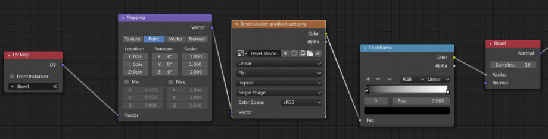
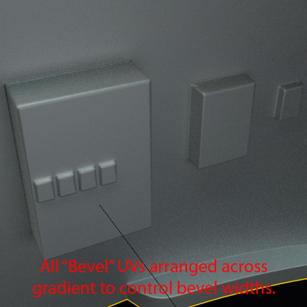
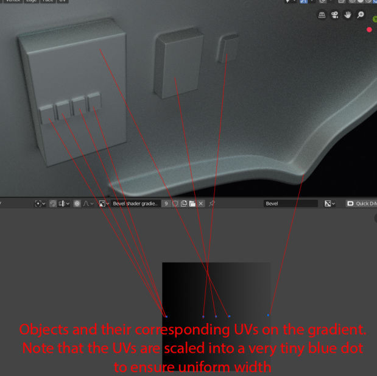

### Baking w/ Hops

unreal and blender don't play nice with floating decals. Floating decals are just randomly flipping their normals once in unreal.
if only *someone* could make it so that bevels dont completely *** the UV. You know when you UV something and 60% of the bevel ends up attached to one UVisland and 40% to another....*hint hint..nudge nudge*

## Bevels w/Cycles

[Gesy Bekeyei did an article here on his workflow with cycles and hardOps/Boxcutter. ](https://80.lv/articles/001agt-modeling-a-spaceship-in-blender/)

Below are some images about the bevel portion of the guide which I found interesting.

