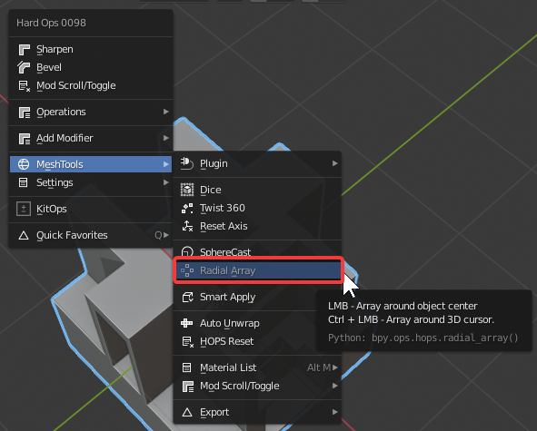

### Radial / Circular Array

Radial array can be found in the Q menu under meshtools.

Radial array has 2 modes. Working around 

# Circular Array w/ hopsTool

When using hopsTool you can add circular array to any object and adjust it using dots.

# How Circular Array works.

- array with count driving rotation of empty using a driver
- empty is parented to the main object

This is due to a change in cyclic dependency issues thanks to the new depsgraph update.

Below is a video about circular array before the tool was added. Our goal was to have boxcutter shift to live with this type of circular array. Now it is a reality.

<iframe width="560" height="315" src="https://www.youtube.com/embed/-THNLxaP_D4" frameborder="0" allowfullscreen></iframe>
