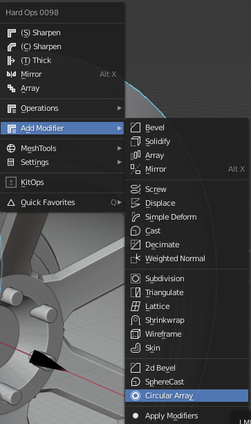
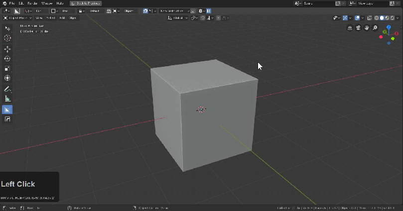
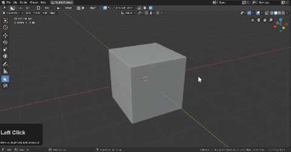
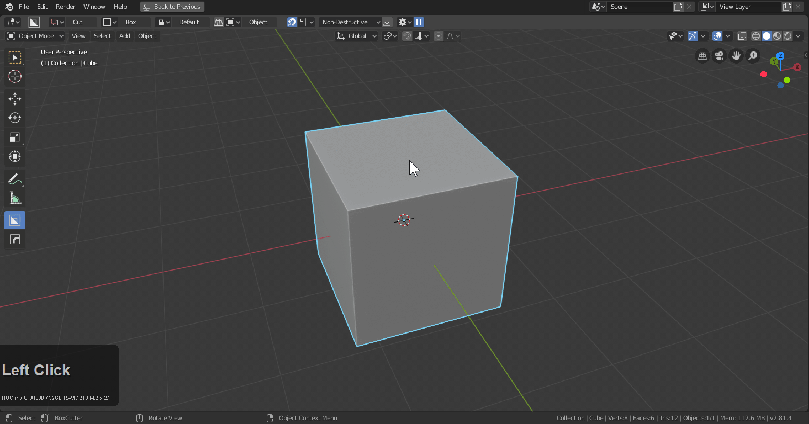

### Circular Array

Circular array can be found in the modifiers section of hard ops Q menu.

After adding additional segments can be added with array and distance adjusted with displace.

There is a ctrl + click 3d cursor circular array which was intended for assistance with things like Boxcutter.

The 3rd state will not use the 3d cursor and will launch the user into displace allowing for quick positioning.

At this time adjustment is done via array and displace modifier modals. This will be streamlined in the future but for now our next feature will have to do.
