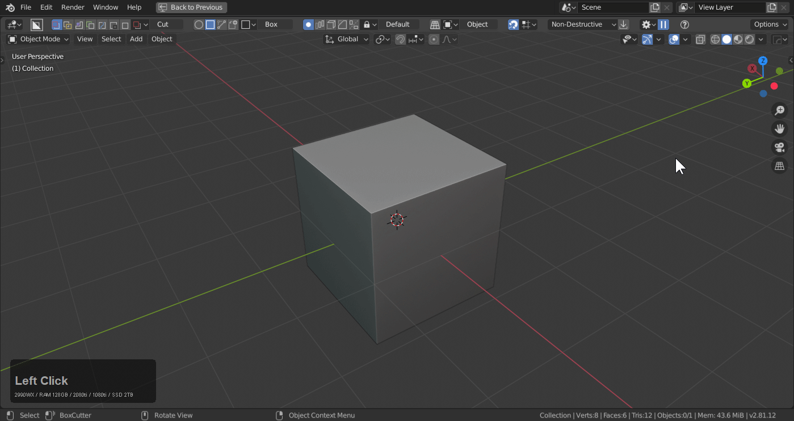
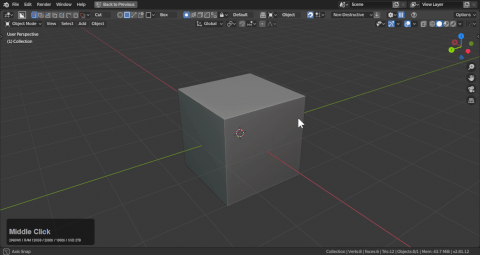
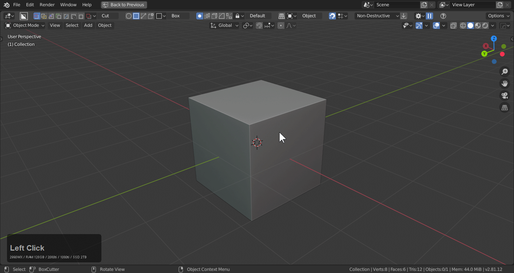
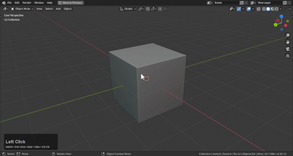
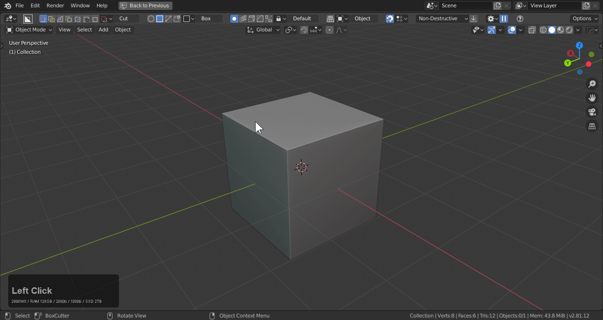

### Help Portals

When it comes to connecting to the hops community there are many options within Blender to connect users with documentation, videos, and updates.

> We have attempted to place many help options in front of the user to connect them with us. We endeavor to find the most optimal help solution. In a way you're surrounded with help options and ways to connect with us.

# hardOps - hops Button

The hops button in the corner of the 3d view has many links to release logs, documentation and the facebook / discord groups.

# hardOps - N Panel

Help links can also be accessed via the N panel.

# hardOps - spacebar >> learn

Assuming spacebar is search in prefs. Otherwise F3.

# hardOps - Q >> Settings >> Hard Ops Learning

Q >> Settings >> Hard Ops Learning will also bring up a popup for connecting users with documentation, videos, and updates.

# boxcutter - Topbar

Pressing alt + W starts boxcutter which also brings the topbar back. In the corner is the help button.

> Ctrl + click will take users to the discord.

# boxcutter - D Pie

It is also present in the behavior panel of the D menu and topbar.

> Ctrl + click will take users to the discord.

## Thread

[Hard Ops has a blenderArtists thread which we check often for input and complaints.](https://blenderartists.org/t/hard-ops-thread/)

## Email

<a href = "mailto: masterxeon1001@gmail.com">Send Email</a>

## Twitter

[Twitter is a common posting place for me to keep users up to date on memes, updates, leaks and personal works.](https://twitter.com/mxeon1001)

