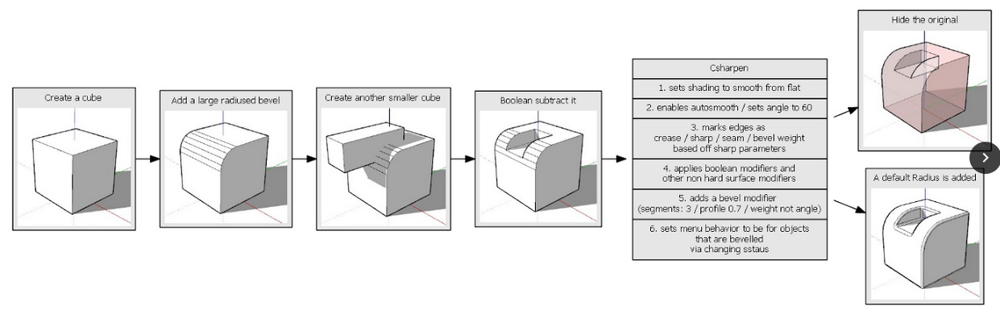

### Csharpen

Csharpen does the following things.

- set shading to smooth from flat
- enables autosmooth / sets angle to 60
- marks edges as crease / sharp / seam / bevel weight based off of sharp parameter.
- applies boolean modifiers and other non hard surface modifiers
- adds a bevel modifier (segements: 3 / profile 0.7 / weight not angle)
- sets menu behavior to be for objects that are bevelled via changing [sstaus](sstatus.md)

If this sounds like the [ssharpen](ssharpen.md) that is because this is the complex version of that tool. Created at the same time for a more specific reason. **Sharpening / Applying modifiers / Setting up bevels.**

This may sound strange but it allows for a very itterative forward workflow with boolean based workflows.

Below is an example of it in action.

In the above example I used simple cubes to boolean into the main shape. Then using cSharpen I was able to both bevel the form and apply the boolean modifier. After that I used another cube to boolean and when cSharpening it was able to ignore the bevel modifier and apply the boolean. This is a process I rinse and repeat to keep adding detail. In my opinion this is the best approach in blender for creating [such detail](http://www.neilblevins.com/cg_education/areas_of_visual_rest/areas_of_visual_rest.htm) in a focused manner with the fewest amount of keystrokes. Of course there is also adaptive subidivision and displacement however thats outside of the scope of this guide.

---

## F6 Menu

The F6 menu has options that are similar to [ssharpen](ssharpen.md) with a few additions.

- Modifiers (hold <kbd>shift</kbd> to select / deselect) defaults generally are fine with the exception of sometimes ignoring solidify as well
- general parameters - adjustments to cSharp
  - the left numbers are global parameters. Changing those will make csharp remember next time.
  - instance numbers - for changing the behavior of csharp for this one instance
- sharpness - same reasons as [ssharpen](ssharpen.md)

---

## Csharpen In Action

This is the basic usage of cSharpen in a boolean workflow.

By default it ignores the bevel modifier. Under no circumstances do we apply the bevels via the cSharpen.

With solidify it can be useful to keep the solidify live for non destructive workflows.

---

## Why Csharpen?

Csharpen became a needed tool after we began using boolean based workflows and needed a way to procedurally work forward with less steps. The tool was initially called complex sharpen but in the end we decided on cSharp.

<iframe width="560" height="315" src="https://www.youtube.com/embed/N-ihUA3VmtA" frameborder="0" allowfullscreen></iframe>

---

## Removing Csharp / Ssharp marks / modifiers from meshes

See [Clear s/c Sharps](clearssharps.md)
