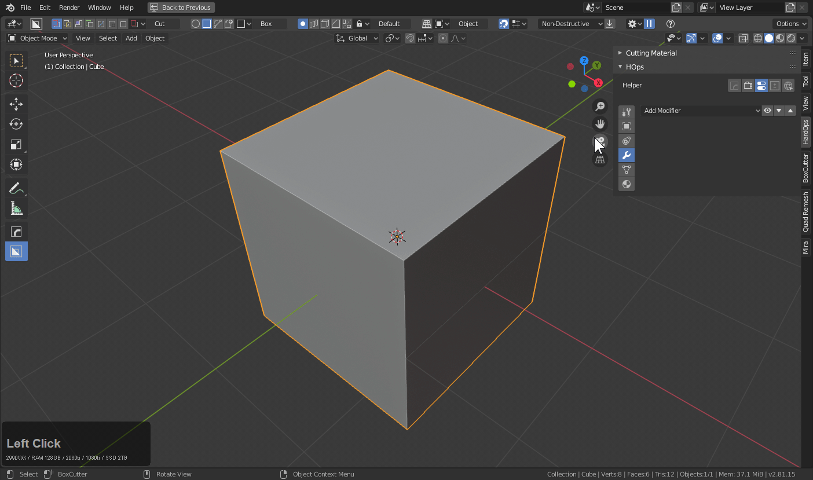
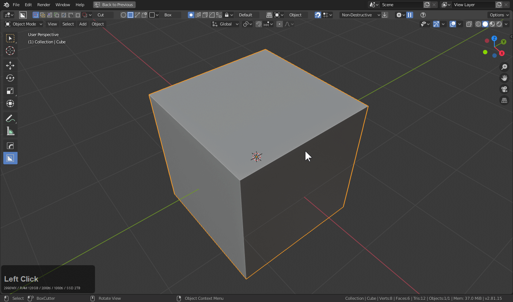

### Csharpen

Csharpen does the following things.

- set shading to smooth from flat
- enables autosmooth / sets angle to 60
- marks edges as crease / sharp / seam / bevel weight based off of sharp parameter.
- applies boolean modifiers and other non hard surface modifiers
- adds a bevel modifier (segements: 3 / profile 0.7 / weight not angle)
- sets menu behavior to be for objects that are bevelled via changing [sstaus](sstatus.md)

If this sounds like the [ssharpen](ssharpen.md) that is because this is the complex version of that tool. Created at the same time for a more specific reason. **Sharpening / Applying modifiers / Setting up bevels.**

This may sound strange but it allows for a very iterative forward workflow with boolean based workflows.

Below is an example of it in action.

In the above example I used simple cubes to boolean into the main shape. Then using cSharpen I was able to both bevel the form and apply the boolean modifier. After that I used another cube to boolean and when cSharpening it was able to ignore the bevel modifier and apply the boolean. This is a process I rinse and repeat to keep adding detail. In my opinion this is the best approach in blender for creating [such detail](http://www.neilblevins.com/cg_education/areas_of_visual_rest/areas_of_visual_rest.htm) in a focused manner with the fewest amount of keystrokes. Of course there is also adaptive subdivision and displacement however that is outside of the scope of this guide.

---

## F6 Menu

The F6 menu has options that are similar to [ssharpen](ssharpen.md) with a few additions.

- Modifiers defaults generally are fine with the exception of sometimes ignoring solidify as well when needed
  - Booleans - csharp was born to apply booleans (on by default)
  - Solidify - typically applied but by unchecking this will keep solidify live when needed
  - Bevel - when checked will apply bevels using vertex groups and ignore angle and bevel weight mods initially
  - Mirror - mirror is typically kept live but clicking mirror will make csharp apply mirror
  - Array - array is typically kept live but clicking array will make csharp apply mirror
  - Others - Triangulate / Subdivision / Screw and other mods related to non-d construction can now be applied here
- general parameters - adjustments to cSharp
  - the left numbers are global parameters. Changing those will make csharp remember next time.
  - instance numbers - for changing the behavior of csharp for this one instance
- sharpness - same reasons as [ssharpen](ssharpen.md)
- autosmooth angle - angle the autosmooth will be set to by csharpen

> Uncheck global to keep the initial autosmooth set manually by you the user.

---

## Csharpen In Action

This is the basic usage of cSharpen in a boolean workflow.

By default it ignores the bevel modifier. Under no circumstances do we apply the bevels via the cSharpen.

With solidify it can be useful to keep the solidify live for non destructive workflows.

---

## Csharpen with Non-D Objects

Csharp now has support for non-destructive objects and can be used in applying the modifiers and moving the object forward with a boolean or bevelling workflow.

> Keep in mind if you want to simple "add a bevel". Ctrl + click bwidth (angle 30) or ctrl + shift + click bwidth (angle 60) bevel mod added. When csharp is used the goal is to apply modifiers and set it up for a boolean / bevel workflow.

In this example a simple non-d object is created.

By checking bevel and other the shape can be applied and converted for a boolean workflow.

> Applying everything like this is not necessary since bevels could be stacked on bevels with multiple levels nondestructively.

---

## Csharp w/ Bevel Vgroup

Special care was taken to make csharp capable of applying vgroup bevel modifiers when needed.

> This can be useful for transitioning from non-destructive to destructive.

---

# Additional Csharp Tips

Csharp has pre-emptive properties in the workflow area of the HOPS N Panel or the ctrl + ~ helper workflow area. These can be used to adjust the behavior of csharp before it is even used.

WN - weighted normal mod will be added with csharp. (Off by default)

HN - will check the harden normal box on the bevel modifier when they are added.

Sharp options pertain to markings. On edges meeting the "sharpness" threshold, the following edge markings will be performed.
- crease (crease at 1 to resist sub-d)
- seam (easy region selection with L in face mode)
- bweight (bevel weighted workflows where bevel is able to be controlled)
- sharp (shading override for sharp shading)

The Global box will ensure ssharp and csharp override the autosmooth angle when ran. Unchecking global will keep the value on the user defined value. This can be useful when using a particular autosmooth and you dont want the workflow disturbed.

> Notice how when Global is toggled off the csharp/ssharp operation will retain the autosmooth of the user.

---

## Why Csharpen?

Csharpen became a needed tool after we began using boolean based workflows and needed a way to procedurally work forward with less steps. The tool was initially called complex sharpen but in the end we decided on cSharp.

<iframe width="560" height="315" src="https://www.youtube.com/embed/N-ihUA3VmtA" frameborder="0" allowfullscreen></iframe>

---

## Removing Csharp / Ssharp marks / modifiers from meshes

See [Clear s/c Sharps](clearssharps.md)
