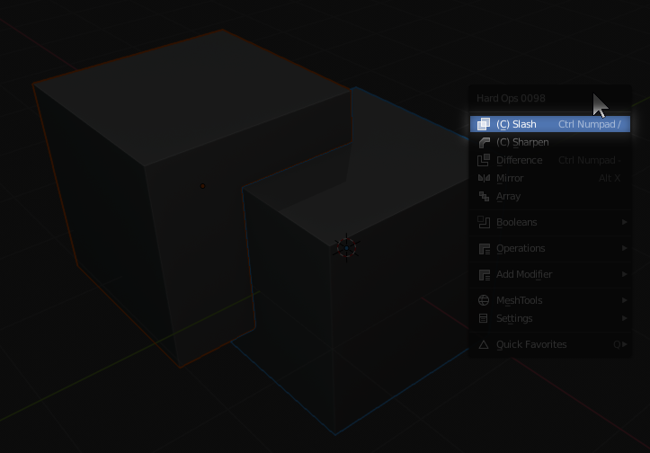

### cSlash

# Finding cSlash

Cslash will show up in the <kbd>Q</kbd> menu if two objects are selected.

> Notice two objects were selected. This is the only way to use cslash. This tool does not work with single selection due to it not having anything to cslash.

# What Is Cslash?

Cslash is the next level of cslice. Over time Blender has changed from carve to bmesh so our slicer has evolved as well. The purpose of cslash is to cut and separate one part of geo into multiple using the secondary as the "cutter".

By default cslash is non-destuctive meaning [csharpen](csharpen.md) is used to apply it.

Cslash can also slice and be done with the destructive toggle in the <kbd>ctrl</kbd> + <kbd>~</kbd> helper, <kbd>N</kbd> Panel, or HOPS mini helper.
This can be much quicker but lacks the ability to adjust and edit prior to application.

Material slicing is also supported.

