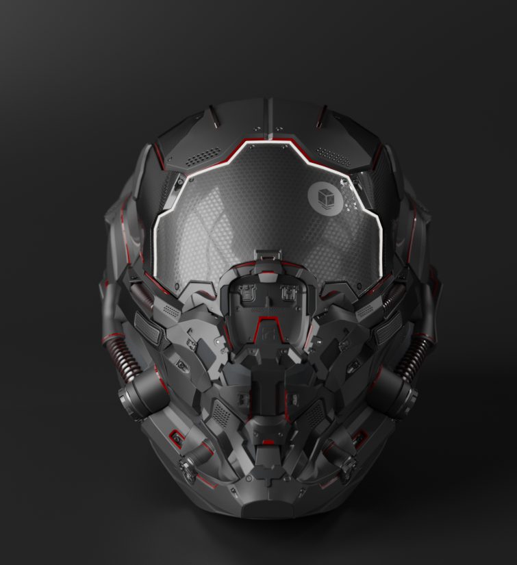
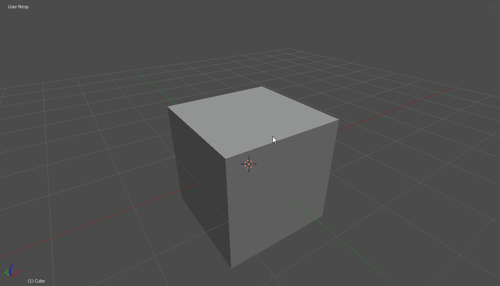
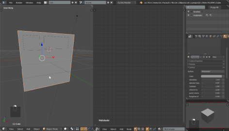
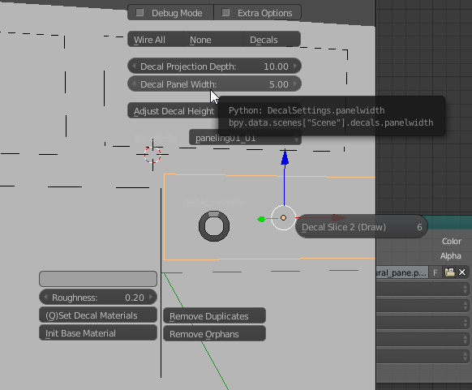

### [decalMACHINE](https://gumroad.com/l/DECALmachine#) tips

[decalMACHINE](https://gumroad.com/l/DECALmachine#) is not a tool made by us or is related to HOPS / BC. However it is a tool just as essential and because of that I wanted to write a little bit about my experiences and give some tips.

---

## Changing Material Colors

# Subsets

For subsets changing the color is just the color node outside of the node group.

# Info

For info decals the color is something you will need to manipulate with a mix node.

If it already has color it can be changed via a HSL node to adjust the tint.

It can be a little odd however I prefer to preview my changes in the render. In this example I use 2 nodes for additional levels of control.

---

# Exporting Decals

This is a WIP example of [Machin3](https://twitter.com/machin3io) exporting a decal set from Blender to Unity.

<iframe width="560" height="315" src="https://www.youtube.com/embed/f6vvF21fQKc" frameborder="0" allowfullscreen></iframe>

This area is still a WIP in fact this video isn't supposed to be here.

---

# Making Decal Slice work

Decal slice can be a gamble at times. I recommend getting familiar with this area.

So the default of 5 may not be the most ideal.
