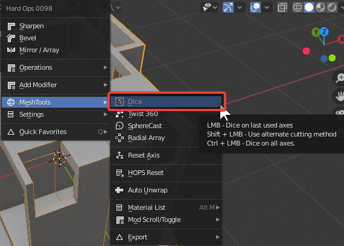
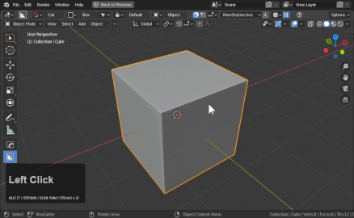
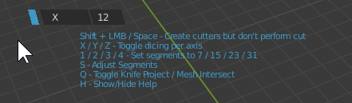
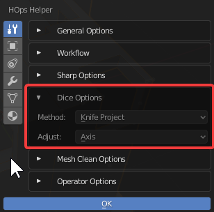
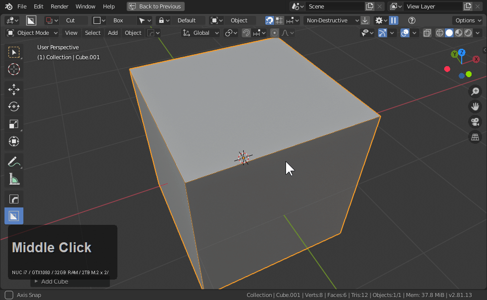

# Dice

[Dice is our attempt at creating a loopcut](https://masterxeon1001.com/2020/01/19/hard-ops-00984-1-neodymium-release/) for ngon meshes. It is intended to force matrix geo onto the form of the primary selection similar to loopcut. This can make boolean geometry more capable of deformation and shaping.

> Dice is fully destructive and only works applied mods and meshes showing in edit mode.

Dice utilizes both knife project or boolean intersect which means dice is limited to real geometry with modifiers applied. This also means hot-lining can be a potential hazard so edges must be placed carefully.

When dice was first used above a few things to note:

- dice failed to add geo the first time due to mods not being applied
- after applying the modifiers (via visual geometry to mesh) dice was able to work

Dice can be followed up with by twist360 for an interesting deformable result.

# Dice Content

<iframe width="560" height="315" src="https://www.youtube.com/embed/y2QBY1SseLU?start=925" frameborder="0" allow="accelerometer; autoplay; encrypted-media; gyroscope; picture-in-picture" allowfullscreen></iframe>

<iframe width="560" height="315" src="https://www.youtube.com/embed/gJeP6BA7NLQ?start=297" frameborder="0" allow="accelerometer; autoplay; encrypted-media; gyroscope; picture-in-picture" allowfullscreen></iframe>

[Launch Post]((https://masterxeon1001.com/2020/01/19/hard-ops-00984-1-neodymium-release/)

# Locating and Using Dice

Q >> Meshtools >> Dice

- LMB / Dice
- Shift / Dice using opposite cutting method
- Ctrl + LMB Dice on all axis

On default mouse move will adjust axis and scroll will add additional segements with LMB being apply.

> Press H for help during modal.

- Shift keeps behind cutters for manual cutting if needed.
- X / Y / Z change / add axis to cut
- 1 / 2 / 3 / 4 - segements to 7 / 15 / 23 / 31
- S - segment adjust via mouse move
- Q toggle between knife project and boolean intersect

# Advanced Dice Usage

Dice can be preconfigured via the Ctrl + ~ (hops helper).

Axis adjustment can be either

- mouse move (similar to loop cut)
- axial press (x, y, or z) during operation

By default adjust is on axis which means mouse move changes the axis and it is inteded for single axial cutting.

## Objects can be twisted then diced

This can be useful for getting the geometry just right before applying.

In the above gif I use Circle(E) to create a circle which is separated with P and used to compare with the deformed circle.

By scaling the circle before dice I can ensure the loops added will help with the solution and not the problem.

This can be quite enjoyable once experienced in action. Dice has uses beyond this that remain undiscovered.

# Knife Project / Boolean Intersect

## Knife Project
- Knife project utilizes knife project which can be reliable in some cases and not the other.
- 2d meshes are treated especially well in this method

## Boolean Intersect
- Boolean intersect is more optimal for all manifold geometry.
- Works optimally if all the parts are together but manifold.

> If one method fails. Try the other. Q during modal will switch operation on the fly.

# How dice works

Planes. Below is how it used to be done before dice was added.

# Dice w/ Bevel

Dice w/ bevel and other heavy modifiers can be sometimes tricky to deal with but will require users to examine the geometry. The majority of the time just looking closely at the loops and their relationships with areas will let you know if the result will be acceptable in advance. If knife project fails then utilizing intersect might give you better results.

# Edit Mode Dice

Dice also exists in edit mode. Same behaviors and rules as object mode.

> In the below example it can be seen the knife failed in an area but boolean intersect did not. Changing these out on the fly is the recommended method of operation for troubleshooting.

# Dice w/ Twist 360

Dice is perfect with twist 360. It is essential to ensure you are working from the correct axis since twist leans more towards the front view for best result.

