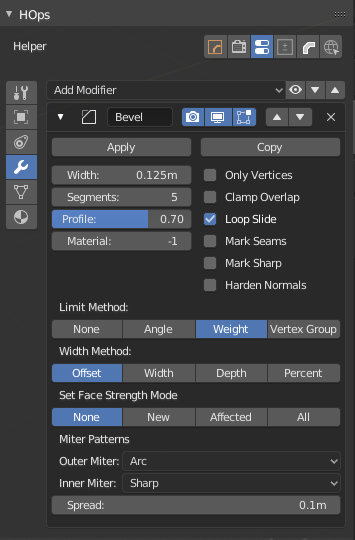

# Bweight

Bweight is for modifying the influence of weight on a selection.

> Weights can only be modified on a mesh using a bevel with weight set. This will not work in angle workflows.

Bweight will only modify the influence on the selection.

> Notice that by lowering the bevel weight of the square area that the bevel was more managable.

# About Bevel Weighting

Bevel weight is important for working with the bevel weight workflow csharpen was made for. By being able to mark and unmark bevel edges at will you have better control over how the bevel can affect the shading.

> Using the bweight option in edit mode will allow you to perfect the bevel amount on the same level to allow shapes to work better without overlap. By hiding what you want to edit and using ctrl + A in bweight modal you are able to adjust the bevel influence for a particualar area.

