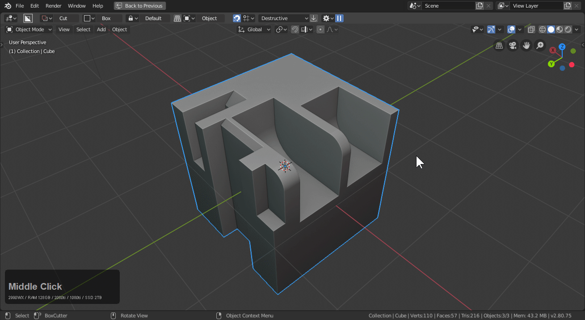
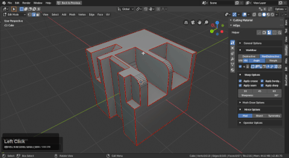

# Set Sharp

Mark sharp will mark the selection with the marking specified in the ctrl + ~ helper or n panel workflow area. If nothing is selected it will calculate sharps in edit mode and mark them accordingly. Set Sharp a 2nd time is also capable of unmarking a marked edge in edit mode. This is the go-to tool for manually adjusting marked edges.

- if there is a selection if will be marked with the specified markings
- if there is no selection it will run [ssharpen](ssharpen.md) in edit mode calculating the sharp edges

This is used in [sharpening workflows.](sharpening.md)

# Unset Sharp

Same option as above but when used on marked edges will unmark them if desired. In the gif below I demonstrate unmarking edges while also unmarking all and using set sharp to [ssharpen](ssharpen.md) the form.

# Marking Reasons

The various markings in blender have different purposes:
- sharp (shading and transitions)
- bevel weight (bevel weighting for bevel workflows)
- seam (uving and face selection simplification)
- sub-d creasing (stiffness for subdiv modelling)

It has been asked by many users why such markings would need to be done on the fly. Let's get more in depth with each. But each of them has a purpose which helps make hard surface easier.

## Sharp

Sharp is marked for shading purposes. Sometimes users will be working at an angle greater than a threshold. Like 30 or 60. There is the option of lowering the autosmooth. Or simple marking the edge as shown.

> The shading issues aren't so prevalent here but with a bevel it becomes more obvious with additional geometry.

## Bevel Weight

Bevel weight is important for working with the bevel weight workflow csharpen was made for. By being able to mark and unmark bevel edges at will you have better control over how the bevel can affect the shading.

> Using the bweight option in edit mode will allow you to perfect the bevel amount on the same level to allow shapes to work better without overlap. By hiding what you want to edit and using ctrl + A in bweight modal you are able to adjust the bevel influence for a particualar area.

## Seam

Seam is used for selection in the scheme of modelling. By marking seams, users can select entire manifold pieces using L in face select edit mode.

> This is one of the preferred ways to handle island selection in Blender at this time.

## Subdivision crease

Subdivision crease at 1 will give marked edges full rigidity allowing for them to hold in subdivision. This can be used creatively to add more divisions  / spans to a model without losing the form to simple subdivision without guidance edges.

> Notice I had to re-bridge the top because it was too ngon for subdivison. Occasionally fixes will have to be administered to make things work. In reality that shape should have been subdivided before all the booleans.
