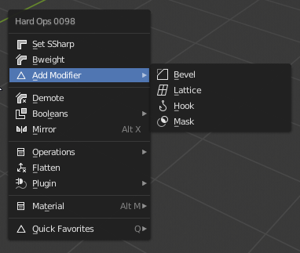

# Edit Mode modifiers

At this time we only support 4 modifiers in edit mode. More will be added in the future.

# Bevel

Adds a bevel modifier to the selection.

> Ctrl + click the bevel to add a new bevel in the event one is already present.

- edge adds weighted bevel modifier
- vertex selection adds vertex group bevel modifier

To show bevel in action.

> Adding bevels this way can be controlled via bevel in object mode.

Users also have the ability to set the profile to be .5 to behave without the default .7 we typically use.

# Lattice

Adds a bevel modifier to the selection. The lattice added can be modified in lattice edit mode to adjust the shape.

# Hook

Adds a hook modifier to the selection. The empty added can be modified in object mode to adjust the shape.

# Mask

Adds a mask modifier to selection. This is a nondestructive way to delete areas in the mesh.

