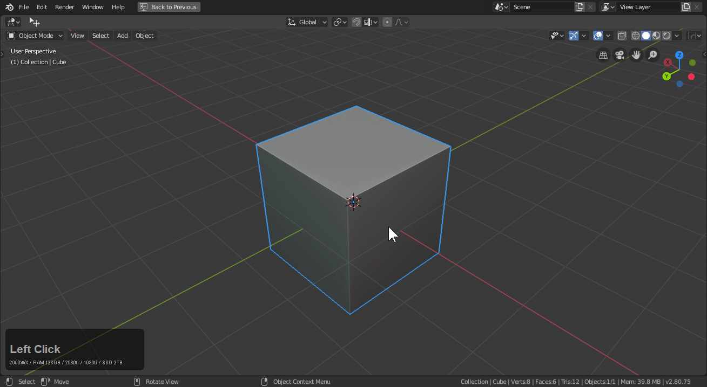
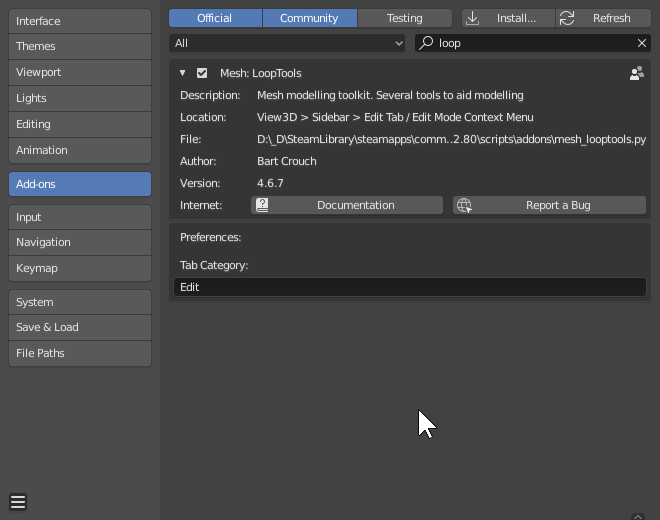
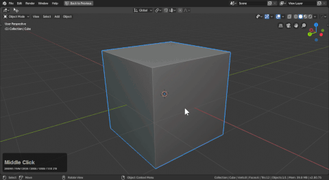
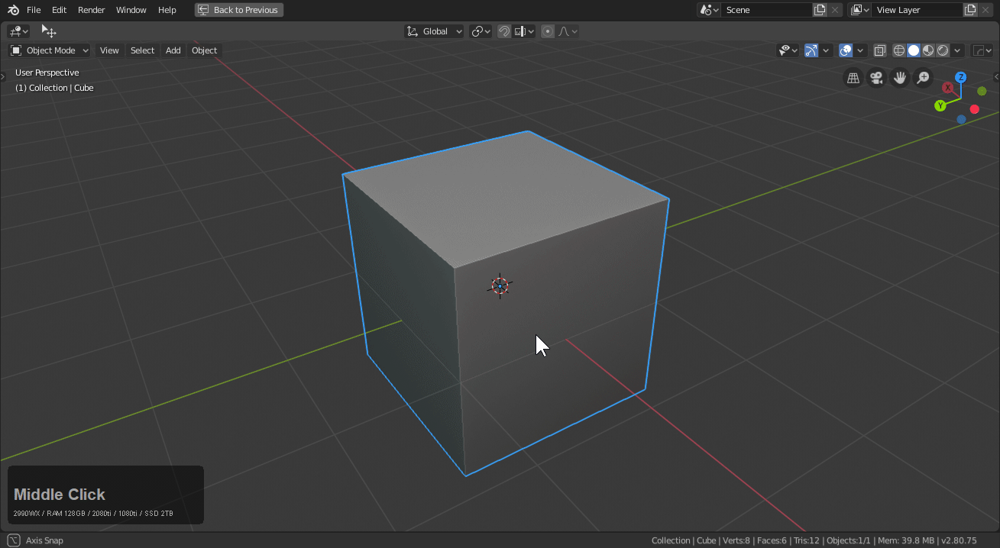
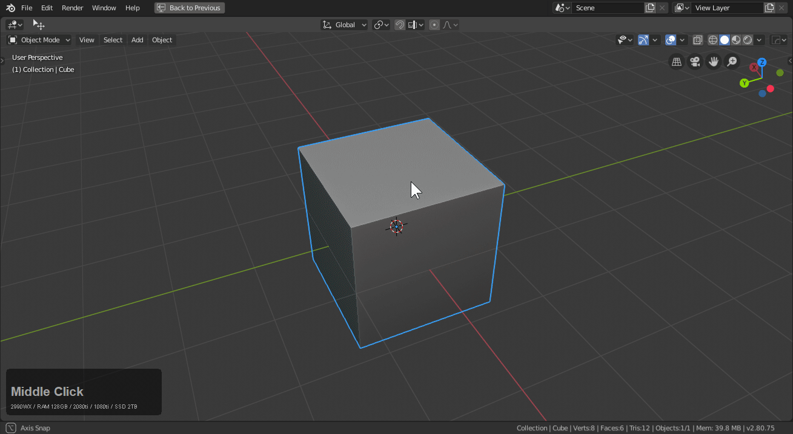

## Operations

# [Add Modifier](edit_mods.md)

see [add modifier](edit_mods.md)

# [Set Ssharp](edit_marksharp.md)

see [Set Sharp](edit_marksharp.md)

# [Bweight](edit_bweight.md)

see [Bweight](edit_bweight.md)

# [Clean Ssharps](clearssharps.md)

see [Clear Ssharps](clearssharps.md)

# Clean Mesh

Clean mesh in edit mode will dissolve useless geometry on a selection. Depending on the setting in the F6 panel.

> Watch out when using clean mesh. Some edges are key and cannot be dissolved without being handed off to another model. Also clean mesh can get odd with curvature so this is used primarily for simplification but it should be used with caution.

# Circle (E)

> Requires looptools.

Circle(E) converts vertices to circle. To show it in action:

> Make sure scale is applied or the circles will have strange sizes.

# Circle (Nth)(E)

Same as circle except with an nth offset.

# Grate (face)

Converts a selection into grates. After operation pressing S will scale the faces for alt + S to be used to push them inwards indicating depth.

# Knurl (Face)

Converts a selection to knurl. Alt + S is typically used to address depth after operation.

# Panel (face)

Converts a face selection into a panel.

# Panel (edge)

Converts an edge selection into a panel.

# Star Connect

Allows an edge to be created for more than 2 points.

# M_Disp

Turns off edge mark visualization. Not disable.

# [Plugin](https://hardops-manual.readthedocs.io/en/latest/meshtools/#plugin)

[see 3rd party plugin](https://hardops-manual.readthedocs.io/en/latest/meshtools/#plugin)

# Reset Axis / Flatten

In edit mode reset axis will do a flatter on the selection for a selected axis.

This can flatten to either the selection or the active object center as well as multiple axis at once in the tool panel.

# [Boolean](edit_booleans.md)

see [edit mode Boolean](edit_booleans.md)
