### FAQs / SFQs

# What happened to the topbar!?

Right click object mode and enable it.

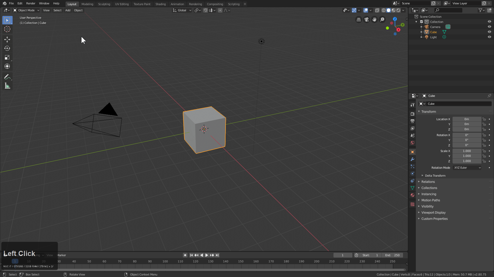

___

# Help! I just installed and it says I need to upgrade!

This means you installed the **older version** of hops/boxcutter. Install the correct version **prefixed with 2.8** and you will be good to go.

> [Bottom two files are for Blender 2.79](https://download.blender.org/release/Blender2.79/latest/)

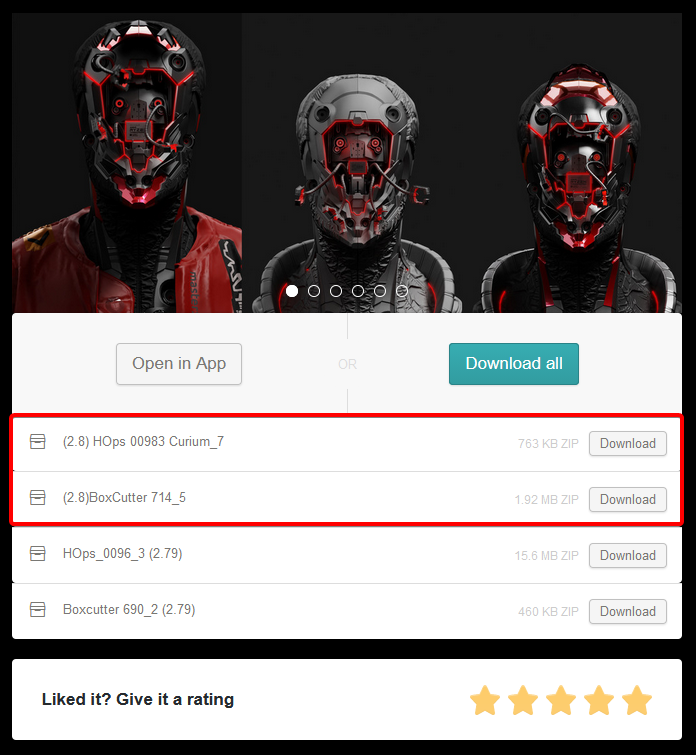

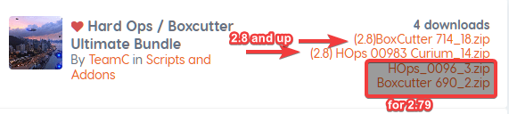

The last versions for 2.79 were:

- [Hard Ops 0096 Proxium](https://masterxeon1001.com/2018/09/25/hard-ops-0096-proxium/)
- [Boxcutter 690 Poly Dirk](https://masterxeon1001.com/2018/09/25/boxcutter-6-9-0-poly-dirk/)

Attempting to install them in 2.8 will show an error.

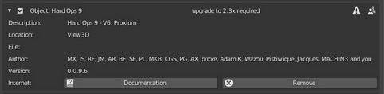

The top file is always the latest and the same applies for [BlenderMarket.](https://www.blendermarket.com/account/orders)

___

# Why can't I cut with planes anymore?

Well to put is simply. [Blender themselves](https://docs.blender.org/manual/en/dev/modeling/modifiers/generate/booleans.html) changed the algorithm.
Previously they used to use [CARVE](https://github.com/VTREEM/Carve) now they use BMESH.

[This was the moment CARVE was removed.](https://developer.blender.org/D3050)

From the final release of [2.79](https://download.blender.org/release/Blender2.79/latest/) to [2.8 going forward](https://builder.blender.org/download) there are now new rules to adhere to.

- watertight (no holes)
  - this means cutting the mesh in half and **using the mirror with booleans is no longer recommended**
  - keeping the mesh solid and [mirroring via modifier is more optimal](mirror_symmetry.md)
- solid **no planes** no 2d geometry.
  - in order to use 2d geometry with booleans it is [recommended to add thickness](tthick.md)
- normals must be properly oriented
  - in 2.8 normals can be harder to notice when incorrect so the alt + V face orientation is useful for troubleshooting.
  - edit mode with all selected shift + N recalculates normals.
  - applying scale if things get inverted can also help boolean issues. With wireshapes for booleans it can be harder to tell if a mesh has been flipped inside out.

Bmesh booleans are faster which results in more booleans being able to be racked up and the tips mentioned above should be followed for a predictable modifier workflow.

These should be rules in general but with BMESH it is now more strict. We simply evolved with the times and continued but we understand this can be an unusual transition after seeing the 2.79 content but it was just a different time and now long gone in favor of something that ties into the rest of the tools and is much faster without so many triangles being created on the cut. It will take some time to get used to but it is the way things are now

As you can see from the image it is sort of random.

And with thickness it just works more predictably.

___

# I updated hops and got this error.

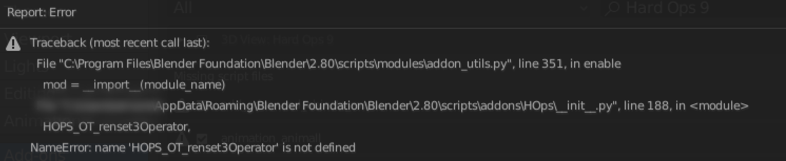

Make sure the old folder is deleted before updating. Blender 2.8 is more specific so if a file is renamed or changed
it will possibly cause a registration issue if it isn't equipped for that operator anymore.

Deleting HOPS via preferences and reinstalling from file will resolve the issue.

___

# What kind of geo can I expect from booleans?

Something like this. Booleans solve as they will and with the most minimal of edges.

All hardOps does is help user make these mistakes quicker so they can be corrected and controlled even faster.

___

# Why won't my sharp edges show up? Did hops do this?

Q: "for some reason hardops is preventing me from making sharps sharp? Tested by turning off the hops addon and it went back to normal, any ideas on why that would be happening? Basically <kbd>Ctrl</kbd> + <kbd>E</kbd> >> Mark Sharp changes nothing with hops enabled in preferences."

a few tips:

- first I checked autosmooth and custom normals. The only things capable of forcing shading besides modifiers
- the modifier scroll is a powerful resource in troubleshooting and rolling through the creation process
- after scrolling I saw things went wrong at Weighted Normal
- keep sharp is required for weighted normal to keep marked sharp edges
- when adding weighted normal if shift is held it will use keep sharp

The modscroll can be a powerful tool for scrolling through the process to see where things go wrong. It also allows for backwards scrolling and looping for more fun with modifier presentation.

Modifier scroll or toggle could be set for the quick favorites to be accessed with <kbd>Q</kbd> >> <kbd>Q</kbd> if needed extensively for a session.

> Save prefs to save quick favorites. I usually don't. So I can vary the quick favorites for workflow.

**When adding weighted normal holding shift will add the modifier with keep sharp checked.**

shoutout to user: modimist

___

# How do I fix this shading?

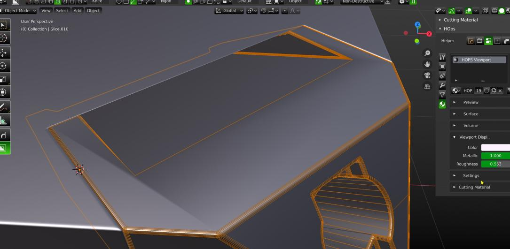

Looking close at the above image shows many bevelled edges converging into a non bevelled edge. This difference in geometry caused a shading convergence issue.

Easy fix. Lower the bevel angle slightly.

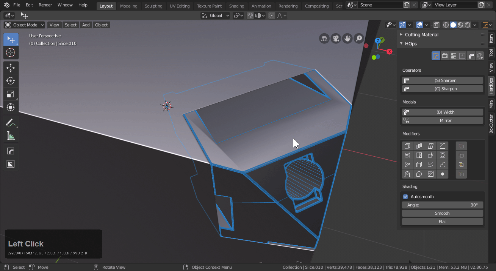

___

# How do you make a hardOps mesh work with subdivision?

Below is my classic video for converting from boolean / bevel to subdivison geometry. As you can see it is a process unto itself. This video is a classic from 2.79 so it is still applicable even in the 2.8 era.

<iframe width="560" height="315" src="https://www.youtube.com/embed/f7dvODWS4e4" frameborder="0" allowfullscreen></iframe>

When it comes to more complex assets sometimes I will convert an unbevelled version to the final model as shown here:

<iframe width="560" height="315" src="https://www.youtube.com/embed/UYMrkAOTV9E" frameborder="0" allowfullscreen></iframe>

I don't normally break down game models to all quads since tris also play a role in simplification but the process differs from subdivison conversion. Working smart and using guidance edges can go a long ways in keeping the work ahead minimal.

When I talk about guidance edges I mean this.

> Booleans by default in blender will solve using any edge it can connect to it. And more often than not this is not the desired way to solve a boolean. In the above gif you can see the geometrical hit lessen as go to the edge while face cuts will solve to the nearest corner. Something as simple as adding an edge counteracted this. This edge has only the purpose of guiding the boolean. Therefore it is a guidance edge. That is the only purpose for adding it.

Having less booleans solve with the corners the less stress the bevel modifier will get which reduces the amount of streaking artifacts while working.

With the new miter options on bevel a user could easily build the block in cage from a boolean mesh. And from there make everything quads and be good to go. The bevel mod creates the guidance edges to prevent subdivison from shrinking everything.

a few things to note note:

- bevel was set to profile with 1 by pressing P during bwidth to adjust the profile.
- boxcutter has sorting for bevel on so the bevel is kept on top of the boolean modifiers
- miter spaces out the top of a cut instead of converging them making the subdivision process easier than ever

Also if subdivison is on an object. All is quad. Automatically. So just using subdivision makes and object all quads.

Using triangulate and bevel intelligently can be the difference between adequate shading with subdivison and artifacts due to ngon to subdivision  issues. Even now this object is still able to be modified thanks to [sorting.](sorting.md)

about the above gif:

- bevel is still live but rounded by subdivision.
- triagulate mod via hops will only triangulate ngons which is thanks to enahncements to the modifier itself.
- everything is dynamic but also fully quad once subdivision is brought into play
- during bevel Z turns on wire. This is the object wire. Not to be confused with the viewport wireframe option that had to be toggled in this example

> The flow will not be what you like but it will be all quads.

So the subdivision conversion process can be quite easy depending on geometry and that is built into blender. So exporting to Zbrush and 3dcoat is an option this way as well.

> While working sometimes I will duplicate a portion before progressing forward in order to keep a state I can revert to if I need to add more geometry to the initial mesh or make a large form change. So part of getting the most out of hops is working smart and using the tools Blender has in addition to the tools added with hardOps.

Alternatively users could apply the bevel and clean up the mesh by manually adding loops and that is the most direct way to get a perfect result. However make sure to bevel with a profile of one to create additional edges for managing surfaces. This can come in handy for modelling as well.

In the above example I beveled in edit mode with a profile of 1 to 100% keep the profile but add a spacer loop with low segments. This spacing workflow is essential for maintaining for and controlling flow to master shading with minimal geometry.

___

# Where is the empty when I do a radial array?

Check the collection. You may have to enable visibility.

> For Boxcutter it is probably in the cutters collection.

The empty is parented to the object of affect so it should translate accordingly.

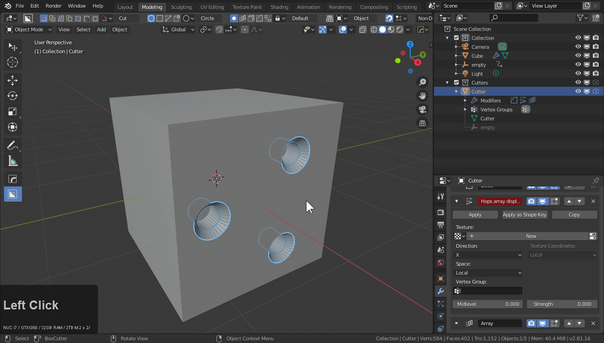

___

# Why is the displace red when using radial array?

Because it is not in use. Sometimes the displace isn't set to any number. It is present in case it is needed.

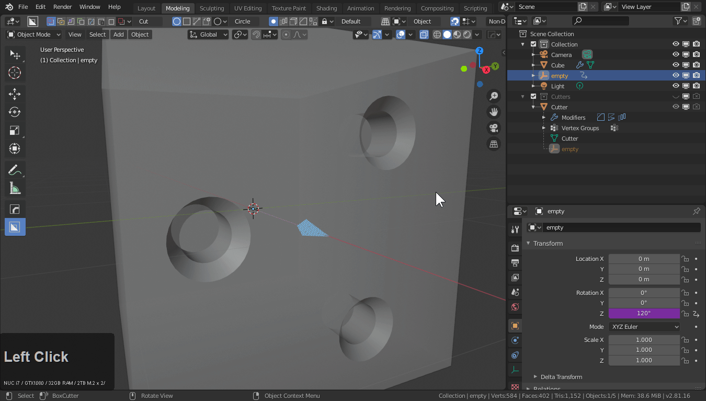

___

# [How did you do the curved wall demo from the 00983 trailer?](https://youtu.be/0qx_hOrW1C8)

At this moment in the trailer I showed a curved wall.

<iframe width="560" height="315" src="https://www.youtube.com/embed/0qx_hOrW1C8?start=36" frameborder="0" allowfullscreen></iframe>

This utilizes spin with curve deformation. It was a happy little accident.

To showcase setting it up in action:

- moved the plane held ctrl for increment snap
- ctrl + A applied location
- deleted one point to make it an edge
- duplicated and separated one vert with P for making the object w/ same origin / rotation
- converted main shape to curve after bevelling
- extrude (spin) the vert shape then ctrl + P (curve deform) to the curve

> Curve deform rarely works out the box so some adjustment may be needed.

This can result in an interesting setup for completion of the asset.

To extend on the previous example:

___

# Why does it crash when using the operator properties?

Blender 2.8 has been having issues with the undo / redo portion that is connected to the properties panel. When changing parameters theres a chance Blender could crash and take you to the desktop.

In the above example I attempted to use csharp and adjust the F6 to trigger an issue. But it didn't come up. But this is a common issue.

Another example is in boxcutter. Notice how changing the apply modifier area can cause a crash.

 > At the top of boxcutter is a button that applies booleans. If tampered with it can quickly take you to the desktop. I'm my general use I dont mess with the F6 of this property because the purpose is only applying booleans.

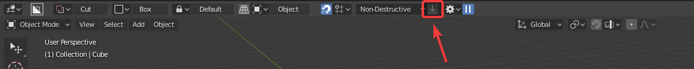

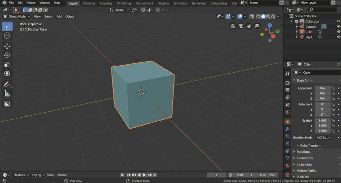

>> [The hard ops thread can be a nice way to convey issues and find support when needed. ](https://blenderartists.org/t/hard-ops-thread/)

[When crashes occur it can be handy to capture it and convey them to us.](issues.md)

But F6 and undo / redo related issues are a known thing that is an issue all throughout 2.8 at this time.

[In 2.7x there was also an issue with undo / redo and as a result we used outside properties to manage ssharp / csharp / booleans / clean mesh and marking.](https://hardops-manual.readthedocs.io/en/latest/ssharpen/#inside-out-sharpening)

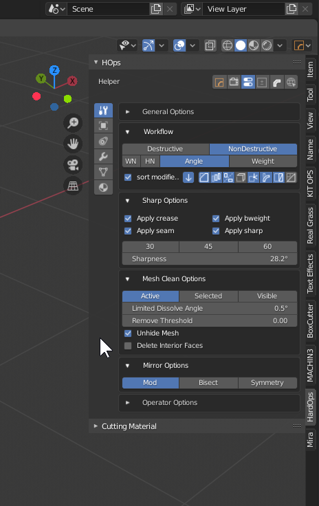

In the hops helper / mini helper or n panel we have the workflow area which has some of those outside exposed properties you would normally adjust on F6. Since we put them outside we never looked back. I recommend spending some time getting acquainted with it.

___

# I was not logged in when purchasing your product. How do I get the latest update?

## Blendermarket

[Purchase Retreival](https://support.blendermarket.com/article/16-how-to-retrieve-your-purchase)

The product should be listed under [orders](https://www.blendermarket.com/account/orders) on your Blendermarket account. Having the product on your account is essential for the updates that come frequently due to changes with Blender.

For additional assistance blendermarket can be contacted at [support@blendermarket.com](support@blendermarket.com)

## Gumroad

When it comes to gumroad you can view products in [your library](https://gumroad.com/library).

If you are unable to login you will need to locate the purchase email and use that to connect the product to your account.

 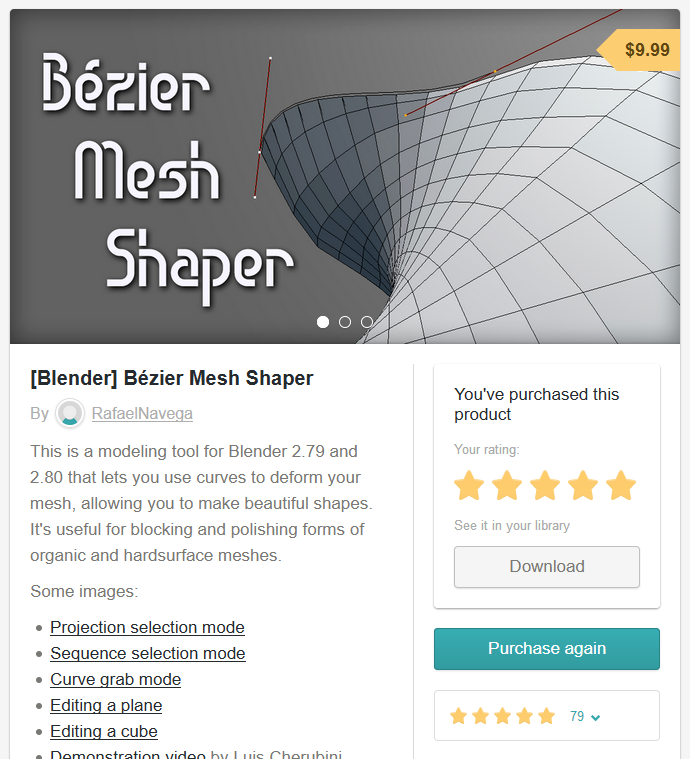

 If you are logged into your gumroad account you should see view product or download on the sales pages for the purchase related to you. [Alternatively the library will show all your purchases.](https://gumroad.com/library)

[HardOps](https://gumroad.com/l/hardops)

[Boxcutter](https://gumroad.com/l/BoxCutter)

[hopsCutter](https://gumroad.com/l/hopscutter)

___

# How do I update Hard Ops / Boxcutter?

Q: I haven't used HardOps for a while and need to update. Where do I get the latest update?

Blendermarket: [log into your account and go under orders in the dropdown of the upper right list.](https://www.blendermarket.com/account/orders)

Gumroad: [log into your account then access the](https://gumroad.com/library) [HardOps](https://gumroad.com/l/hardops) or [Boxcutter](https://gumroad.com/l/BoxCutter) pages.

The top file is always the latest.

Q: How do I get up to speed with the tool?

A: In the N panel or HOPS button is an option called Hard Ops learning that is built to help users find the documentation or [tutorial](https://www.youtube.com/playlist?list=PL0RqAjByAphEUuI2JDxIjjCQtfTRQlRh0) content. Every major version I usually make a new course set of materials to show off the tools.

___

# Can I disable to Q menu and use only the Hops pie? For quick favorites?

>> Quick favorites can be accessed with Q >> Q. Hard Ops was made before the Q menu came to Blender so now they've come to share the same key.

Even though I wouldn't recommend it... yes.
> Menus contain all options while pies and panels contain most. The Q menu is the best way to get the most out of HardOps.

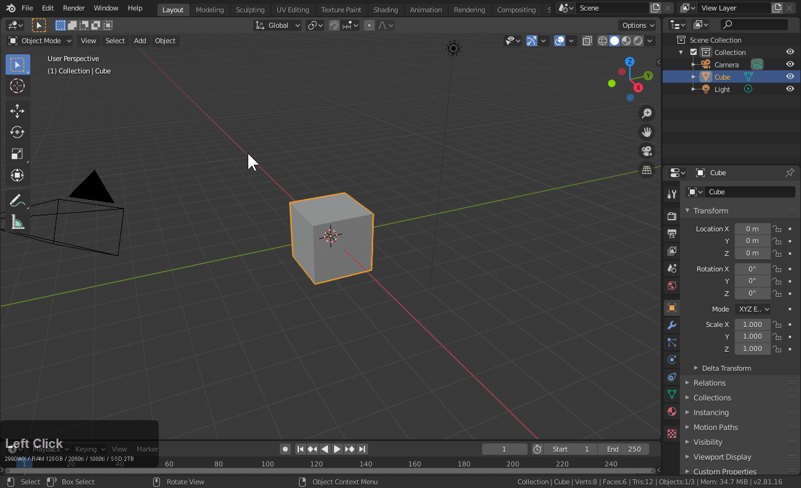

In the keymap tab any hotkey not wanted can be unchecked.

> Do not click the X or delete the keymaps. Doing harsh changes will require reinstallation to resolve.

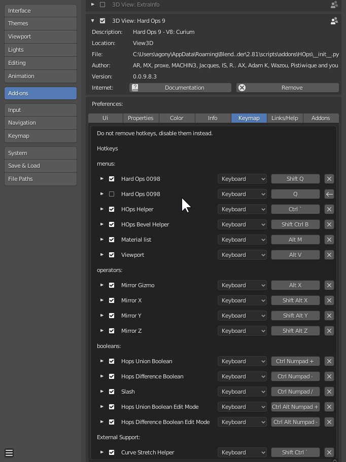

> To restore to default just enable to the option disabled here.
___

# How do you stack bevels non-destructively? My bevels keep bevelling each other.

First lets look at the bevel modifier as it is in the Add Modifier submenu.

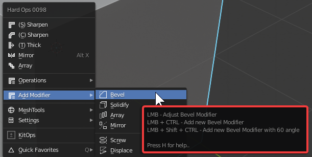

- LMB - adds 30 degree bevel if not present / adjusts if present
- ctrl + LMB - adds an additional bevel modifier at 30 degrees.
- shift + ctrl + LMB - adds an additional bevel modifier at 60 degrees.

The **shift + ctrl + LMB - adds a bevel at 60 degrees** is the key.

If you bevel 3 segments at 30 then bevel again more than likely you will double bevel.

Ideally you want the subsequent bevels at 60 so you dont catch the same edges. This is the easiest solution.

> Alternatively you could add more segments to the first level to round it out for the 2nd level to not get caught under the 30 degree threshold.

In hopsTool adding multiple bevels is slightly different but still the same.

- LMB adds bevel modifiers at 30 degrees
- ctrl + LMB adds bevel modifiers at 60 degrees

___

# How does reverse bevel work?

In edit mode with a face selected on a "boolshape" the face will be flipped resulting in a nice outwards bevel.

Even if HN is on this feature should ignore that since harden normals would affect the shading. (we try to avoid cutting custom normals into other meshes).

> Notice how harden normals is ignored on boolshapes.

This video goes more in depth on the topic.

<iframe width="560" height="315" src="https://www.youtube.com/embed/6TdRQc1Grws" frameborder="0" allowfullscreen></iframe>

___

# How do you use sorting? The sort tickbox doesnt do anything.

The sort tickbox in hardOps and boxcutter is there for users to specify what modifiers are supposed to be where in the stack. Unchecked modifiers do nothing and remain where there are in the stack.

**clicking them does nothing until the next boolean operation**

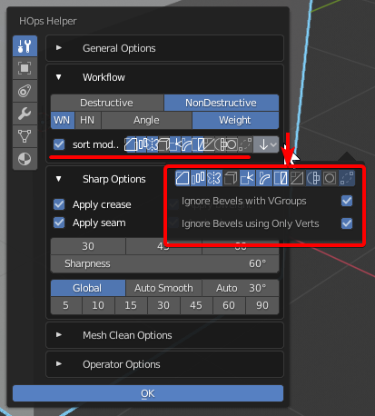

Sort can be turned off an on overall and the buttons next to it do the following:

- last bevel to bottom of stack (ahead of booleans)
- sort bevel modifiers - move bevel mods to bottom of stack
  - non vgroup / weight models
- sort array - ensures array is last so it shows booleans in all subparts
- sort mirror - using modifier mirror at the end of the stack will mirror all cuts
- sort solidify - keeps solidify later in the stack. Off by defaults. Only used in certain situations.
- sort weighted normal - keeps weighted normal at the end of the stack (maintains shading)
- sort simple deform - keeps simple deform at the end of the stack before the rest.
- sort triangulate - keeps triangulate after boolean to allow for iterative working on an exportable mesh
- sort decimate - moves decimate at the end of the stack (useful for rare situations)
  - recommended off for smart shapes and situations where the mod order is crucial.

To show sort bevel in action.

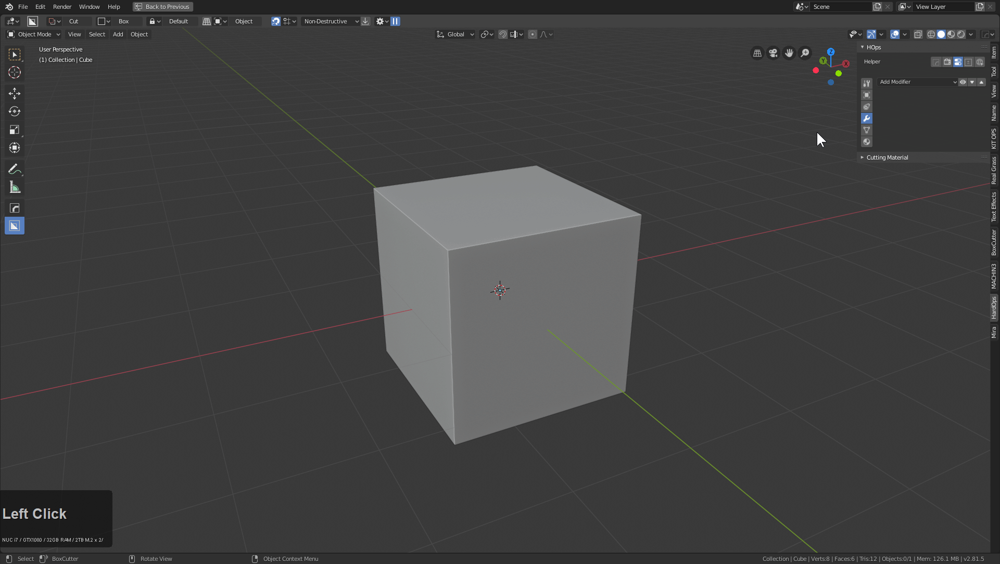

In this example I turned on only bevel sorting. Notice that when I used the boolean operation, the modifier for mirror was put last.

The down pointing arrow is for latest bevel sort. If you have more than one bevel more than likely you only want to deal with the highest level in order to cut with an independent bevel level.

## ctrl + ~ helper

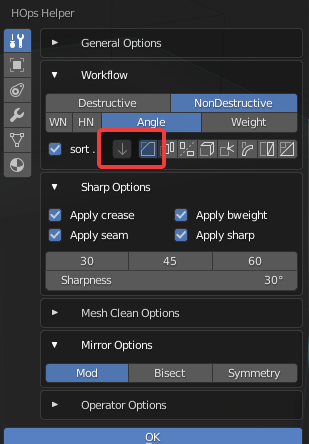

This is how I am able to cut on the final level of a bevel without affecting previous levels.
In this example the bevel angles are as follows.

- 30 degrees
- 60 degrees
- 60 degrees

If I use another 30 degree bevel it will detect the previous levels and cause mesh issues and possibly a crash. So this can be a delicate dance.

With mirror sorting the mirror will also be added to the end of the stack ensuring that the modifiers are always ordered in a way to keep working with booleans non destructively.

At the end of the last gif I added a Weighted normal modifier. This mod will always need to be at the end or else shading issues will occur. Turning it on will ensure the mod remains at the end when boolean operations are performed. It is best to turn that on when working with weighted normal.

> Multi- Bevel Sorting video

<iframe width="560" height="315"
src="https://www.youtube.com/watch?v=ZnyMUIilp6g"
frameborder="0"
allow="accelerometer; autoplay; encrypted-media; gyroscope; picture-in-picture"
allowfullscreen></iframe>

## Sort Gotcha w/ hShapes

Some of the new smart shapes will require certain mods be off in order to maintain stack order.
Lets look at the current smart bbox and scroll through its mods to see how it is made.

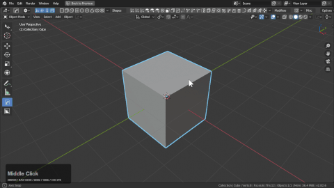

The mods on this box are as follows.

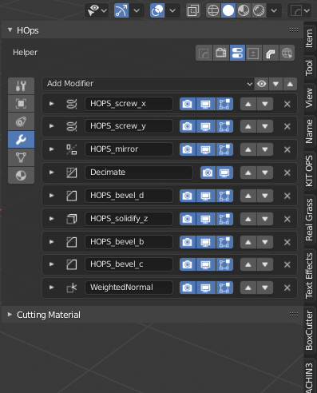

If we move / toggle the decimate mod this shape will be fundamentally changed. The decimate is needed for simplification and will cause issues.

To show that in action.

This is just to show that all situations can't be handled with sorting and at this time turning off sorting can also be of benefit to users.

Boxcutter also has a sort that must be taken into account. It can be found in either the topbar, n panel or D menu.

We aspire to expand sorting into something more expansive down the road but for now it will have to suffice for boolean operation.

___

# How do I apply a boolean I set up with Hard Ops?

Quickest answer. Apply the modifier. A boolean is just a modifier in your modifier stack. However this isn't the quickest or most recommended.

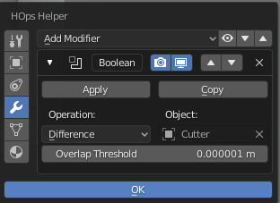

First lets set up a boolean and examine what is happening.

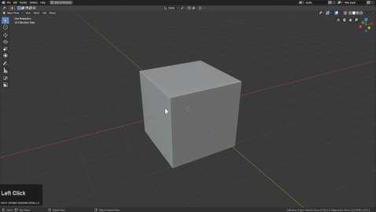

By pressing (ctrl + ~) or using the N panel or HOPS mini helper I am able to see the modifiers on the object via the helper. This can be an easy way to quickly see whats happening with an object in the 3d view.

From the helper you can apply like and modifier or apply it using csharpen which is one of the primary purposes of the behavior.

Csharpen is being used in the above example to apply the modifier as you work forward thus making the workflow faster and easier than going through panels and menus.

# How Do I Install Hard Ops / Boxcutter?

 [See Install](installation.md)

# Why is the add-on checker not working?

The recommended addons will show checkboxes when the supported plugins are present.

This can have issues if the naming is different than what it is looking for.
BoxCutter for example requires the folder is named "BoxCutter"

If the naming is not exact this will cause issues. Just rename the .py to resolve the issue.        

The naming is as follows.       

- [Boxcutter](https://gumroad.com/l/BoxCutter/)     
- [kitops](https://gumroad.com/l/kitops)     
- [mira_tools](http://blenderartists.org/forum/showthread.php?366107-MiraTools)     
- [meshmachine](https://www.blendermarket.com/products/MESHmachine)
- [Group Pro](https://gumroad.com/l/GroupPro/)
- [bms](https://gumroad.com/l/bezier_mesh_shaper)
- [power_snapping_pies](https://github.com/mx1001/power_snapping_pies)
- [DECALmachine](https://gumroad.com/l/DECALmachine/)       
- [Batch Operations](https://gumroad.com/l/batchops)        

This can be an issue to some however it is recommended to just check the folder naming. We are currently looking into improving it but it was intended to be a quick checklist to assist with troubleshooting.

To troubleshoot further you also can run the following command in the scripting area of the scripting tab.

**bpy.context.preferences.addons.keys()**

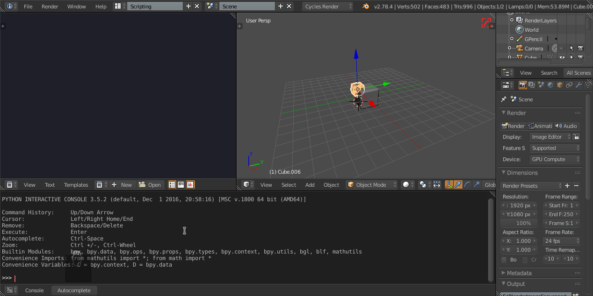

This will show a list of all the add ons present. This is how we troubleshoot this area when the plugin detection is not working.

___

# Why am I having issues when I boolean certain areas?

see [boolean tips](tips_boolean.md)

___

# What is Cstep / step?

In short.

**Cstep** - cstep is an [sstatus](sstatus.md) for baking bevels while keeping a bevel modifier active for new intersectional bevelling.

**step** - bakes bevels while adding a bevel modifier back to the mesh for new bevelling.

[See Step](step.md)

___

# Why is my mesh hidden when I step?

Step hides the mesh when used. See [How does step work technically](step.md)

  - press alt + h to unhide mesh
  - press h to hide mesh

# Can I get out of Cstep?

Absolutely. Q >> meshtools >> sstatus reset

> **q >> meshtools >> status reset** will reset any mesh back to a default state. Causing the Q menu dynamic options to also be default instead of cstep oriented.

___

# Why is it called Step / Cstep / Ssharpen / Cssharpen?

The naming made sense at the time but the functions are best described like so. Someday the tools will be unified into something more logical however in the meantime we needed some sort of terminology for naming.

When I was originally writing a book about modelling I found myself saying repeatedly:
tab >> editmode >> select sharps >> mark sharp >> mark seam >> mark crease >> mark bevel weight

Over time I just simplified it into that for my own sake however after they became tools the names just stuck.
Since it's version 9, changing names might confuse actual users just to appease people who possibly are not even using the tool nor plan to.

___

# Help! Why doesn't this add-on show activated in the add-on checker!

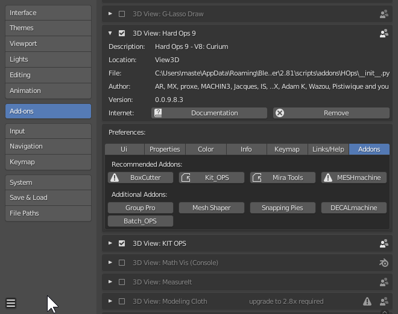

By using this line in the scripting area of blender you can see all the add-ons  activated.

**bpy.context.preferences.addons.keys()**

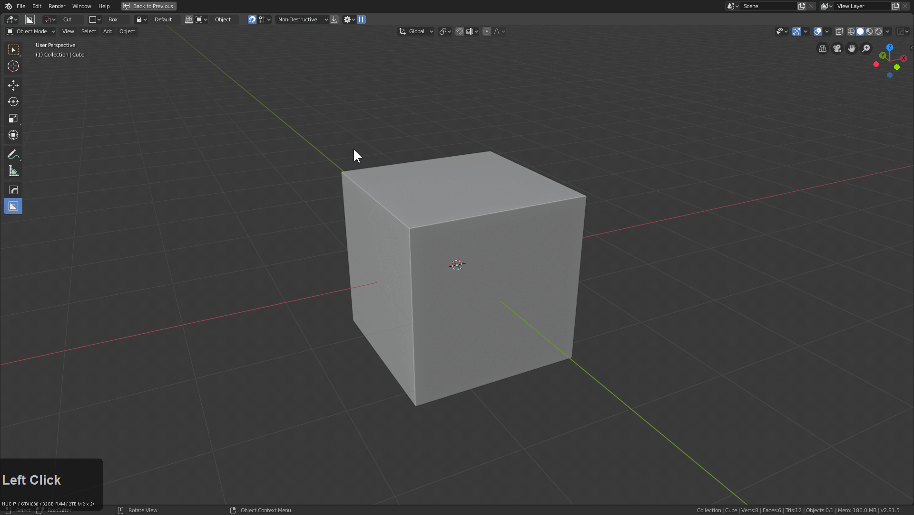

The Boxcutter add-on folder requires the naming be "BoxCutter"

You can also find the foldername in the addon file area.

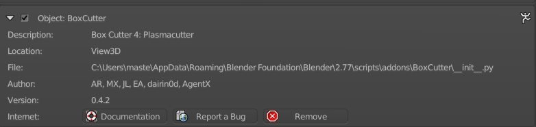

This is how it would be fixed in the add-ons directory.

Mira tools also is the same way.

In my add ons folder it is just called mira_tools. For this addon it can get complicated since the naming is rather specific.

I must add that the add on checker doesn't really matter. It was attempted to be a convenience thing. However some issues that users find with it is due to the naming.

___

## Mira Tools

# Why doesn't curveStretch show up in the Q menu?

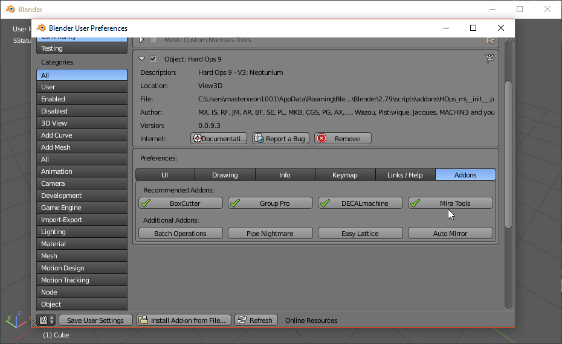

Check the add on preferences for Hard Ops under the add on tab. If Mira tools is not enabled you must download and install it.

[Mira Tools](https://github.com/mifth/mifthtools/archive/master.zip) /
[Thread](https://blenderartists.org/forum/showthread.php?366107-MiraTools)

If mira tools is not enabled the icon next to the button will show an error.

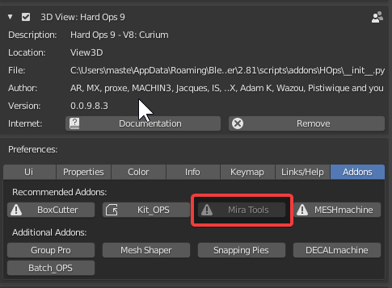

The below example shows how installing it and enabling it allows HOPS to use it as well.

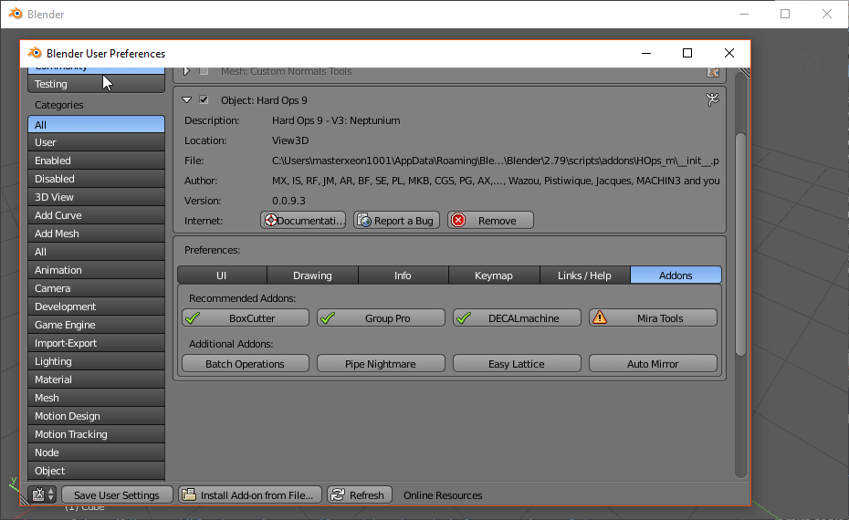

___

# What is the difference between [Hard Ops](https://gumroad.com/l/hardops/) and [Boxcutter](https://gumroad.com/l/BoxCutter)?

Hard Ops is a toolkit containing many tools for various tasks ranging from viewport adjustment, rendering, helpers and symmetrization and not to mention sharpening.

Boxcutter is only a cutter. It only cuts. The purpose of boxcutter is to cut via drawing.

One can't replace the other. They are supplemental to each other. Boxcutter is a small subtool when compared to the entirety of the hops suite.

___

# What is the difference between [Hard Ops](https://gumroad.com/l/hardops/) and [KitOps](https://gumroad.com/l/kitopspro)?

Hard Ops is a toolkit containing many tools for assisting users with getting all the way from cube to final result. It's our swiss army knife of modelling. [However back in 2016 I did discuss the implementation and our plans with it.](https://masterxeon1001.com/2016/01/05/hops0065update/)

A few things to note.
  - I took the idea for Insert Merging from Chipp in Moi and I left a comment about it.
  - now he's using Blender years later and we collaborated to make his system from Moi a thing in Blender but faster
  - the initial insert system of HOPS was just a means to an end. It was limited due to its simplicity which limited our expansion on it. One mesh merged and one mesh left behind.

KitOps is focused primarily on insert management into packs called Kpacks and the workflows of aligning them on surfaces and smart behaviors. This takes the behavior system of subsets and removes several steps and makes it an artistic process compared to before.

# What can [KitOps](https://gumroad.com/l/kitopspro) do that [Hard Ops](https://gumroad.com/l/hardops/) doesn't?

- manage inserts / allows for user created inserts
- merge multiple levels of booleans in order
- connection / disconnection live via smart selector
- thumbnail rendering and creation
- duplication / shift + r redo capabilities
- support for HOPS tools like interactive mirror and Qarray
- smart hiding of modifiers for quick modifications
- insert hiding via quick selectors in T panel
- auto scale system
- custom scale system
- auto grouping for quick selection
- inserts dont appear until mouse is over surface during insertion

and much more.

KitOps was made from the ground up to offer a faster and more user friendly experience than our initial offering in Hard Ops. With an emphasis on expandability.

[There is a free version available.](https://gumroad.com/l/kitops) However there are some restrictions since it is a demo.

Try it for yourself. [KitOps Videos](https://www.youtube.com/playlist?list=PL0RqAjByAphG7h2dzNXdbao1tTNgQYNwb) / [HOPS Red Insert Demo](https://youtu.be/xURxPGdAbjg)

The videos themselves should show the differences.
___

# How about [Meshmachine](https://gumroad.com/l/MESHmachine/)? How about that?

[Meshmachine](https://gumroad.com/l/MESHmachine/) is a different system going for something different altogether. And that't what makes it awesome.

Meshmachine began as a series of tools to make Machin3's life easier in edit mode but has introduced "Plugs". I cannot recommend his tool enough. I imagine the final version being unlike any tool we have seen before.

KitOps currently does nothing beyond connecting meshes to other meshes with booleans and even simple placement. As you know this can be inefficient and messy when combined with curvature. So planar surfaces are optimal for this if you are not skilled with cleanup and efficient boolean modelling.

[Meshmachine](https://gumroad.com/l/MESHmachine/) takes this in a brilliant new direction. With his inserts you will be able to not only merge them with any surface efficiently, but the normals and shading will be resolved as well. This is alone worth my recommendation for this product. Fuse, Refuse, Unf*ck, UnChamfer, and Boolean Cleanup are tools that fill holes in the workflow of concept mesh creation.

 [Meshmachine](https://gumroad.com/l/MESHmachine/) is poised to do great things but this workflow does come with speed compromises due to complexity.
 This shouldn't affect your decision but this is where Plugs and Kpacks differ. They are 2 very different delivery systems for 2 different circumstances.

Kpacks are intended to just be used as inserts with users having to deal with consequences and ramifications of poor placement or hotlining. And not to mention doubles and shading issues with bad geo.

Plugs will conform with the surface and heal the shading. They both have their place. But in short there is no doubt that we will evolve to meet the standards that [Meshmachine](https://gumroad.com/l/MESHmachine/) will set.

I recommend to use [Meshmachine](https://gumroad.com/l/MESHmachine/) and bring it into your workflow. Our goal is never to compete. If someone can do a better job why not expand on that.

___

# Why did my shading get messed up starting the cylinoid video?

<iframe width="560" height="315" src="https://www.youtube.com/embed/szrnUx_2_uk" frameborder="0" allowfullscreen></iframe>

In 2.8 the parameter "Harden Normals" was added to the bevel modifier. While it's capable of being useful for shading later in the model this can have issues with the start of the cylinoid video.

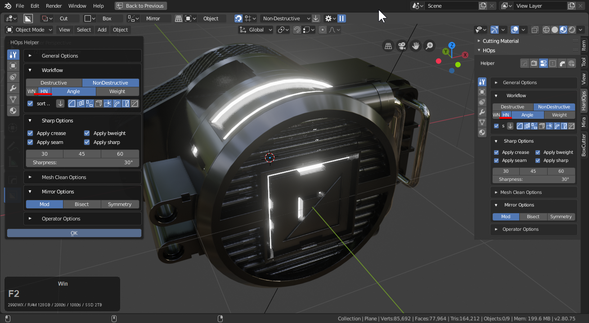

> The ctrl + ~ helper can allow users the change workflow or using the N panel.

This is what happens if the HN (harden normals) parameter is on.

The shading looks incorrect for the following reasons:

- harden normals is on making the normals look smoothing
- autosmooth is set to 60 and not 30.

Here is how I would fix it using the ctrl + ~ helper.
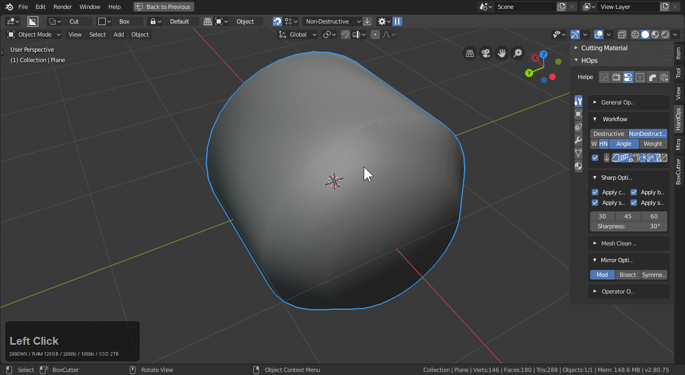

And here I am working on both the shading and the Harden Normal not being on.

This should not be an issue in the most recent update. 1 during bwidth will now fix the shading properly. We apologize for this being an entry level gotcha. Markets have been updated with this change. (9-6-19)

___

# How do I bake alpha maps / height maps from a Hard Ops model?

I assume you mean bake in substance painter or get normal / height maps.

Also I must add [DecalMachine has it's own system worth looking into for baking out decals to textures.](https://www.youtube.com/watch?v=YCUV8pS7MXQ)

If you wanted to be lazy you could make a version without bevelling and use x-unwrap on it to get some quick UVs.

Then export the bevelled as the high and the unbevelled triangulated as the low and with the correct settings you should be fine. However the best work is done by UVing and properly creating a low but workflows for hacking your way through exists.

And then exported.

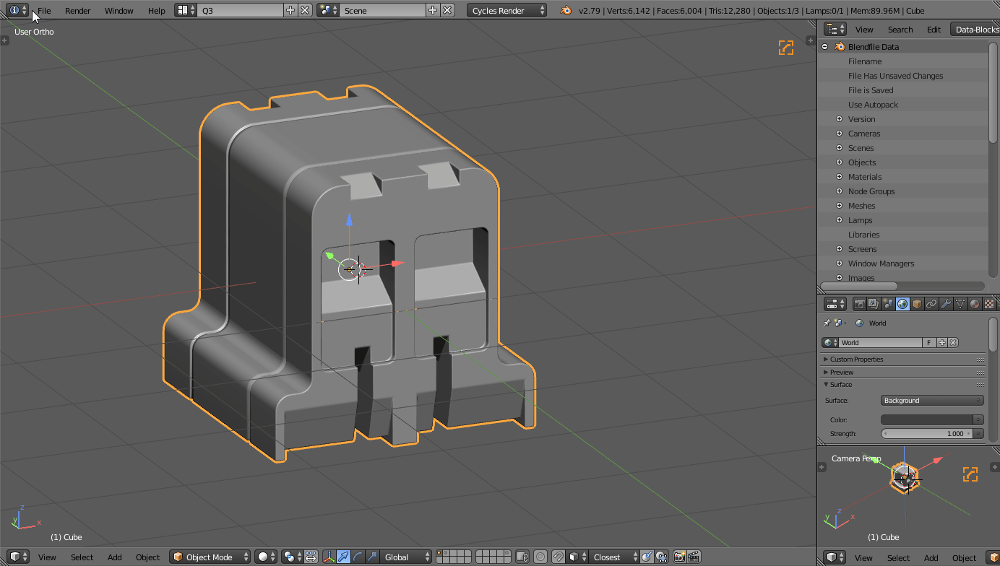

Xunwrap provided some UVs however you can also preview them using operations << UV preview.

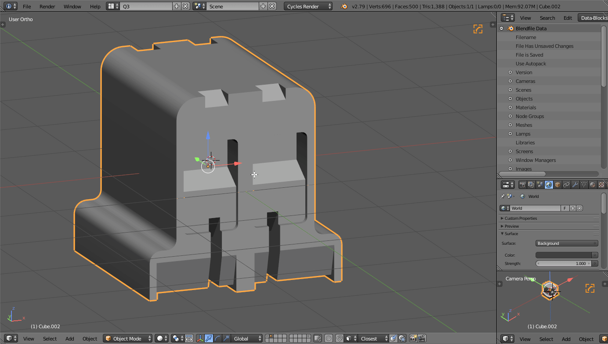

Now in substance painter I bring up the mesh and do a quick bake.

The UVs provided will do for such a boxy example however when inserts and material colors are present you will need to accomodate for baking ID maps and so on.

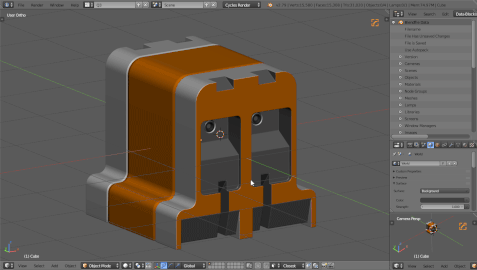

In this bake I'll up the res and allow a little AA to get a nice result.

As you can see from my IDs the material colors also baked into the low mesh.

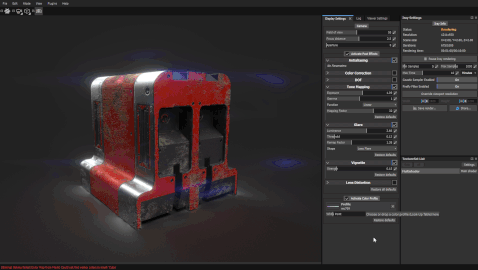

None of the inserts are present on the low. Its all just the bake. By removing the render and the filters and finally the layers you can see its the same low I used for the block in phase.

So the point of all this is to explain that a workflow exists however it is up to the preferences of you the user as to how you want to go about using the tools in your workflow.

The beauty of hard ops is you can use as much or as little of it as you need for your preferred workflow. But many of the tools are designed with particular workflows in mind.
___

# Obligatory Text

When it comes to having issues the first thing I'll recommend is updating. Theres a couple of ways to do that.

- [Buildbot](https://builder.blender.org/download)
- [Official](https://www.blender.org/download/)
- [Blender Update Utility](https://github.com/DotBow/Blender-Version-Manager/releases)
  - I like the update utility because it keeps Blender up to date and works well.
  - It's only for windows though.
  - [BlenderUpdater is also nice.](https://github.com/overmindstudios/BlenderUpdater/releases)

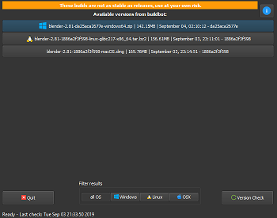

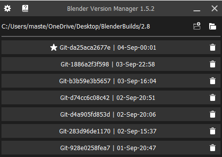

Anyways after having blender up to date comes ensuring you have the latest version.

Accessing previous orders.

- [Gumroad](https://gumroad.com/library)
- [Blendermarket](https://www.blendermarket.com/account/orders)
- [BM Support](https://gfycat.com/UnevenSmartGadwall)

When it comes to contacting us theres a couple of ways.

[Blendermarket](https://www.blendermarket.com/account/orders)

> Clicking that button will send us a message which can be easy.

[Gumroad](https://gumroad.com/library)

Responding to any email I send should come back to me. Believe me people use that alot.

>[Also I'm always on twitter so I can be messaged there as well. I probably post there the most. You can follow me for updates and occasional tips.](https://twitter.com/mxeon1001)

[Support Channels](https://thumbs.gfycat.com/FastInferiorGlowworm-mobile.mp4)

Boxcutter has a support button in the behavior panel. This will take you to our discord where we're haunted 24/7 with support issues.

hardOps has multiple help areas.

Below are links to the direct sales pages which you can access the product via being logged in.

Gumroad
- [hopsCutter](https://gum.co/hopscutter)
- [boxcutter](https://gum.co/BoxCutter)
- [hardops](https://gum.co/hardops)

Blendermarket
- [hopsCutter](https://www.blendermarket.com/products/hard-ops--boxcutter-ultimate-bundle)
- [boxcutter](https://www.blendermarket.com/products/boxcutter)
- [hardops](https://www.blendermarket.com/products/hardopsofficial)

Artstation
- [hopsCutter](https://www.artstation.com/jerryperkins1447/store/D7aM/hard-ops-boxcutter-ultimate-bundle)

___

# Hello I am a student / child / woman / former-lover / hobbyist / beginner. [Can I get a discount on the product?](https://gumroad.com/l/hopscutter)

No.

We keep our prices low to keep the entry low. The sales of our product go to paying programmers, paying for blender to keep improving and ensuring the tools evolving. We pride ourselves on our willingness to reinvest into the growth of Hard Ops / Boxcutter. This is 24/7 operation to us and we love working late nights, holidays, birthdays and family events on this tool to ensure you have the best experience in Blender for concept creation.

Please buy it.

___

# Hello, I would like to use [hopsCutter](https://gumroad.com/l/hopscutter) w/ [Heavypoly config.](https://youtu.be/aQKUCjTRzTk)

Love me some Vaughn Ling. [We are honored to have him using b3d.](https://gumroad.com/l/blender_for_conceptart/fb?fbclid=IwAR2xJgcejNvvcBMrUD3OP3NXhT55yAvO4grc_Gyw2CNNoNdve6hVCpeZWcw)

If you want to use [HeavyPoly](https://www.youtube.com/embed/aQKUCjTRzTk) scripts together with [Boxcutter/HardOps](](https://gumroad.com/l/hopscutter)) you will need to do these steps for them to work together:
Transcribed from: Utopies Selectives on the [HeavyPoly Discord](https://discord.gg/rcxU94J)

[HeavyPoly install:](https://www.youtube.com/embed/aQKUCjTRzTk)

<iframe width="560" height="315" src="https://www.youtube.com/embed/aQKUCjTRzTk" frameborder="0" allowfullscreen></iframe>

The following is the guide on how to get hopscutter working with [HeavyPoly](https://www.youtube.com/embed/aQKUCjTRzTk) config.

1. You open your Hpconfig blender, go in preferences/keymap and export your key configuration.
2. For your new Blender setup,  you put all of the HPConfig files like usual except the config folder (The problem doesn't come from the plugins).
3. In that new blender you go to preferences/keymap, import the old keymap
4. you need to move your windows around to get the user interface similar (if you want) and then you are good!

**ALSO**

5. if you want the text file with the shortcuts, you go in your HPconfig Blender,  in the text editor tab, you choose save as to extract the file from the config,
6. you load it in your new blender! easy peazy.

You can now install Boxcutter and hardOps to your liking.

7. Save the new  config by going into File/Defaults/Save Startup file "

For more assistance on this please consult with [the HeavyPoly group who has many members](https://www.facebook.com/groups/heavypoly/) enjoying hopsCutter.

___

# How does your tool stack up against ~~Insert Tool Here~~ ?

To say, why us? In three words:

- [we love Blender](https://fund.blender.org/)
- [useful](https://twitter.com/ArtFromRachel/status/1189186158254641153?s=20) [for anyone](https://www.pinterest.com/masterxeon1001/hard-ops-users/)
- one time purchase
- free updates forever
- one button system
- reduce your keystrokes
- [number one tool](https://blendermarket.com/posts/jerry-perkins-on-creating-hardops-for-blender-keystrokes-and-clicks-are-my-enemy)
- [working since 2015](https://youtu.be/L_HT_D9eDpI)
- [3dArtist Magazine 99](https://www.instagram.com/p/BLRfjG0AJE2/)/[101](https://www.instagram.com/p/BNflOC1gMnQ/)

[Personally](https://www.instagram.com/p/BDQKup8E25J/), [I have been 3d modelling since 2010 in Blender 2.49.](https://masterxeon1001.com/2015/06/01/introp1/) All the experience and knowledge we have learned over the course of our 3d careers have went into these tools and continues to. The team working on the tools has experience in multiple areas of 3d ensuring the approaches are well rounded in various aspects and come from a point of understanding. To us: not only does the function matter, the connection of the function to subsequent functions is also taken into consideration. We care about how the tool is configured and used before, during and post operation. Workflow and key reduction is why these tools exist in the first place. The customizable behavior of our toolset ensures we will work with anyone of **any level or disability**. Much care ,thought and planning goes into every aspect of the tools we make. Our commitment to resolving customer issues and remaining proactive with updates is next to none. The product you purchase we can only assure is a **one-time purchase** and that any **future updates will be provided free of cost**. Not a day goes by where these tools aren't discussed, planed-on or under the knife in search of the next level of what we endeavor to achieve.

To describe each of our tools briefly:

- [Boxcutter was created to be a concept cutter drawing utility](https://gumroad.com/l/BoxCutter) and we intend to make it the best one.
- [hardOps is an all encompassing toolkit aiming](https://gumroad.com/l/hardops) to be the most essential Blender utility for all aspects of working.

To elaborate more:

- our tools are in use by a large amount of [AAA game / film and design studios](https://medium.com/embarkstudios/a-love-letter-to-blender-e54167c22193)
- User interface is offered via [panels, pies, topbars, menus and popups.](https://boxcutter-manual.readthedocs.io/en/latest/getstarted/)
- hardOps / boxcutter were designed from the ground up intending to allow users to work full screen without UI or interruption
- [Boxcutter was completely re-written for 2.8 with the new possibilities in mind.](https://boxcutter-manual.readthedocs.io/en/latest/#history) Every tool was then dissected, examined and has now been in the process of re-entry resulting in a stronger product.
- [self.cut (using itself as a cutter)](https://www.youtube.com/watch?v=k60evWExwVQ) only boxcutter is capable of this.
- [modifier sorting was one of the first radical innovations we implemented with 2.8.](https://hardops-manual.readthedocs.io/en/latest/sorting/) With this system in place tools are able to synergize with each other and seamlessly allow users to continue working without interruption.
- [Boxcutter](https://boxcutter-manual.readthedocs.io/en/latest/getstarted/) and [hopsTool](https://hardops-manual.readthedocs.io/en/latest/hopsTool/) were 2 of the first active tools by us in 2.8 with our contemporaries still being unable to catch up yet. Even the topbar is something we use uniquely and continue to attempt to push forward.
- Boxcutter currently [supports edit mode live with the ability to start destructive and shift non-destructive mid operation](https://boxcutter-manual.readthedocs.io/en/latest/edit_mode/) which is as crazy as it sounds.
- Boxcutter's [drawing aesthetic was systematic designed and redesigned to provide the most visually pleasing out of box experience which cannot be matched. Shapes fade in gradually and fade out with customization and user experience in mind.](https://boxcutter-manual.readthedocs.io/en/latest/fade/) Even sound has been added experimentally to provide additional entertainment capable for babies and adults alike.
- Boxcutter [is capable of using any mesh as a cutter.](https://boxcutter-manual.readthedocs.io/en/latest/shape_custom/)
- hardOps began as a macro system for hard-surface and booleans but expanded into systems encompassing everything from object, edit, sculpt, and even grease pencil mode. Over the course of it's development, smarter minds have taken concepts much farther accomplishing more than we could have individually.
- hardOps contains essential tools for any selection ranging from [mesh, meshes, lattice, curve and empty.](https://hardops-manual.readthedocs.io/en/latest/getstarted/)
- hardOps even has a Q menu for reference images allowing transformation and transparency adjustment.
- Even the code of our tools is intended to be an educational journey of solving various programming issues in python with users able to read and find out various ways to approach and solve problems.
- hardOps allows users to assign [materials via hotkey](https://hardops-manual.readthedocs.io/en/latest/hotkeys/#alt-m-material-menu), [model destructively using dots](https://hardops-manual.readthedocs.io/en/latest/hopsTool/), and even [adjust modifiers just in the 3d view](https://hardops-manual.readthedocs.io/en/latest/meshtools/#modifier-helper-ctrl) without having to exit full-screen.
- proceeds of the products continues to go towards keeping the products continuing to grow and evolve. This was the foundation of the tools and ensures continual talent pushing the boundaries of what is possible. [We also support the blender fund ensuring future growth.](https://fund.blender.org/)
- some of the most brilliant minds in b3d have assisted over the creation of the tool. Even the icons are lovingly designed by our own Adam Krol.
- [on learning materials comments and upvote downvotes are allowed and considered important for user interaction. No support issue is ran from and will get you working no matter the position we are in.](https://www.youtube.com/playlist?list=PL0RqAjByAphEUuI2JDxIjjCQtfTRQlRh0)
- [3rd party support connecting and working with multiple tools.](https://hardops-manual.readthedocs.io/en/latest/meshtools/#plugin)

Competition is expected and we welcome it since it validates concepts and furthers our endeavors of bringing awareness to bevel, boolean and general workflows while also following in the vision of Blender itself. We hope users experiment with both our tools and others and help coordinate how they can best work together. In the end competition benefits you the customer since it brings about the best via competition. In the end I suppose the only thing that separates one tool from that one is the person in charge of making it happen and guiding its development. I pride myself on finding the right person for the job because I want only the best results for my users. Our goal is to make Blender and modelling more entertaining by giving more control back to you the user with less UI and panel overflow to allow for focused thought and execution.

Due to our tool's usage in schools, studios and general 3d places of work we test tools daily to ensure they work with both the current and most up to date versions of Blender. Even unto the future [**we try to review commit logs and curtail issues**](https://twitter.com/blenderlogs) users will face and provide silent updates without fail ensuring consistent working as expected of a commercial product.

Over the years support has been streamlined to a fine point as well. I pride myself on giving prompt responses and taking any support issue into consideration for future enhancements. Anytime I leave the house I am geared up to maintain a 24/7 support network extending to all customers. Even user created [art is lovingly currated into a gallery and can be found and added using the #hardops or #boxcutter](https://www.pinterest.com/masterxeon1001/hard-ops-users/) hashtag.

hardOps started off a [small idea](https://www.dropbox.com/s/xki8i94y0syt85a/HardOps%20Guide.pdf?dl=0).

<iframe width="560" height="315" src="https://www.youtube.com/embed/L_HT_D9eDpI" frameborder="0" allow="accelerometer; autoplay; encrypted-media; gyroscope; picture-in-picture" allowfullscreen></iframe>

We're committed to making Blender easier without obscuring what makes it great. And it is with great pride that we can [continue to fund blender at every level.](https://fund.blender.org/) And it is the customers that make this possible. Our goal is to make customers glad they chose us by multiplying the value they invest in us and work hard and without tire to assist them in gaining more value from their 3d endeavors by making their lives easier.

___

# Are you planning to add something like ~~Insert Feature / Tool~~

We make our tools based off what is needed, not to just copy others. The vision of what we endeavor with our tools remains the same. Tools are built on an as needed basis. Our goal is to make fine art and reduce keystrokes while also solving issues users might face. I have always said that if someone else is doing it right, why bother? Not unless it can be improved and innovated.

Mirror is an easy example:

- in older hops we used Automirror (for bisect), MirrorMirror (2 object mirror), and HOPS itself had symmetrize.
  - this required 2 additional tools to do all 4 functions needed in a general workflow.
- [Interactive mirror is a consolidation of all of these systems into 1 tool / 1 hotkey](https://hardops-manual.readthedocs.io/en/latest/mirror_symmetry/)
  - now this style of mirroring is the standard way interactive mirroring is approached
  - Mirror now supports Bisect, Modifier, Symmetrize, and 2-Object Mirror in a single tool.

When it comes to pipes there are many pipe tools available freely:

- [piperator](https://www.blendernation.com/2019/10/29/free-blender-addon-review-piperator/)
- [pipe nightmare](https://blenderartists.org/t/pipe-nightmare-0-3-33/682448/69)

  > Pipe Nightmare was actually made by our own [ProxeIO](https://twitter.com/proxeIO) which caught my attention for getting him to work on the team. [Prox is currently the lead on Boxcutter and is an integral member of the team.](https://proxe.io/) To be honest I want pipe nightmare to be a connected tool in BC. Making pipe volumes with a simple draw. It could already be a thing by the time you read this. Proxe recently brought back [pipe nightmare](https://blenderartists.org/t/pipe-nightmare-0-3-33/682448/69) for use in the future and to get working in 2.8.

However, these pipes don't play a primary role in our art internally. So at this time I can't state future plans. It always is dependent on if we can improve upon the idea and take it in a different direction while continually evolving it. Or even if it is a [popular request](https://blenderartists.org/t/hard-ops-thread/).

[We visited pipes previously in HOPS](https://www.youtube.com/watch?v=z-hnCtUQYJM)

<iframe width="560" height="315" src="https://www.youtube.com/embed/z-hnCtUQYJM" frameborder="0" allow="accelerometer; autoplay; encrypted-media; gyroscope; picture-in-picture" allowfullscreen></iframe>

[Hard Ops Q menu - curve system](https://hardops-manual.readthedocs.io/en/latest/menu_system/#q-menu-for-curves)

Also in boxcutter we explored ideas for procedural cutters involving pipes and plating.

<iframe width="560" height="315" src="https://www.youtube.com/embed/qvgwnUzEuwQ?start=1994" frameborder="0" allow="accelerometer; autoplay; encrypted-media; gyroscope; picture-in-picture" allowfullscreen></iframe>

Someday we hope to expand on the idea of procedural custom cutter creation but that should give you a better idea of where our minds are at on the topic.

___
