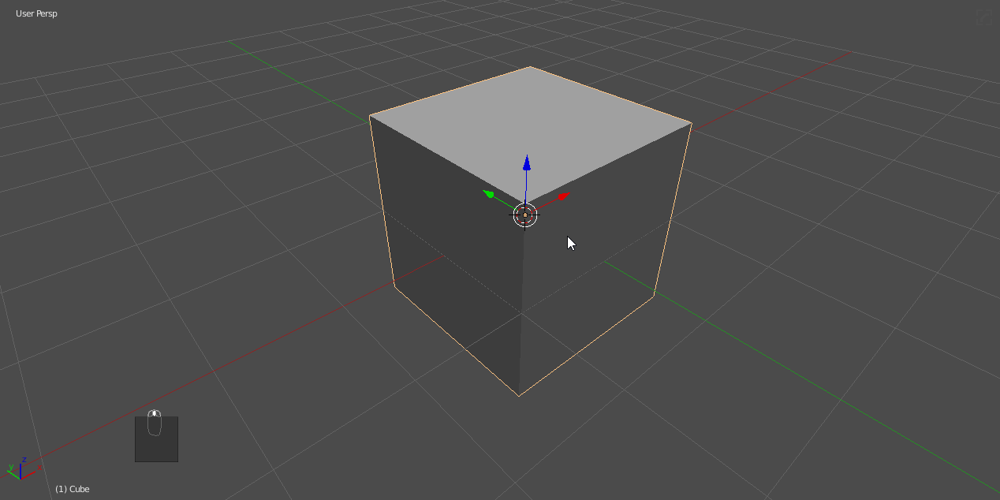
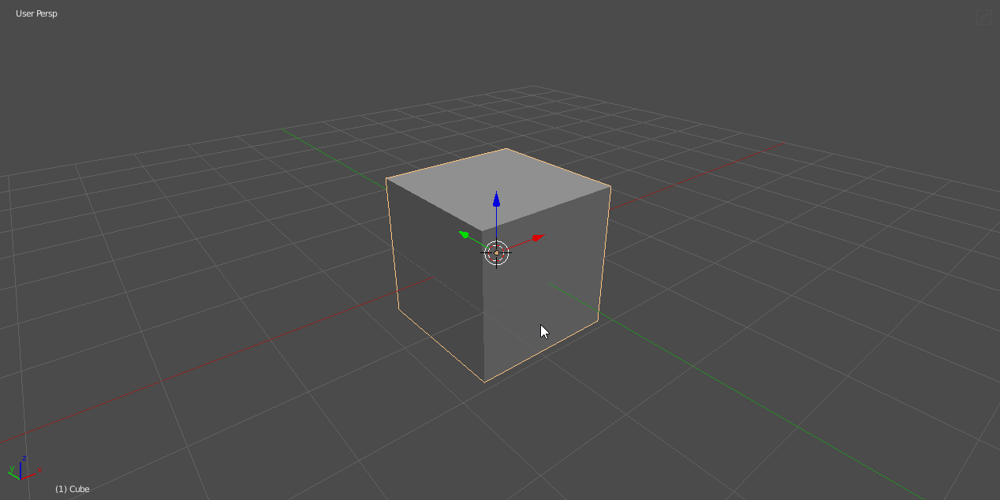
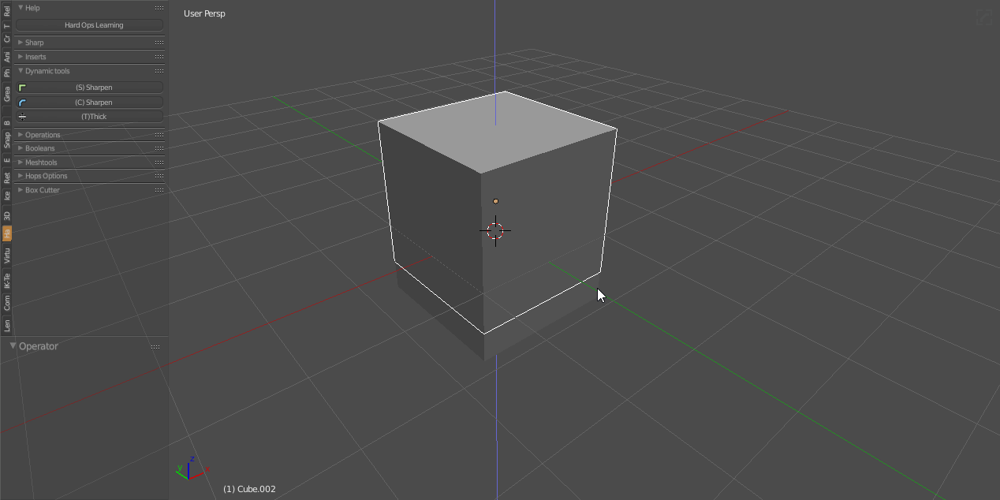
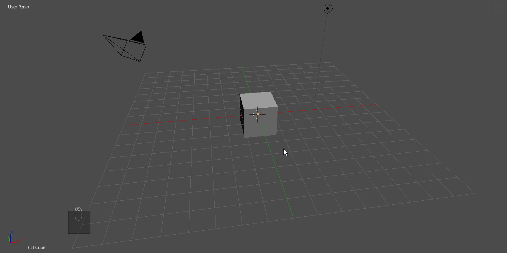
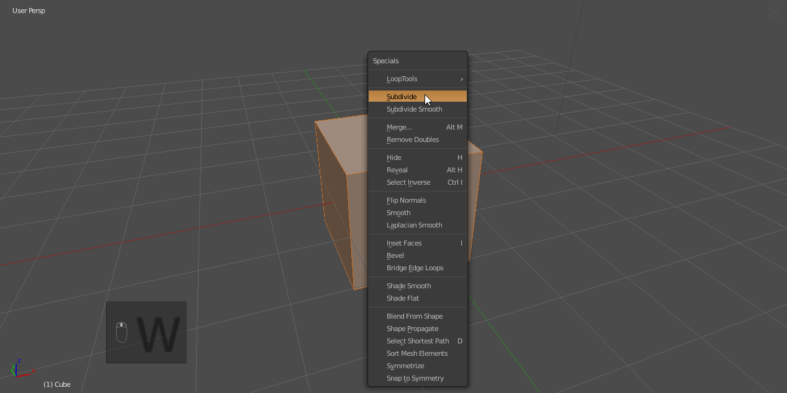
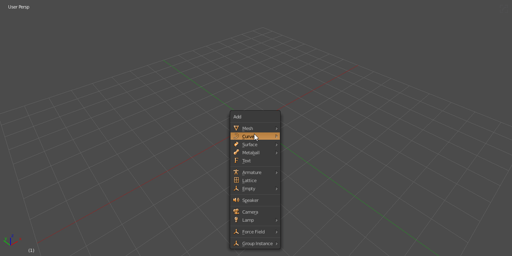
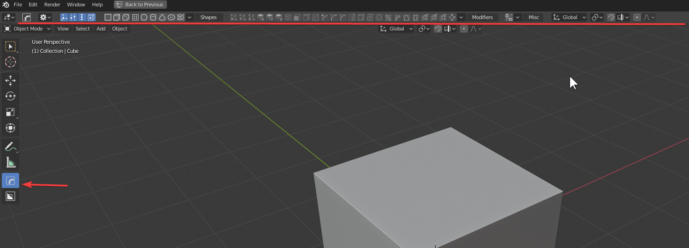

### Getting Started With Hard Ops

Hard Ops can be brought up one of 4 ways. Not to mention the active tool.

## <kbd>Q</kbd>  - Menu

Pressing <kbd>Q</kbd> will bring up the Hard Ops <kbd>Q</kbd> menu.

> The first options will always be dependent on context most of the time.

We'll be going over the options later in depth. See [options](options)

## Shift <kbd>Q</kbd> - Pie Menu

Pressing <kbd>shift</kbd> + <kbd>Q</kbd> will bring up the Hard Ops pie menu. Designed and maintained by [AR](https://twitter.com/AdrianRutk0wski/)

The pie menu is the same as the <kbd>Q</kbd> menu. Icons are not in the pie menu due to speed issues but is the same format of options as the <kbd>Q</kbd> menu. The options change based off of context.

## <kbd>N</kbd> - <kbd>N</kbd> Panel / Mini Helper

In the vein of most plugins Hard Ops also has a <kbd>N</kbd> - panel for options that can be useful for beginners or those who like seeing all the options all the time.

Even in the examples I have a hard time using the <kbd>N</kbd> panel. Pressing <kbd>Q</kbd> is just so fast.

---

## <kbd>Q</kbd> Menu Option Types

The <kbd>Q</kbd> menu options are not just for meshes.

**Camera <kbd>Q</kbd> - options**

- options for lens / depth / dof / target and even set active cam

**Lattice <kbd>Q</kbd> - options**

- simplify will change all the x/y/z parameters of the lattice to 2 simplifying it for large form changes.

**Curve <kbd>Q</kbd> - options**

- 1 curve will allow you to do a 3d taper and set the spans around and along the curve.
- 2 curves will allow you to do a curve taper and set the 2nd curve to the 1st curve as a taper object.

---

## [hopsTool](https://youtu.be/0qx_hOrW1C8)

> Hotkey: <kbd>Alt</kbd> + <kbd>Shift</kbd> + <kbd>W</kbd>

> [with boxcutter installed and surface toggle **off** the hotkey is <kbd>Alt</kbd> + <kbd>W</kbd>](https://boxcutter-manual.readthedocs.io/en/latest/preference/#enable-surface-toggle)

HardOps version 983 introduces the first active tool of Hard Ops called hopsTool. We intend for this tool to provide a simple ui to assist with modifier management for non destructive modelling in the 3d view. Designed by AR and enhanced for released via collaboration hopsTool is the first active tool of HardOps and serves as a nice playground for non destructive modelling.

[hopsTool](hopsTool.md) was added as of version [00983](https://masterxeon1001.com/2019/09/01/hard-ops-00983-update-log/).

hopsTool can be started via the **Tpanel**. Once started the [topbar](https://twitter.com/mxeon1001/status/1123820309168177154) will populate with items.

Here is an example of merging a cube into a vert then making a simple non destructive object.

Scrolling through the modstack can be useful for troubleshooting as well.

