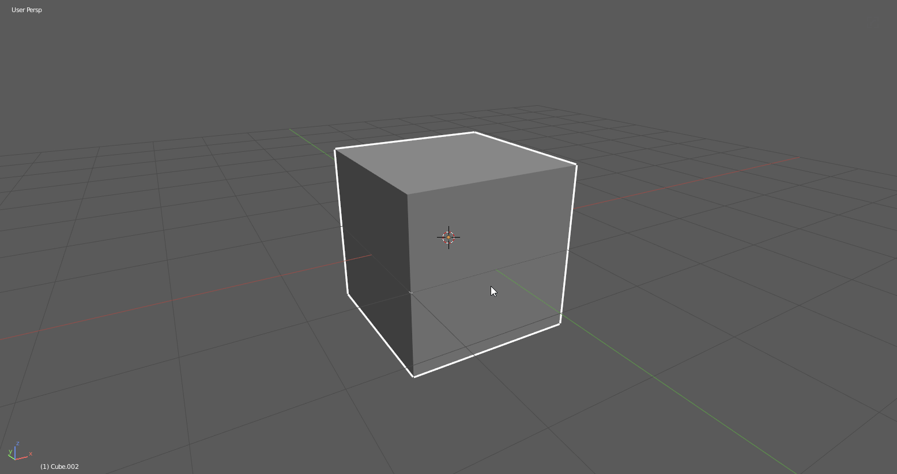
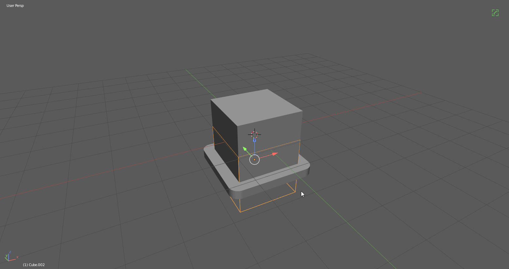
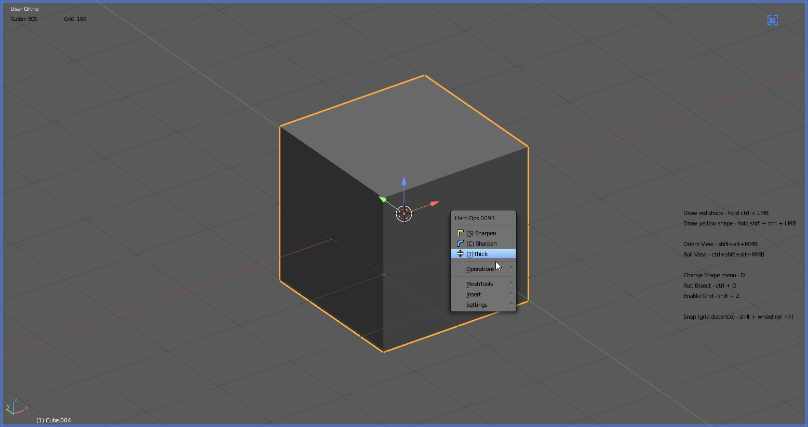
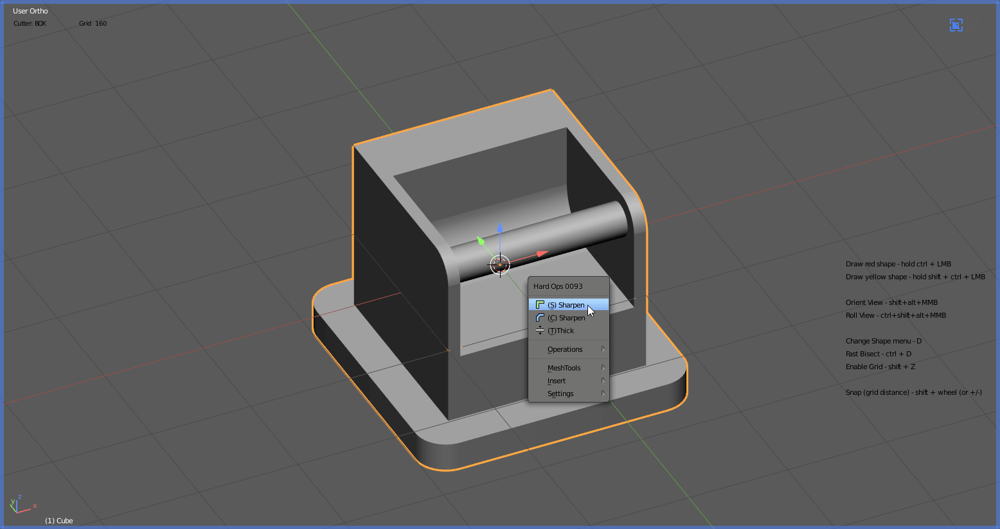
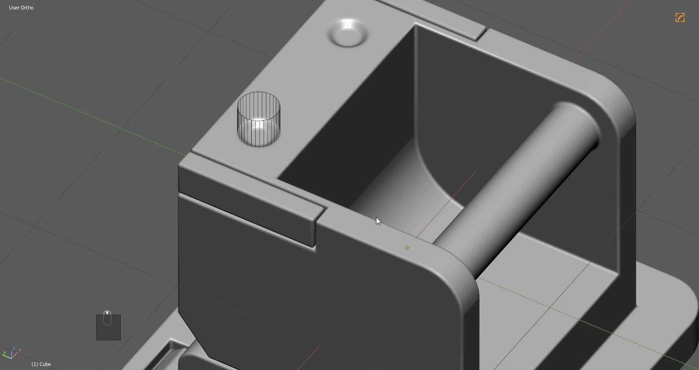
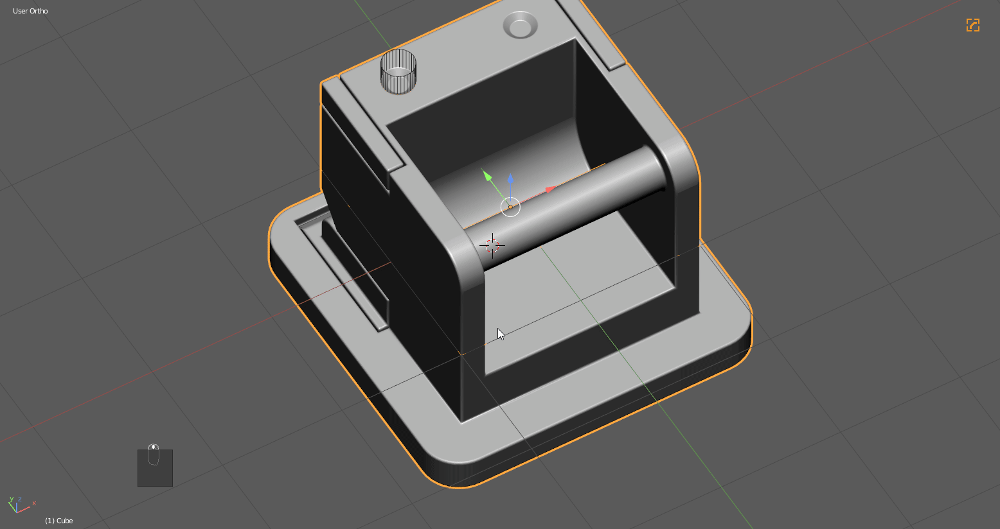

# External Tutorial Notes
Artists in the community have also started making content on Hard Ops. I will be trying to document them as well as they pop up.

---
## [Tutorial: Creating a game ready SciFi corridor (Part 1) // Blender / HardOps / Substance Painter (By: Alejandro Gorgal)](https://youtu.be/zBrCDsGfc2U)

I am always excited to see tutorials by users that are not by me. Hearing how others approach the tool helps me better to understand how to make it work best for the most people.

Alejandro is a pro in my eyes so theres no notes from me. Just watch the video! 

## [Admin area WIP (By: Alejandro Gorgal)](https://www.youtube.com/watch?v=DKx8Pi4v6wc)

This posting by Alejandro was amazing and a breathtaking result. I was in awe when I first saw this posting.

<iframe width="560" height="315" src="https://www.youtube.com/embed/DKx8Pi4v6wc" frameborder="0" allow="autoplay; encrypted-media" allowfullscreen></iframe>

---

## [Blender Hard Surface Tips : Hardops (By: Jayanam)](http://www.youtube.com/watch?v=ltuD1wg9MoE)

Jayanam did a [video](http://www.youtube.com/watch?v=ltuD1wg9MoE) about [HOPS 0093](https://gumroad.com/l/hardops/). I wanted to add a few notes on it as well as add it to the [docs](https://hardops-manual.readthedocs.io/en/latest/).

- By using x-sym you could put a loop on the origin on the x. That would save 6 keystrokes for removing the corner nodes

- ssharpening objects before booleans can work well

- with bwidth pressing A will turn on Adaptive mode which is an alternate dynamic bwidth that will add segments as needed based off of scale.

- sometime you should try the following. hops boolean >> q >> tthick. Its pretty nice to use as well.

- try adding an edge before booleans sometime it makes the result much more predictable.

- Also lowering the bweight of certain selections will allow users multiple levels of bevel weight within the same model.

- By enabling pro mode in H9 prefs, you have an additional edit mode option called demote. It will clean the sharps enough for manual bevelling with ctrl + B.

---

## [Hard Surface : Boxy #1 | Speedart (By: Olen)](https://youtu.be/iC2fxg0HX_I)

https://youtu.be/iC2fxg0HX_I

I'm not going to even go over a timelapse. But fortunately it is narrated so I found it enjoyable. But if I had some tips for this user...

[Olen](https://www.twitch.tv/olensonssimon) also has a [twitch](https://www.twitch.tv/olensonssimon) account which is where these notes come from.

- Clean mesh has a [helper](helper.md) area that allows for clean mesh to be refined to work on selections or only visible meshes. It can be a alot faster than ctrl + x on select edges

- Ssharp has an additive mode box allowing ssharp and therefore csharp to remove all sharps then calculate them. This was once a tool called resharp but now has been consolidated into ssharp and the other sharpeners.

---
