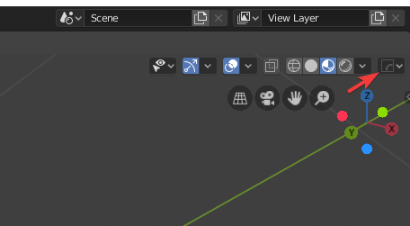
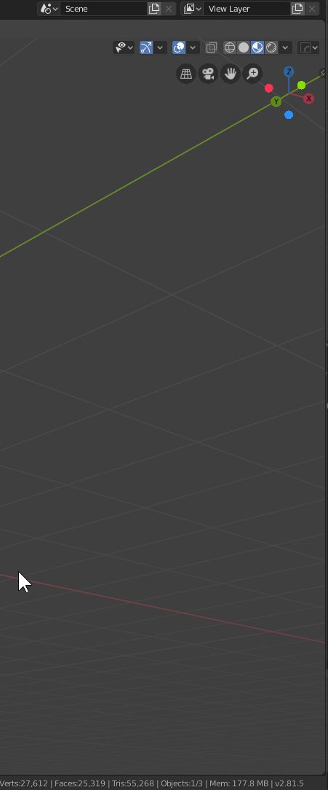
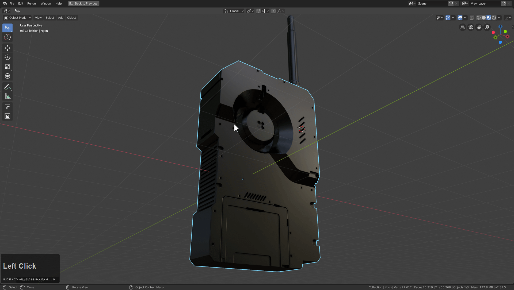

# Hard Ops helper / HOPS Helper (CTRL + ~) /

HOps helper is special Hard Ops menu with quick access to modifiers / materials and even and advanced section with mesh options and sharpening customization. This is also in the N panel to make it easier and more permeant.

This should make HOPS more approachable since the most important options can be found in multiple locations.

The Hops helper is one of the more beloved features in Hard Ops and fulfills needs that are required for full screen working.

You can call the helper by pressing **CTRL + ~** or use the HOPS button in the top right.

Or press N and use our N panel.

When I first started 3d I asked... could the modifiers be in the 3d view? I was told no. End of story...

### Modifiers Tab

This tab lists the modifers on the active selected object. You are also able to adjust / collapse / reorder / remove them.

There are also buttons up top for showing / collapsing / expanding all modifiers.

While the modifier helper is simple it has a complex purpose and comes in handy for quickly accessing settings related to modifiers and their existence.

### Materials Tab

The material tab is like the Modifier helper except for materials. With ver9 it now supports multiple shaders.

As of ver 8.7 there is also the Material Cutter.
With this you can specify a material for boolean operations.

The material cut extends into cslash and booleans.

### Workflow Tab

Last but certainly not least is the workflow tab. This is the top button of the helper and the most important.

This contains various misc Hard Ops related operations.

A brief description of the following sections.

- Sharps (configure sharpening information pre operation for added efficiency)
- Operator Options (configure boolean algorithm / adjust modal scale)
- Status  (change sstatus of mesh previous sstatus override)
- Mesh Options (smoothing / parenting / wire options )

The options are here because they are needed quickly and readily for situations requiring a special touch.

### Bevel helper

Pressing ctrl + shift + B brings up the bevel helper. This is a helper designed for making bevel management easier.

In the helper you can adjust every bevel present on a model.

As you can see the presets / full properties are also available

### Other Notes

Whatever you leave the helper on will be what tab the helper reopens on.
