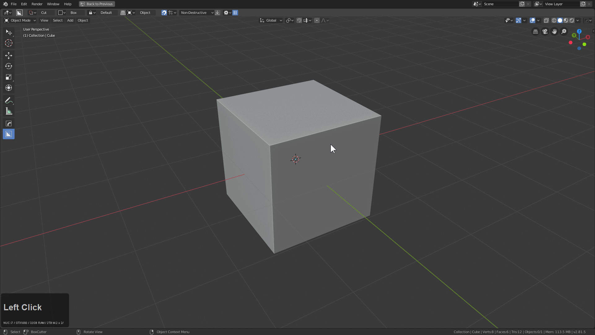
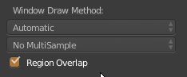
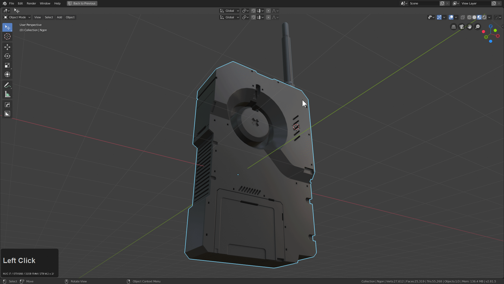
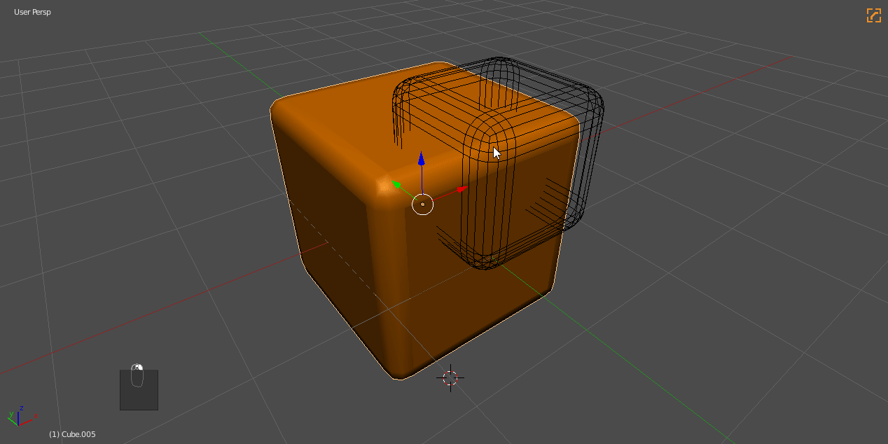

# Hard Ops helper / HOPS Helper (CTRL + ~)

HOps helper is special Hard Ops menu with quick access to modifiers / materials and even and advanced section with mesh options and sharpening customization.

The Hops helper is one of the more beloved features in Hard Ops and fullfills needs that are required for full screen working.

You can call the helper by pressing **CTRL + ~** with a mesh selected.

The HOPS helper requires window buffer options to work correctly in prefs / system.

When I first started 3d I asked... could the modifiers be in the 3d view? I was told no. End of story...

### Modifiers Tab

This tab lists the modifers on the active selected object. You are also able to adjust / collapse / reorder / remove them.

There are also buttons up top for collapsing / expanding all modifiers.

While the modifier helper is simple it has a complex purpose and comes in handy for quickly accessing settings related to modifiers and their existence.

### Materials Tab

The material tab is like the Modifier helper except for materials. With ver9 it now supports multiple shaders.

As of ver 8.7 there is also the Material Cutter.
With this you can specify a material for boolean operations.

The material cut extends into cslash and booleans.

### Misc Tab

Last but certainly not least is the Misc tab.

This contains various misc Hard Ops related operations.

A brief description of the following sections.

- Sharps (configure sharpening information pre operation for added efficiency)
- Operator Options (configure boolean algorithm / adjust modal scale)
- Status  (change sstatus of mesh previous sstatus override)
- Mesh Options (smoothing / parenting / wire options )

The options are here because they are needed quickly and readily for situations requiring a special touch.

### Other Notes

Whatever you leave the helper on will be what tab the helper reopens on.
