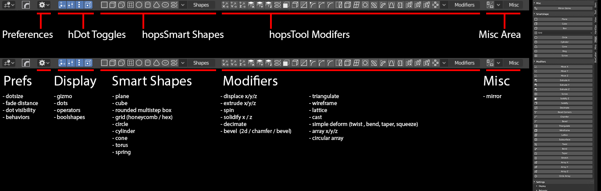
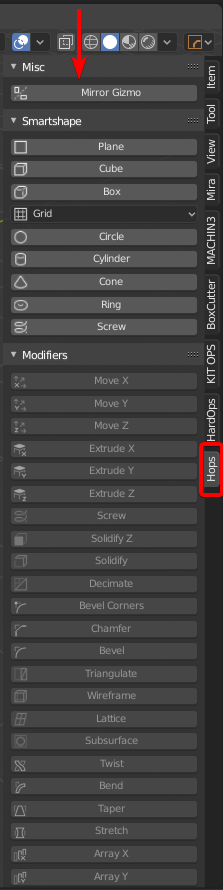
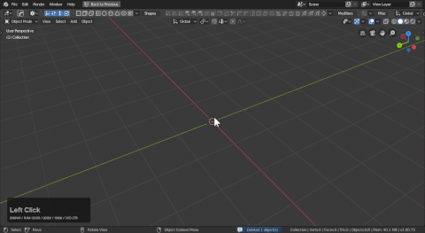

# hopsTool

> Hotkey: <kbd>Alt</kbd> + <kbd>Shift</kbd> + <kbd>W</kbd>

> [with boxcutter installed and surface toggle **off** the hotkey is <kbd>Alt</kbd> + <kbd>W</kbd>](https://boxcutter-manual.readthedocs.io/en/latest/preference/#enable-surface-toggle)

HardOps version 983 introduces the first active tool of Hard Ops called hopsTool. We intend for this tool to provide a simple ui to assist with modifier management for non destructive modelling in the 3d view.

When hopsTool is active pressing <kbd>ctrl</kbd> will show up dots that can be adjusted for quick manipulation on the fly. Clicking the dot brings up the modifier for fine edit.

If boxcutter is not installed the hotkey is <kbd>alt</kbd> + <kbd>shift</kbd> + <kbd>W</kbd>.

If boxcutter is installed then hopsTool is swapable with <kbd>alt</kbd> + <kbd>w</kbd>.

hopsTool also adds a nifty little n panel toolbar.

# Breaking down the UI

hopsTool is primarily able to be used via the topbar.

[hopsTool will need the topbar to show.](https://twitter.com/mxeon1001/status/1123820309168177154)

- Behavior - like boxcutter a behavior panel exists to fine tune behaviors before operation
- Display - options dictating what shows when <kbd>ctrl</kbd> is held.
- hShapes - procedural shapes for users to insert and get started with
- Modifiers - add modifiers on the fly w/ adjustable dots for certain ones
- Misc - mirror is the only option here for now.

You are also able to simplify the topbar.

Clicking a dot will bring up the modifier panel for the specific modifier. This can come in handy for tuning or fine adjustment.

---

# Color Coded dots

Prefs now exist to color the dots in case users need to customize the look of hopsTool.

Radial array was consolidated into one dot which makes it easier to adjust and control on the fly.

> This change also prevents array active tool from working for adjusting distance. However this will be fixed in the future.

---

# Boolean dots

While hopsTool is active users can select 2 objects and hold <kbd>ctrl</kbd> to bring up boolean dots.

- cut
- join
- slice

are available at this time.

Boolshapes also get their own dot which is where the view can get cluttered quickly.

Fade distance can be adjusted if needed and booldots can be turned off if they are getting in the way.

---

# Radial Dots

Radial dots have now been consolidated into one for simplicity.

---

## Non-Destructive stepping

Using the [hopsTool](hopsTool.md) you can stack up bevels easily in the viewport.

There are 3 bevel icons in the topbar. All with special purposes.

-  corner bevel (intended for planes and vertice beveling
-  chamfer (bevel w/ 1 segment)
-  rounded bevel (3 segments default angle 30 / <kbd>ctrl</kbd> + click angle 60)

To showcase each in action.

In this mode holding <kbd>ctrl</kbd> shows modifier dots. LMB clicking one shows the modifier information.

Levels can be added very quickly this way.

Also working this way is possible using the <kbd>Q</kbd> menu add modifier system.
A few things to note:

- first bevel can be an angle 30 or 60
- second bevel cannot be an angle 30 or else it will catch the first bevel
- bevels from here on are 60 and above to keep simplicity.

The gif shows me adjusting bevels that aren't showing to set up levels I did moments later. Also the shading was incorrect due to not holding <kbd>shift</kbd> as well as <kbd>ctrl</kbd> to set it to 60 and not 30. But this is a good example of how the angles can work against you if you aren't mindful.

___

# Things to know

## The topbar can be simplified

## <kbd>ctrl</kbd> + <kbd>shift</kbd> clicking dots allow for alternative modification.

Bevel dot adjusts the width but <kbd>ctrl</kbd> + <kbd>shift</kbd> allows for segment adjust.
The info text up top lets users know whats being adjusted.

On screw <kbd>ctrl</kbd> + <kbd>shift</kbd> left click dragging adjusts the steps in screw

Simple deform also gets dots for making large adjustments on the fly.

When using hops tool w/ boxcutter and racking bevels the <kbd>ctrl</kbd> + add mod behavior adds a mod at 60 degrees which is smoother for going to box city.

## The <kbd>N</kbd> panel can display your modifier stack so get in there and look at the mods.

## If you get confused about how a shape is constructed just mod scroll it.

# [How did you do the curved wall demo from the 00983 trailer?](https://youtu.be/0qx_hOrW1C8) [from FAQs.](faq.md)

At this moment in the trailer I showed a curved wall.

<iframe width="560" height="315" src="https://www.youtube.com/embed/0qx_hOrW1C8?start=36" frameborder="0" allowfullscreen></iframe>

This utilizes spin with curve deformation. It was a happy little accident.

To showcase setting it up in action:

- moved the plane held <kbd>ctrl</kbd> for increment snap
- <kbd>ctrl</kbd> + <kbd>A</kbd> applied location
- deleted one point to make it an edge
- duplicated and separated one vert with <kbd>P</kbd> for making the object w/ same origin / rotation
- converted main shape to curve after bevelling
- extrude (spin) the vert shape then <kbd>ctrl</kbd> + <kbd>P</kbd> (curve deform) to the curve

> Curve deform rarely works out the box so some adjustment may be needed.

This can result in an interesting setup for completion of the asset.

To extend on the previous example:

# Extrude uses the spin axis at 0 to extrude.

This means that the best shapes for extrude are 2d ones. For some context this is the normal screw modifier:

This one spins the object around in a 360 degree axis. This can be useful for making cylinders non-destructively.

Extrude will extend the 2d shape via 0 axis spin. This results in a nice edge extrusion on a shape.

This can come in handy for lathing forms around curves.

- <kbd>ctrl</kbd> + <kbd>P</kbd> >> curve deform was used to deform the object around a curve
- <kbd>alt</kbd> + <kbd>x</kbd> was used to mirror and create a watertight mesh and hiding the seam
- clicking a dot will bring up the modifier stack for tweaking.

> When using the spin modal pressing 3 will use extrude as the mode instead of spin.

---

# Building from a vert

Collapsing a cube to a vert and using handles to guide spins and then add mirroring, decimation, solidification, and 3 levels of bevels can be a fun way to wrap your head around the process.

# Tire Design

By adding a displace, screw and solidify a rim can be made in short time and be dynamically adjustable.

<iframe width="560" height="315" src="https://www.youtube.com/embed/PtNJs5iWjKk" frameborder="0" allowfullscreen></iframe>

# Braided Cable Design

For this example I started with a curve. Then did the following.

- converted to mesh with <kbd>ctrl</kbd> + <kbd>a</kbd> >> visual geometry (fastest way to make mesh)
- <kbd>alt</kbd> + <kbd>j</kbd> (adjusted max shape size in the F6)
- hopsdot wireframe mod then adjusted the dot
- <kbd>ctrl</kbd> + double clicked the dot for fine preference adjustment.

Then I undid until I had the original curve. And pasted the future object back to it so there was an inside shape.

> In retrospect I should have duplicated but undo is nice when it works.
