### Essential Hotkeys

## What is tilda or ~?

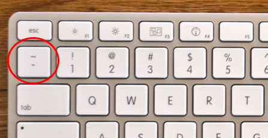

## HOPS Hotkeys

# Q / Shift + Q - Menu / Pie Menu

These are the core of Hard Ops and are the intended  method for choosing and finding functions for Hard Surface Operations.

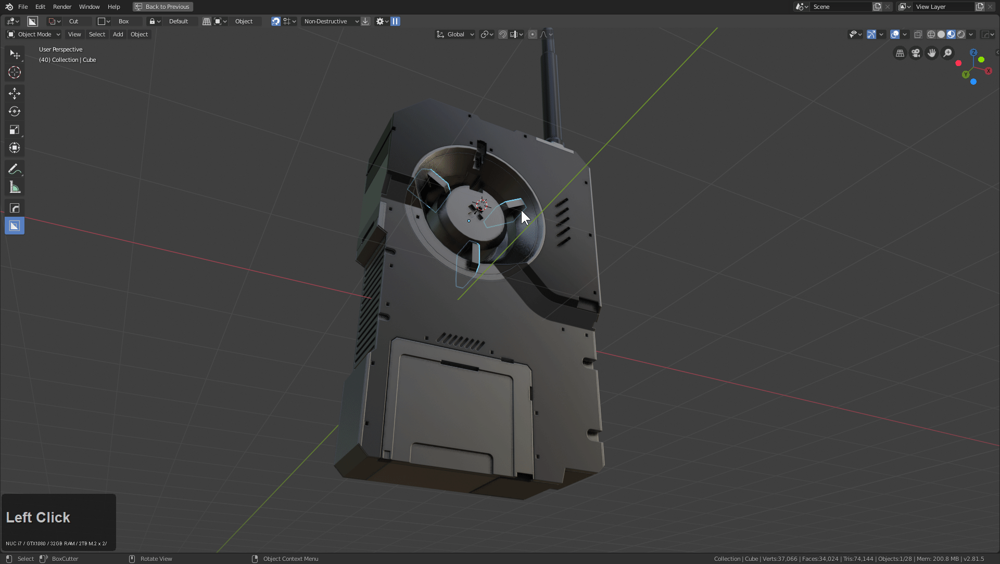

# Ctrl + ~ - HOPS Helper

The HOPS helper is a series of helpers for using Blender quickly in fullscreen.

The Helper is used for working most aspects of 3d.

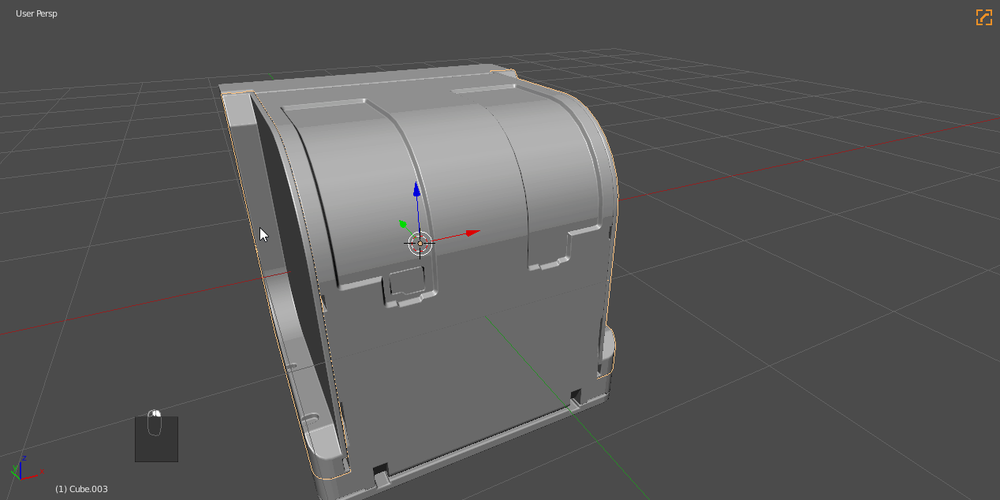

The Hops helper is one of my favorites in Hard Ops and has it's own page.

See [HOPS Helper](helper.md)

# Alt + shift + W hopsTool

see [hopstool](hopsTool.md)

# Alt + ~ - [Mira](https://github.com/mifth/mifthtools/tree/master/blender/addons/mira_tools/) Helper

**[Mira](https://github.com/mifth/mifthtools/tree/master/blender/addons/mira_tools) Tools must be installed**

Mira Tools has been a favorite tool of mine for the longest. Curve Stretch remains one of my favorite tools and as a result we have added a front end to as well.

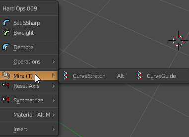

In this example I will use the hotkey Alt + ~

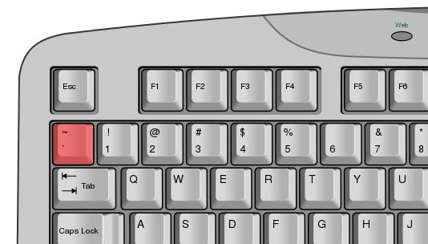

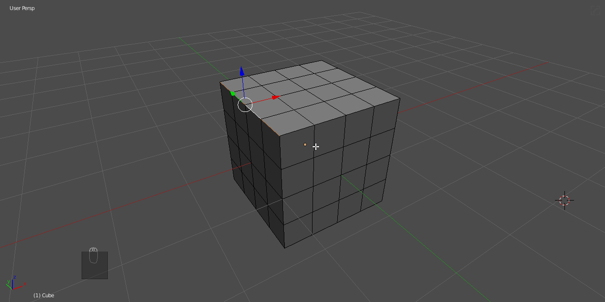

# Ctrl + Shift + B - Bevel helper

The bevel helper can come in handy for making quick bevel adjustments on the fly.
For this to come up the bevel must already be present.

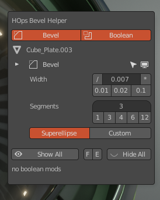

In this example I'll build a shape and then add multiple bevels to adjust in the helper.
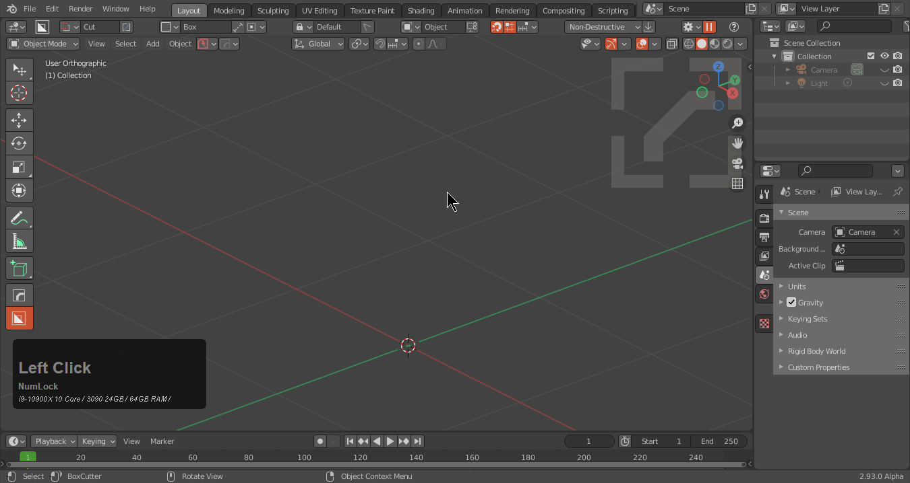

The bevel helper will already show up in the mini helper and N panel if bevels are present.

Even though I could adjust the dots I could also use the helper for the multiply divide controls.

# Alt + M - Material Menu

The material menu was a happy accident that showed much potential in the click and go workflow of Hard Ops.
This will assign a material to the selection with a list of shaders in the scene.

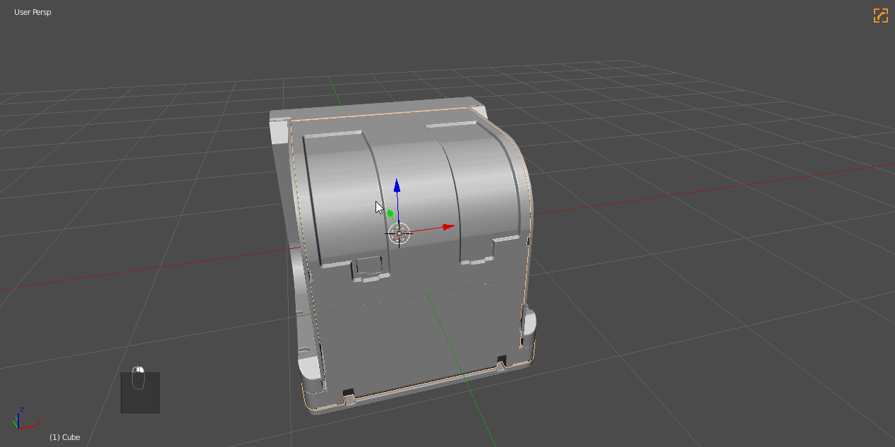

**NO MATERIALS COME WITH HARD OPS**

# Alt + V - Viewport Menu

Alt + V has options for simplifying the viewport and is useful for quickly adjusting the viewport or render scene.

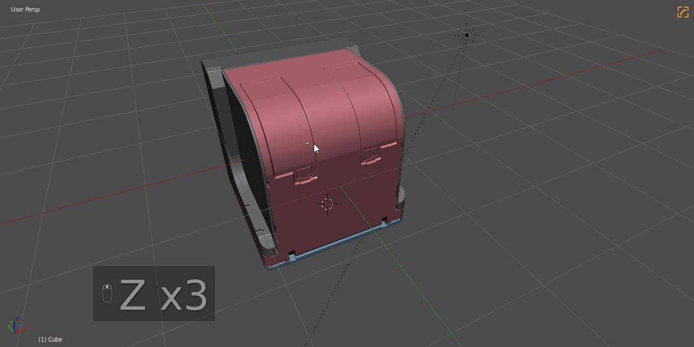

# Ctrl + Numpad (-/+//) - Boolean Operators

Booltool started a revolution when it showed a quick way to get quick booleans non destructively and without many clicks or hotkeys. Over time the tool evolved far beyond its initial use and is no longer being developed by the same person. So in the end we built a simpler version in HOPS that has the drawing and is more aligned to the workflows utilized in HOPS.

>  Booltool is no longer needed for HOPS. If enabled we will respect its hotkeys and allow its usage alongside Hard Ops but that is not recommended.

When it comes to Hard Ops there is more than one way to perform a boolean operation.

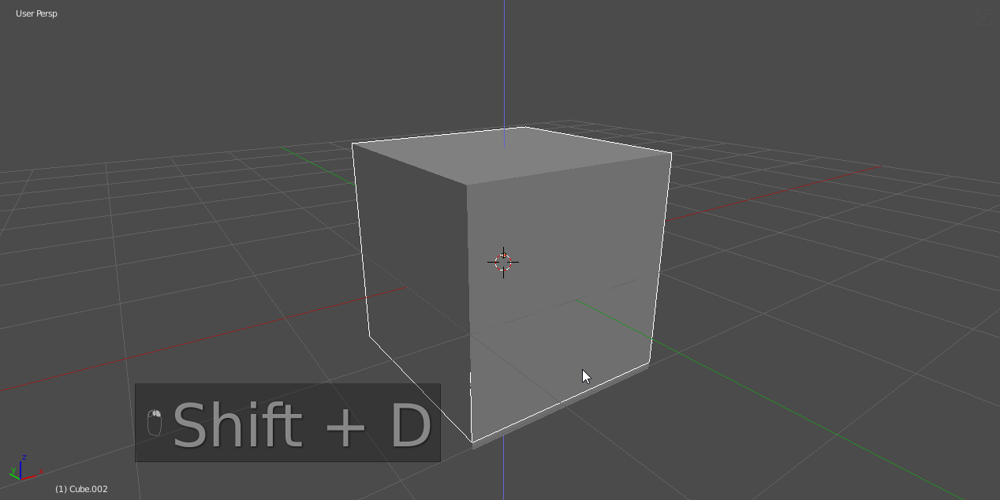

The HOPS Boolean hotkeys are as follows.

- CTRL + NUMPAD Minus - Cut

- CTRL + NUMPAD Plus - Add

- CTRL + NUMPAD Slash - Cslash / Cut and split

[It is also worth mentioning that you can also use hopsTool dots](hopsTool.md) for boolean operations which can also be quick.

# X Mirror Tool - (Alt + X)

Hard Ops interactive mirror is alt + X. This represents the final solution in mirroring with Hard Ops and requires no 3rd party plugins.

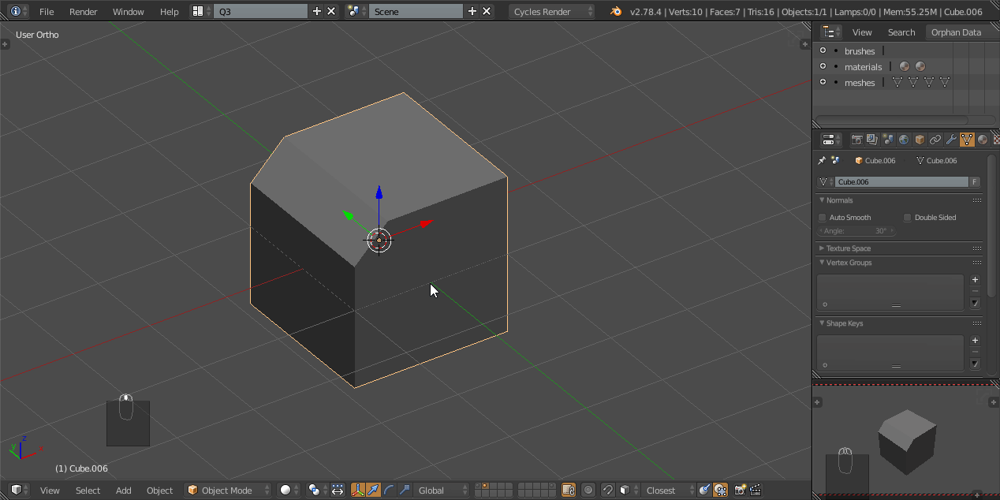

3 mirrors available

- Modifier / mirrors mesh and bisects it on a mesh level. This makes this optimal for booleans.

- Bisect / useful for symmetry modelling. Not for booleans. Can cause issues in boolean workflows but is optimized for tradititional mirroring pipelines

- Symmetrize / one and done. Symmetrizes to the other side without further issue or interaction needed.

---

## Manual Hotkeys

There are many hotkeys that I set manually in Blender.

# Select Boundary - (shift + ~)

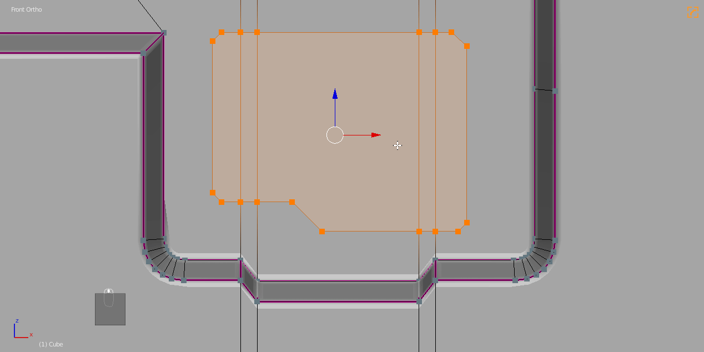

Select boundary will convert a selection to the edge perimeter. This can be useful if you need to bevel a boundary and add an inset. This is something I do quite a bit in my work and is essential.

Select Boundary is in the Select Menu at the very top. To set the hotkey I right click and choose to change shortcut.

# Mark Sharp - (ctrl + ~)

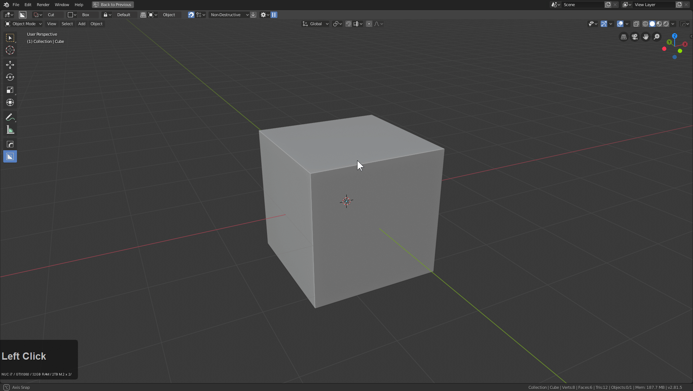

Marking sharps is essential in a Hard Ops workflow for fixing shading issues without bevelling or using mark ssharp in the edit mode Q menu. This is something that is only for edit mode. Ctrl + ~ in Object Mode brings up the Hard Ops Helper.

> Not setting this hotkey keeps ctrl + ~ as the helper in edit mode.

# Shortest Path - D / Also ctrl + left click by default in 2.8

I am quite happy with this function in blender and it comes in handy for selecting an area between two points. Sometimes when the edge flow is not optimal due to ngons or you want only a partial selection this option is for you.

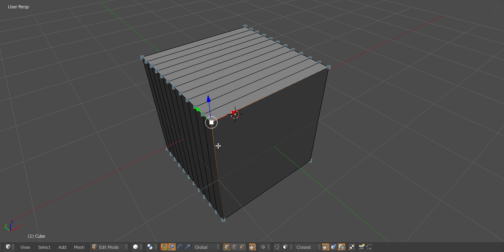

In the above image I located "shortest path" and right clicked it to set it to D and used it for a partial selection and then used the [Mira Tool](http://blenderartists.org/forum/showthread.php?366107-MiraTools) >> curve stretch to adjust that area. This is just one of the use cases but it's a custom hotkey worth knowing.
