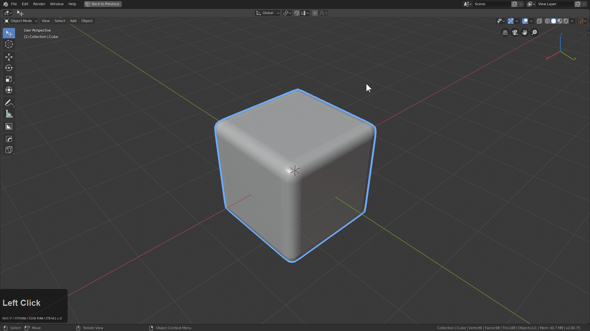

# Hard Ops HUD

Hardops recognizes a selected object's state, and based on that changes behaviors and usage.

Previously we had text doing this however the nature of this added additional text so now it is hidden behind a discreet logo.

It brings me great pride to say that now the button is integrated into Blender and is clickable.

If it fails to show the N-Panel is there for you.

___

### STypes

see [sstatus](sstatus.md)

Undefined - classic objects

CSHARP- applied after csharpen operator, indicates bevel workflow

CSTEP- applied after cstep operator, indicates multi bevel workflow

BOOLSHAPE - applied after a mesh becomes a boolean shape.

### HOPS Modal Strips

These are also part of the HUD system of Hard Ops and will show up during modal operations such as tthick / bwidth / qarray.

### Customization

Hard Ops wouldn't truly be a blender tool without the ability to change the color schemes used with Hard Ops in preferences.

