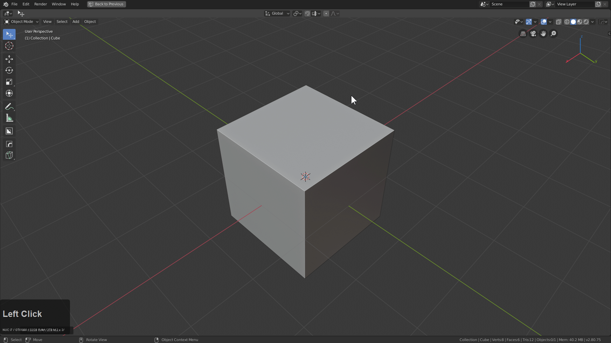
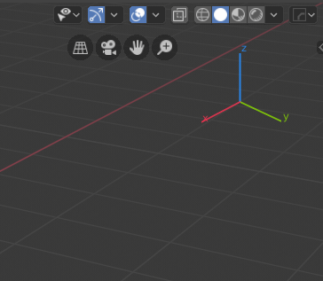
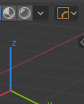
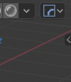
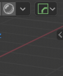
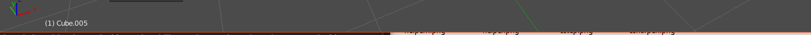
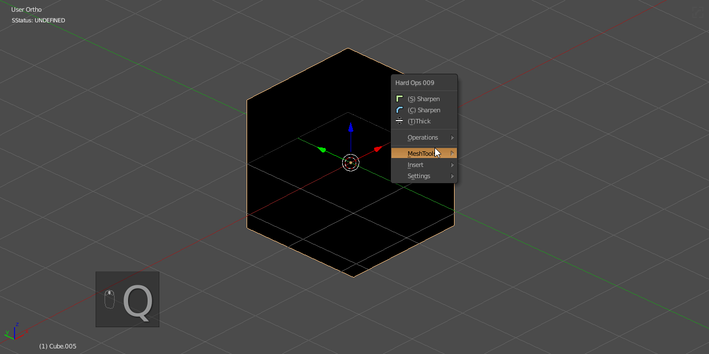
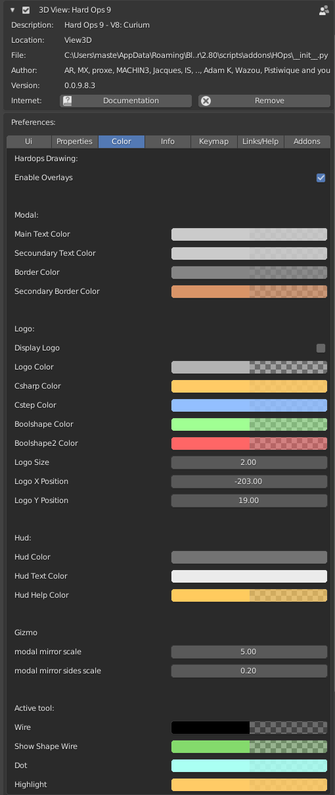
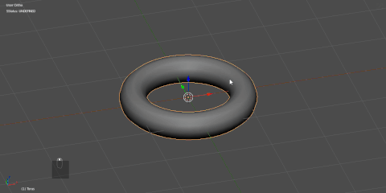

# Hard Ops HUD

Hardops recognizes a selected object's state, and based on that changes behaviors and usage.

Previously we had text doing this however the nature of this added additional text so now it is hidden behind a discreet logo.

You can still enable the text if desired.

There is even an option to have the text only show when Hard Ops is in use on the mesh.

___

### STypes

see [sstatus](sstatus.md)

Undefined - classic objects

CSHARP- applied after csharpen operator, indicates bevel workflow

CSTEP- applied after cstep operator, indicates multi bevel workflow

BOOLSHAPE - applied after a mesh becomes a boolean shape.

### Hard Ops Overlay

When using tools in Hard Ops most of them use a notification system also developed for HOPS. This was so the user can more readily know what is happening in the 3d scene.

### HOPS Modal Strips

These are also part of the HUD system of Hard Ops and will show up during modal operations such as tthick / bwidth / qarray.

### Customization

Hard Ops wouldn't truly be a blender tool without the ability to change the color schemes used with Hard Ops in preferences.

There is also a theme grabber for grabbing colors from the theme currently active.

I change themes periodically but all the themes I use are default in buildbot blender with the exception of [Amaranth](http://pablovazquez.org/amaranth/theme/)
