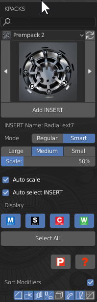

### Insert System

Inserts have been handed off to [Kitops from 2.8 onward.](https://gumroad.com/l/kitops)

For those who miss the inserts we do offer [classic inserts for Kitops ](https://gumroad.com/l/hopsclassicinserts).

# Kitops w/ Hardops

When kitops free or pro is installed a new button is added to the main Q menu.

Kitops can also be accessed from the mini helper. And the N panel kitops area not to mention the kitops N panel.

The hardops version of the kitops panel also has the mod sorting at the bottom for easier access than prefs.

