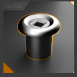
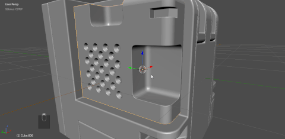
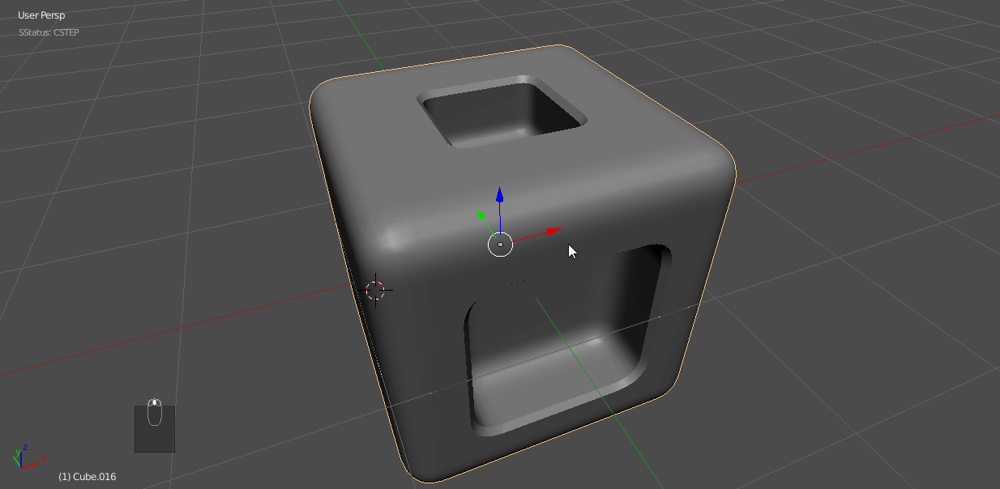
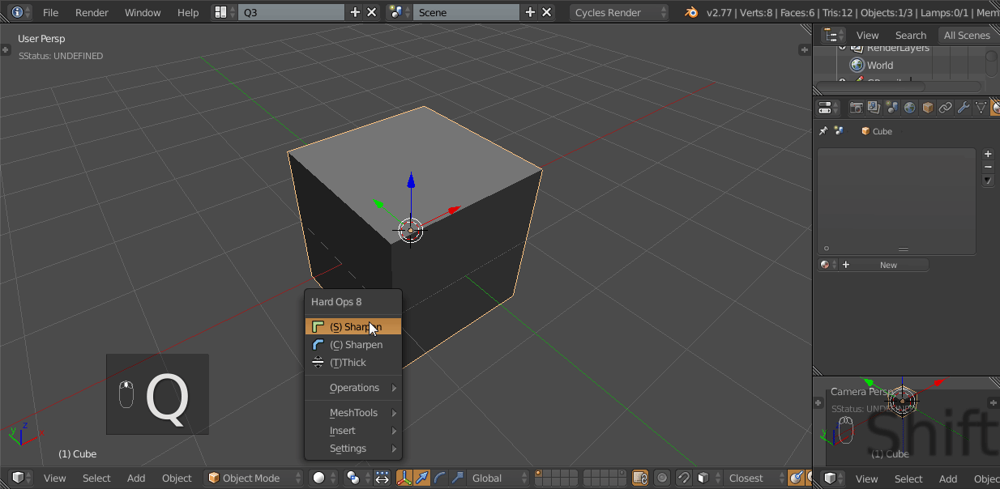
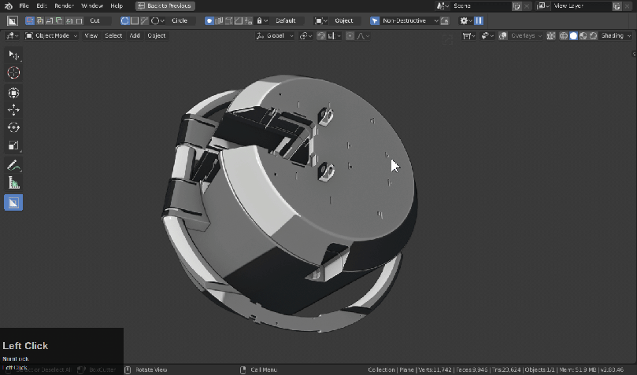

### Insert System

<iframe width="560" height="315" src="https://www.youtube.com/embed/IHjd-b9gtls" frameborder="0" allowfullscreen></iframe>

## What are the Inserts?

Hard Ops has an insert system for using premade meshes for quick greebling and detail work. It's intended to be used in a pinch when detail is needed quickly.

The insert system can be brought up via the Q menu via inserts and also has a top option for an asset scroller which allows you to cycle through assets.

___

## Insert Types

 Orange Inserts are just basic inserts. These are just meshes you place.

> Orange inserts can be inserted on a series of faces and can be scaled immediately after selection via a modal operation. This allows for scaling to perfection. It even sets the pivot points to individual origins so they retain their position. These work in both object and edit mode.

 Red Inserts are inserts made to be boolean cut into surfaces.

 Adjustable inserts are red inserts that can be adjusted prior to being applied.

>Red inserts also do not get inserted on faces. They always are inserted at the 0,0,0 of the 3d view. This is because they dont behave well being placed automatically due to the hook modifiers that the adjustable ones have. These inserts also have an AP that allows for surface snapping while also seeing the outside perimeter. This allows for precise placement.

## Red Inserts Details

> Red inserts are built up out of these 3 pieces.
  - AP or alignment plane (used for aligning the whole insert)
  - BB of BoolBox (used for the boolean to make room for the OB)
  - OB or Object (the object being inserted)

[Update Log Explaining Red Inserts ](https://masterxeon1001.com/2016/01/05/hops0065update/)

___

# Inserts / Materials Sharing

Inserts come with basic materials assigned. These are placeholders that are just indexes for materials that you would want to replace them with.

In this example I will add some inserts to a cube.

As you can see the materials have the .00X numbering due to them being subsequently added. If you select both inserts and go to the operations menu there is an option for Material Link.

This is here just for material localization however most of the time I replace these with the placeholders I have present and then use the shift + L >> material link.

This is one of the more hidden options however it was made for just this purpose.

---

## Additional Resources

This following pages are useful guides on how to approach detailing on Hard Surface design. It is recommended to make inserts small and use them sparringly and intentionally.

[Neil Blevens - Advice For Detail](http://www.neilblevins.com/cg_education/areas_of_visual_rest/areas_of_visual_rest.htm)
