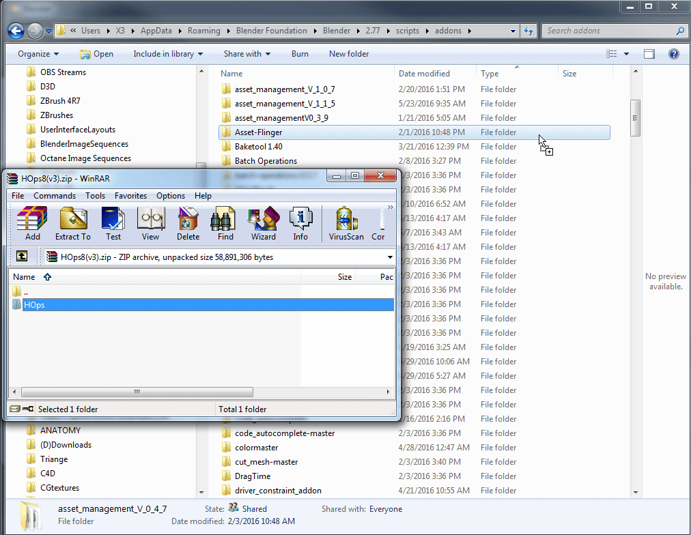

## How To Install Hard Ops
________________

> Using install from file will more than likely **not work**. I would recommend
installing the add-on manually by copying the contents of the zip into the add-on
directory.

Here is where you would locate it on your system.

# Windows
>When using Blender a folder is created deeply in your PC for add-ons. Putting it
here instead of the branch you are using ensures the next updates also have it
installed.

C:\Users\ **your user** \AppData\Roaming\Blender Foundation\Blender\2.77\scripts\addons\HOps

# Mac
>Locate Blender in your applications folder

RMB on the blender.app and select show package contents

# Linux:
>I assume linux users know their PC.

~/.config/blender/2.77/scripts/addons

__________________________________

Most of this will be assuming Windows is used. So once you open the zip you should
see just one folder.

This is what the contents of the zip look like. Its just a folder called HOps.
Which is also the internal codename.

All you do is copy the folder into the add ons folder. Then upon opening Blender
you are able to go into add-ons.

>ctrl + alt + u >> is the hotkey to access use preferences.
You can then search for Ops and you will isolate Hard Ops. From here you can
enable the plugin.

Now onto discussing the preferences and setup inside of Hard Ops.

___

## Additional Notes

# Enable Looptools

Looptools is a plugin that is already built into Blender. It comes in handy for a variety of things however for Hard Ops it powers the circle tool behavior.
