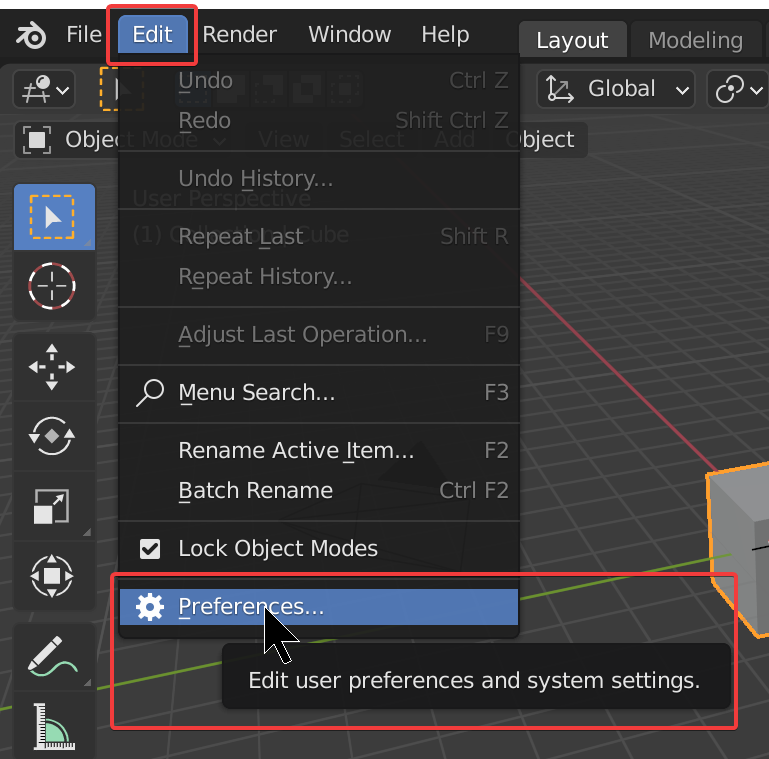
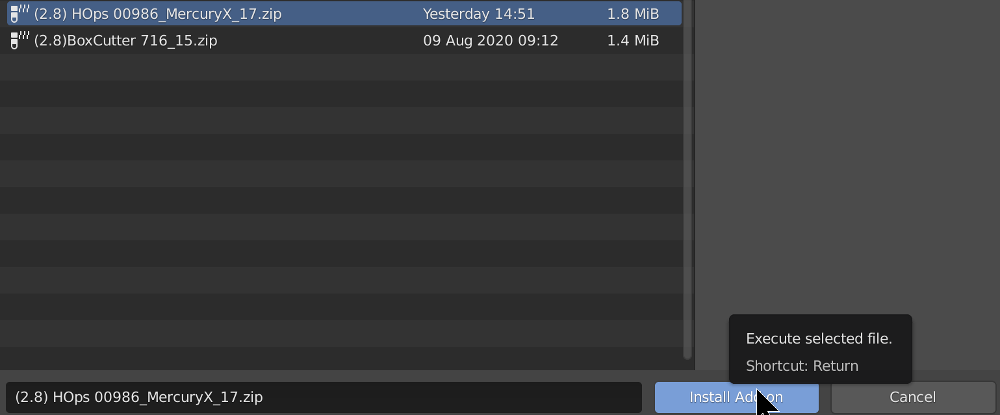
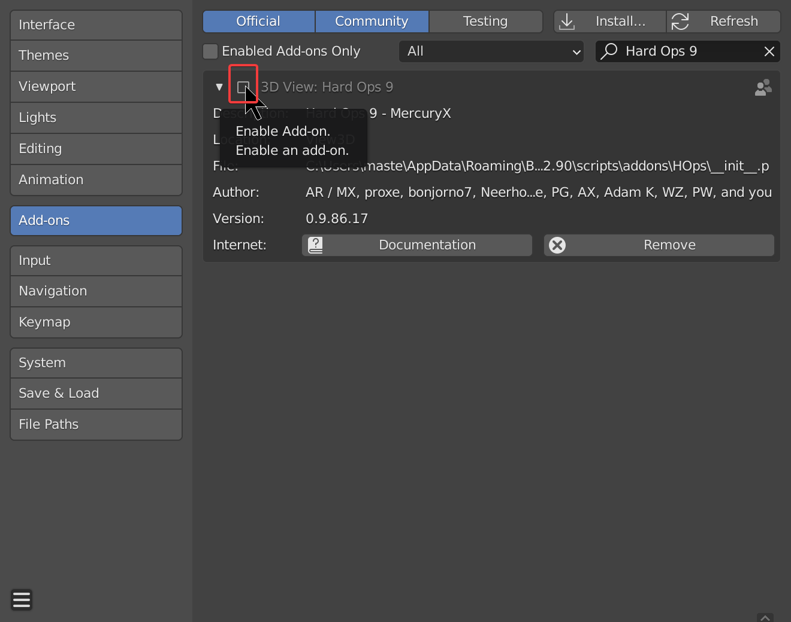
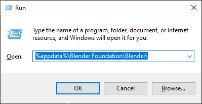
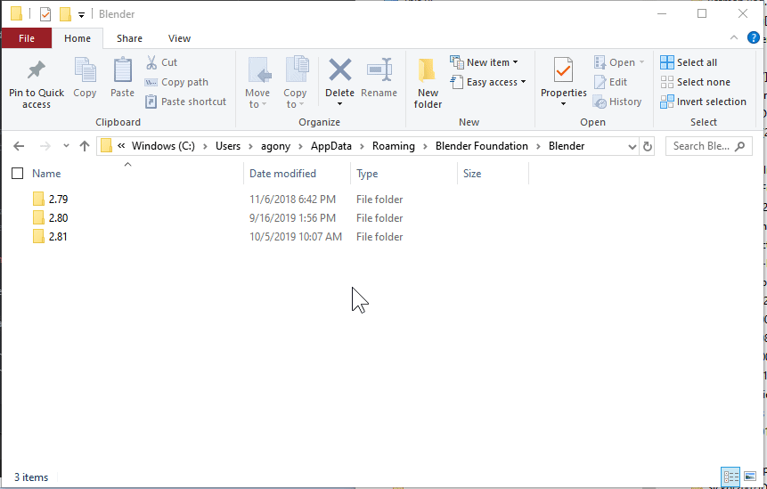
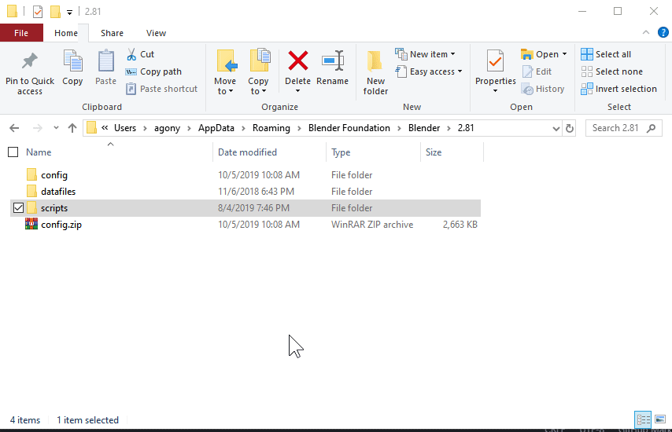

## Requirements

[Blender 2.8+](https://www.blender.org/)

The [official version](https://www.blender.org/download/) on the website is always supported first and foremost but the developments also cover [buildbot](http://builder.blender.org/).

---

## Hard Ops Installation     

<iframe width="560" height="315" src="https://www.youtube.com/watch?v=yvKSFpAFoBw" frameborder="0" allow="accelerometer; autoplay; encrypted-media; gyroscope; picture-in-picture" allowfullscreen></iframe>

[Updating Blender](https://builder.blender.org/download) requires the latest updates. [Current is at least](https://www.blender.org/download/) recommended.

If updating Blender one must also update the Hard Ops / Boxcutter packages for the latest version.

#1. Firstly ensure Blender 2.8 is up to date.

- [blender.org](https://www.blender.org/download/)
- [Steam](https://store.steampowered.com/app/365670/Blender/)
- [Buildbot](https://builder.blender.org/download)
  
On Windows there are a couple of version managers and launcher that can make keeping blender up to date and trying upcoming branches easier.
 
- [Blender Version Manager](https://github.com/DotBow/Blender-Version-Manager/releases) 
- [Blender Launcher](https://github.com/DotBow/Blender-Launcher/releases)

#2. Ensure the latest zips are downloaded 
Latest can be downloaded from the marketplace of origin. (top file is always the latest)

- [Blendermarket](https://www.blendermarket.com/account/orders)
- [Gumroad](https://gumroad.com/library)
- [Artstation](https://www.artstation.com/marketplace/library)

[Gumroad](https://gumroad.com/library) Sales Pages (make sure you are logged in first)
The links below will take you to the respective sales page where if logged in you will be able to [view product if it is the one you purchased.](https://gumroad.com/library)

- [HardOps](https://gumroad.com/l/hardops)
- [Boxcutter](https://gumroad.com/l/BoxCutter)
- [HOPScutter Bundle](https://gumroad.com/l/hopscutter)

#3. Install from file / Enable addon

> If updating make sure to remove the previous version first.

Choose the zip that was downloaded and choose to install from file. After the installation is complete it will show up in the addon list.

> This only works if the folder is not there already! Otherwise... issues.

In the addon panel locate Hard Ops / Boxcutter and **Remove** them, then you are able to install the newer update.

  

Make sure the previous addons / folders are not there and it should work fine.

> In the event of installation failure close / reopen Blender.

**(DO NOT try to install it on the blender install itself. That has shown to not work. ex: C:\Users\RUSER\Desktop\Blender Builds\2.8-updater\Git-f18373a9ab1a-25-May-23-18\2.XX\scripts\addons - this is not the right place. See 3.**

1. If using install from file. As shown in the video. It will isolate the addon for enabling. After enabling do not double click while waiting. Just give it a second if you know you clicked it. Registrations can take a moment sometime.

> Also nuking prefs is not recommended. Quarantining prefs is recommended. However in the event of upgrade failure a clean installation is the only way to isolate issues and assure they are related to our product and not something irrelated.

In the event of installation issues.

- close / reopen blender
- check for hops icon in T panel
- if the icon is present the addon is installed
- if not then F4 >> preferences >> addons >> search "9" >> enable hardops

<iframe width="560" height="315" src="https://www.youtube.com/watch?v=qcmCgfJgCqo" frameborder="0" allowfullscreen></iframe>

Detailed installation instructions are below.

2. If an advanced user, upgrade / update can be done via folder replacement. This is the classic process of addon installation and requires copying the folder from the zip to the addons folder and reopening Blender. This is my preferred way to update but can go over the head of the general user. In that case refer to #1 which is about replacement from within Blender.

USER\AppData\Roaming\Blender Foundation\Blender\
  \2.XX
  \scripts
  \addons
Replacing the HOps and or Boxcutter folder here from the contents of the zip which is a folder will update the installation upon close / reopen of blender. 

---

## Detailed Install Instructions    

# Windows 10 / 7        
>When using Blender a folder is created deeply in your PC for add-ons. Putting it       
here instead of the branch you are using ensures the next updates also have it      
installed.      

C:/Users/ **USERNAME** /AppData/Roaming/Blender Foundation/Blender/ **2.XX** /scripts/addons

Windows Key + R >> Run Window >> Type "%appdata%\Blender Foundation\Blender\" and click ok to access your blender installation

If you do not see a folder for scripts that means nothing is installed. The folder is generally made during addon installation.

The config folder is the main folder containing what makes you "you" in b3d. I tend to zip this folder and back it up periodically.
    

If you find yourself needing to test in a neutral installation either delete config (after zipping it first) or using
File >> Default >> Load Factory Defaults.

When it comes to testing a neutral installation this is the preferred method.

# Mac       
>Locate Blender in your applications folder     

RMB on the blender.app and select show package contents    

<iframe width="560" height="315" src="https://www.youtube.com/embed/ZM_OWHtJsS8 " frameborder="0" allowfullscreen></iframe>

# Linux:        
>I assume linux users know their PC.        

~/.config/blender/ **2.XX** /scripts/addons     

# Support     

Q: I can't install Hard Ops 9!      

>Make sure you copied the contents of the zip into the directory mentioned above. Also try reopening blender. Install from file does not work most of the time so manual installation is recommended.       

Q: Hard Ops won't enable!       

>Try reopening Blender! Also check installation. Hard Ops latest version only works with Blender 2.78 and above. The api changes before will cause issues with old blender.     

Q: The prefs panel wont show the add on I have it installed help! Omygerd!      

The way the addons are detected is the naming.      

>Running the following line in the script editor of blender will show all enabled add ons and their name in the system.     

> **bpy.context.preferences.addons.keys()**

        

If the naming is not exact this will cause issues. Just rename the .py to resolve the issue.        

The naming is as follows.       

- [Boxcutter](https://gumroad.com/l/BoxCutter/)     
- [kitops](https://gumroad.com/l/kitops)     
- [mira_tools](http://blenderartists.org/forum/showthread.php?366107-MiraTools)     
- [meshmachine](https://www.blendermarket.com/products/MESHmachine)
- [Group Pro](https://gumroad.com/l/GroupPro/)
- [bms](https://gumroad.com/l/bezier_mesh_shaper)
- [power_snapping_pies](https://github.com/mx1001/power_snapping_pies)
- [DECALmachine](https://gumroad.com/l/DECALmachine/)       
- [Batch Operations](http://wiki.blender.org/index.php/Extensions:2.6/Py/Scripts/3D_interaction/BatchOperations)        

Also the above texts are hyperlinks to their locations.

# More about installation.

> When it comes to diagnosing issues with install a **screenshot of the issue would help with diagnosing errors**.

The easiest way to restore blender to defaults is to delete the config folder for your blender installation.

The local folder in windows is located at (depending on version):

- C:\Users\RUSER\AppData\Roaming\Blender Foundation\Blender\2.81
- C:\Users\RUSER\AppData\Roaming\Blender Foundation\Blender\2.80

> I tend to right click and send my config to a zip so it can be saved for later if needed. To restore it I can delete the new config folder and unzip the archive to this location to restore a previous setup.

**Install from file will not work if the addon is present**

For install from file to work you will need to delete the HOPS / boxcutter folders out of addons. This will ensure a clean installation.

# Rename 2.8x folder for testing reinstallation

Alternatively you can also try a clean install by just renaming the 2.81 folder and trying install from file then.

This is the method I use to test every support issue involving installation that customers write me about.

- renamed 2.81 folder to 2.81a so Blender won't load prefs from that folder. Causing a new clean 2.81 folder to be created.
- loaded up Blender which loaded full-screen showing the config splash **indicating prefs have been reset**
- installed Boxcutter / Hard Ops from file **notice the hang when installing from file, this is normal for installation**
- configured prefs for general experience

# Detailed Mac Install details.

>> 2.8X means X is the version you are dealing with. Could be 2.80, 2.81 and so on. Deal with the version you are currently trying to install.

<iframe width="560" height="315" src="https://www.youtube.com/embed/iS99DR1Chq4" frameborder="0" allow="accelerometer; autoplay; encrypted-media; gyroscope; picture-in-picture" allowfullscreen></iframe>

A key thing to note when dealing with bad mac installs is in videos you'll see me delete the internal 2.8X folder.

**This ensures the next attempt will be clean.**

Also if an install fails. **Close blender and reopen.**

Mac isn't my favorite OS due to having to make security exceptions with blender by clicking the spotlight icon in the mac toolbar and typing security.

Also to get to the 2.81 folder you have to have finder open so the toolbar says finder up top
when clicking go by holding option you can access library. It is hidden for some reason.

From there it is a short trek to where plugins and preferences are kept.
Library >> Application Support >> Blender >>

From here the versions are listed. These folders contain prefs, addons and other files associated with you as a user.

Before attempting any install I **delete the entire 2.8X folder**. This ensures blender loads with no prefs, history or addons.

Alternatively users could go further into  the specific install and delete just the folder.
ex: 2.81 / scripts / addons

and delete the folder of the addon giving issue.
ex: hardops or boxcutter

**This is the only way to ensure the install from file will work cleanly.**

Otherwise if the folder of the addon you wish to install is already present errors will occur.
Closing and reopening Blender after a failed install will also help make the situation easier to resolve.

On mac pressing Cmd + Shift + 4 will take a screenshot and put it on the desktop.
Showing us any errors you receive will assist in diagnosing any issues.

<iframe width="560" height="315" src="https://www.youtube.com/embed/m0AyFhq1GL0" frameborder="0" allow="accelerometer; autoplay; encrypted-media; gyroscope; picture-in-picture" allowfullscreen></iframe>
