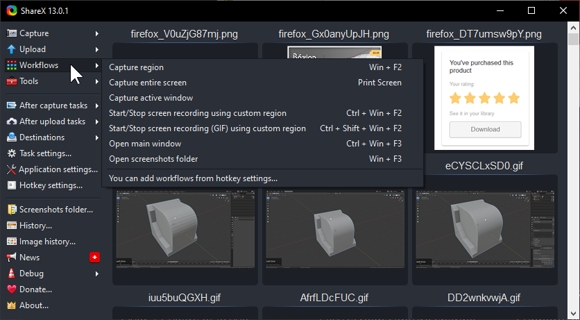
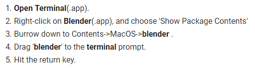
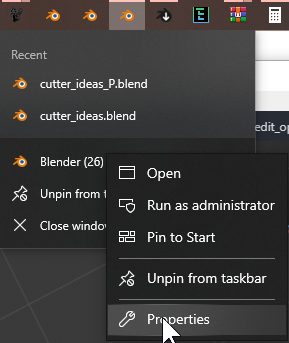
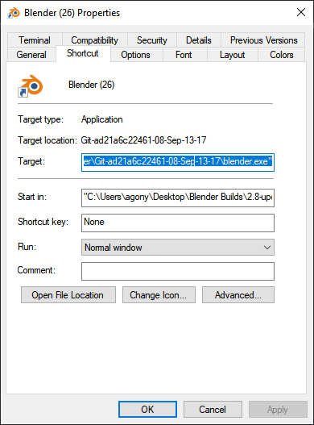
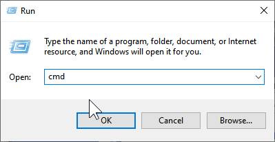
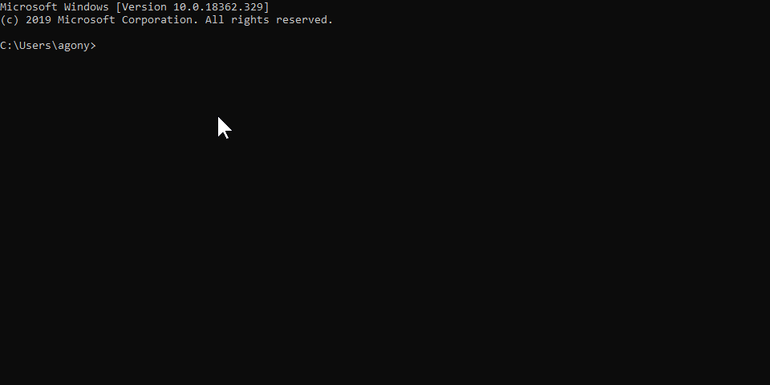

### Helping us help you

Being in a position of support has taught me how important it is to get adequate information on an issue.
Screenshots, gifs and videos of issues are the best way to help us resolve your issue. By being linked this page I am requesting additional information to assist with a support issue.

> Without a visual form of recreating the issue all we can do is speculate. Please provide us gifs / videos / images of the issues to help us resolve it as complete and quickly as possible.

Text descriptions can only go so far and we are often asking users for more information so the issues experienced can be triangulated and resolved.

# The fastest way to help you is with a screenshot, video or gif.

- [gif](https://getsharex.com/)
- [screencap](https://duckduckgo.com/?q=how+to+take+a+screenshot&t=ffab&ia=web)
 - [Windows 10 (windows + shift + S)](https://www.howtogeek.com/226280/how-to-take-screenshots-in-windows-10/)
 - [Mac OS (Shift-Command-3)](https://support.apple.com/en-us/HT201361)
- first console error
 - Console is found in the file menu under: Window / Toggle system console
 - first error shows point of failure. Subsequent errors are less important
 - we need the first error
 - **Even if blender is crashing we need the console output.** Info below.
- [video](https://www.youtube.com/watch?v=DTk99mHDX_I)
 - just show us what is happening when it crashes and maybe the console
 - the more information the better. Our goal is to resolve it for good.
- [zip version name](https://hardops-manual.readthedocs.io/en/latest/faq/#how-do-i-update-hard-ops-boxcutter)
  - example: (2.8) HOps 00983 Curium_20
  - this tells us the following:
    - **2.8 Branch** of **HardOps**
    - Era **Curium** Release term **00983**
    - Service Update **Number 20**
  - with this information we can pinpoint the work and changes done on that day to troubleshoot only what is needed.
  - when the information is insufficient is has us looking over more than is needed.

It is key to see how the issue occur so we can go through the process for ourselves. At least send us the first error in the console.

# MAKE SURE YOU ARE RUNNING THE [LATEST VERSION](https://hardops-manual.readthedocs.io/en/latest/faq/#how-do-i-update-hard-ops-boxcutter)

Service updates happen post release to fix things reported by active users. These are done quietly with the notification being done via video or social media. This is to prevent those with working versions from having to disturb their work within projects. Also all the service updates go into the next version. Our tools are always in a state of refinement and perpetual improvement and our commitment to providing to users quick remains a model for others to follow.

[Make sure to have the latest version of hopscutter anytime a support issue is happening.](https://hardops-manual.readthedocs.io/en/latest/faq/#how-do-i-update-hard-ops-boxcutter)

These tools are being worked on round the clock so every few cycles updates are pushed customer side to ensure things continue to run fluidly.

# Capturing Issues w/ ShareX windows

When it comes to Blender crashes occur however being able to replicate it and provide steps for what causes it goes much farther for assistance with diagnosis.

For windows a small freeware app called [ShareX](https://getsharex.com/) is essential.

In ShareX I set my workflow to the above image.

Thanks to this I am able to quickly record gifs and screencasts of issues in windows.

# Mac Help

The stuff it says in crash reports is not of use to us. I don't think non apple engineers can read that.

Getting the terminal output to remain after a crash is more essential.

Cmd + Shift + 4 will do a screen capture box and save it to the desktop.

# PC Help

When Blender crashes the console goes with it. By running Blender via the cmd you can get additional information that can help us fix issues.

Right clicking Blender while open to access the properties will get you the shortcut.

Windows + R >> Run Window >> cmd

> Brings up command prompt.

In the cmd paste the shortcut from the properties window.

Running blender this way will make the cmd be a terminal output. Providing us information on why crashes occur.

# Proper error reporting

When it comes to errors the first error that comes up is the most important one. When it comes to an error sometimes an error cascade will occur of repeated errors but the first error is the one that caused it and is the one we need.

**We need the first error in the console.** The one that started it all.
