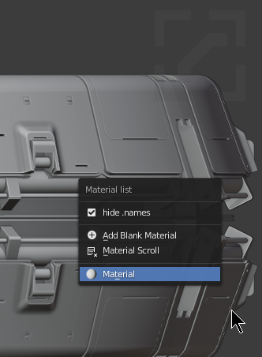
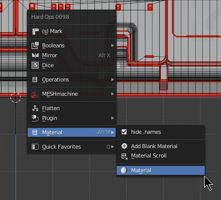
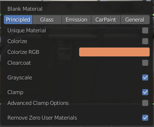
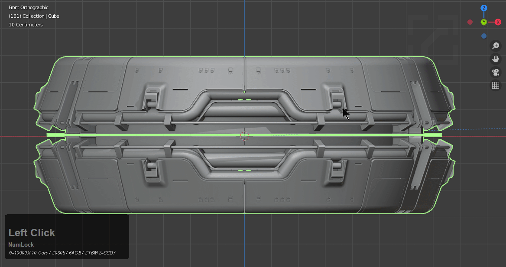
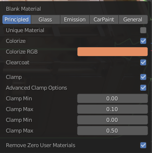

____

# Locating Material List

## Object Mode

>> Alt + M

Alt + M is the material submenu in object mode.

## Edit Mode

>> Q >> Material

It is also available in edit mode via the Q menu and shift + Q pie menu.

Blank material can be used for rapid material placeholders.

<iframe width="560" height="315" src="https://www.youtube.com/embed/QnMHKz2TD54" frameborder="0" allow="accelerometer; autoplay; encrypted-media; gyroscope; picture-in-picture" allowfullscreen></iframe>

# Blank Material

F9 allows for adjustment of blank material via the popup.

Blank material can be useful to quickly add placeholder materials to an object. They are intended to be random.

Principled

  - random metallicity either 0 or 1
  - random roughness
  - random greyscale value
  - random viewport color

Blank material is also capable of adding additional types of materials.

  - Glass
    - Viewport Transparency at 50%
  - Emission
    - Random pulse emission material
  - Carpaint
    - customizable carpaint shader
  - General
    - unified randomly generated random material utilizing graph as a range

Hops has a special system in place to create node graphs and these materials were created with it. In the future we hope to make it more capable and simplify it to a greater degree. It's current intention is quick placeholders for a fast result.

# Edit Mode Blank Material

Blank material may also be used in edit mode. Material will be assigned to the selection.

# Material Scroll

Material scroll is capable of scrolling through the materials available in the scene and is available in both object and edit mode.

<iframe width="560" height="315" src="https://www.youtube.com/embed/qKxpwzYMkKA" frameborder="0" allow="accelerometer; autoplay; encrypted-media; gyroscope; picture-in-picture" allowfullscreen></iframe>

____

# Blank Material In Depth

Material can be reshuffled by clicking the button for the shader needing reshuffle. In the below example I click principled to get different shaders.

## Principled

The F9 panel allows for the following:

Unique Material - assigns a unique material per object
Colorize - colors material using color value
Clearcoat - randomly uses clearcoat
Clamp - keeps values within a recommended range for roughness
Advanced Clamp Options - contains options for specific random ranges of materials
Remove Zero User Materials - clears out unassigned materials (Keeps material list clean)

## Glass

Glass sets the viewport visibility to 50% and assign a custom made glass shader.

## Emission

Emission will add a pulsing material similar to tutorials on scripted expressions in the past.

## carpaint

Adds a carpaint shader

wip

## general

adds a general shader

wip
