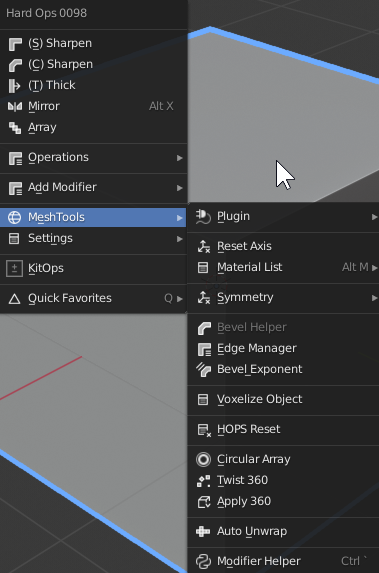
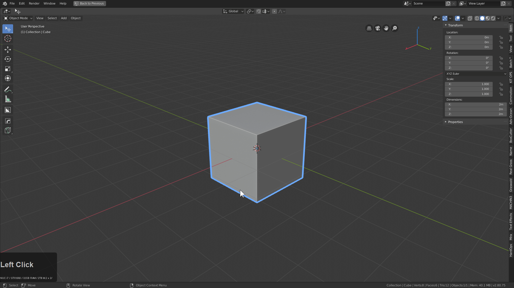
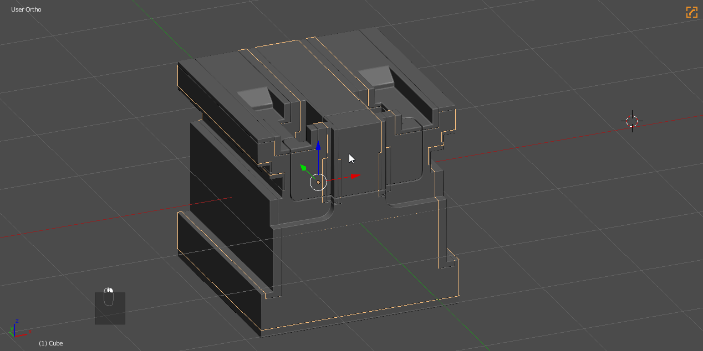
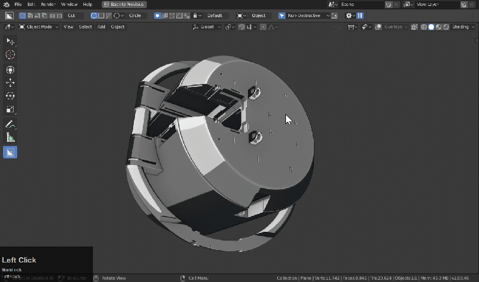
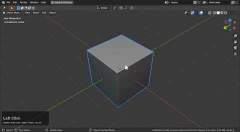
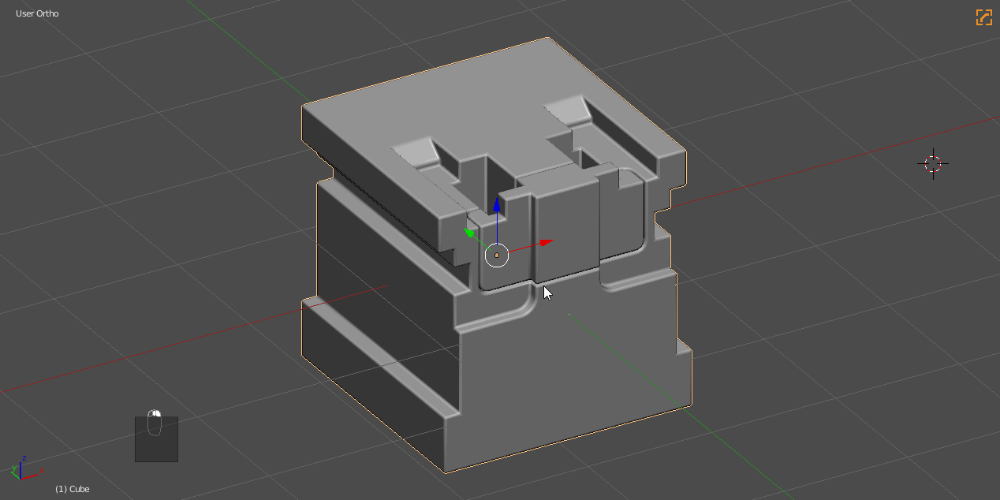
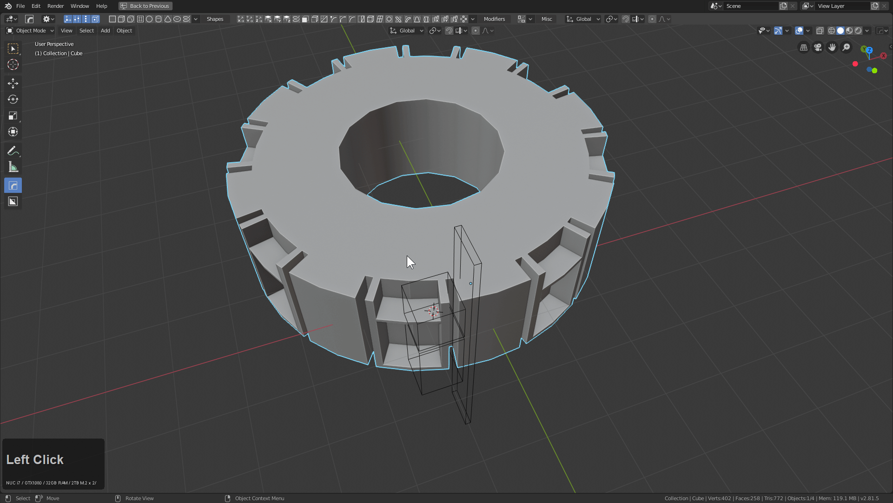
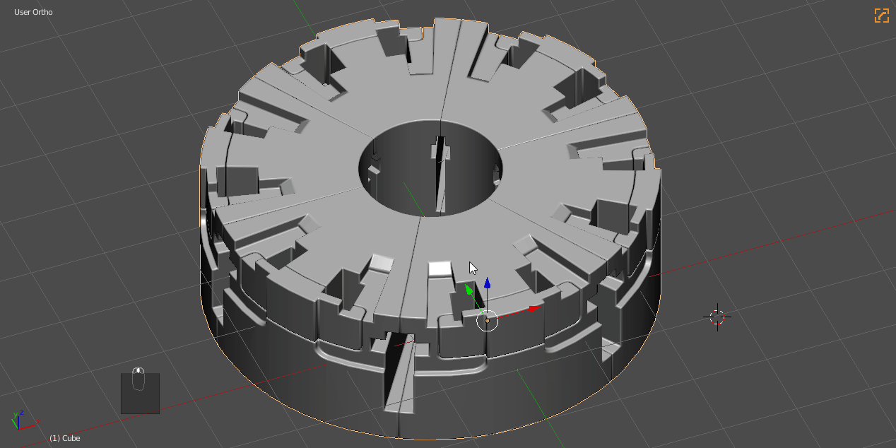

### Meshtools Submenu (Object Mode)

## What are Meshtools?

>> Meshtools can be found in the <kbd>Q</kbd> menu and contains many small tools optimized for various tasks.

Meshtools are tools that perform quick operations that I use quite often in my workflow. There are also options for materials and a shortcut to the [HOPS Helper](helper.md). These options are just random tools and experiments that are useful in the hard ops workflow at certain points.

<iframe width="560" height="315" src="https://www.youtube.com/embed/iSQjRdiomlw" frameborder="0" allowfullscreen></iframe>

---

## Plugin

Extendable submenu for 3rd party tools that HOPS connects with.

Currently extends to the following
- meshmachine
- bezier mesh shaper
- mira tools

A video about this topic is also available.

<iframe width="560" height="315" src="https://www.youtube.com/embed/l4IlEZZPpG4" frameborder="0" allowfullscreen></iframe>

---

## Reset Axis

In object mode Reset Axis will allow you to reset an object on the Xyz on global space.

Using Reset Axis
- scroll wheel to scroll various reset axis'
- <kbd>X</kbd>, <kbd>Y</kbd>, and <kbd>Z</kbd> to reset to specific axis respectively

When 2 objects are selected it will allow the axis to be reset in accordance with the primary object.

---

## Material List (<kbd>Alt</kbd> + <kbd>M</kbd>)

see [materials](tips_material_menu.md).

Pressing <kbd>Alt</kbd> + <kbd>M</kbd> will list all the materials in your scene. If you have no materials this list will be blank.

***HARD OPS provides no materials besides the placeholders for inserts that are simple shaders and not recommended for rendering***

The material list has proven to be quite useful to assigning materials to assets. Just selecting things and pressing <kbd>Alt</kbd> + <kbd>M</kbd>.

---

## Symmetry (only here for legacy reasons)

> hotkey: <kbd>Alt</kbd> + <kbd>X</kbd>

see [mirror](mirror_symmetry.md)

This workflow can get complicated due to there being 3 systems we support but in short:

  - symmetrize is make symmetrical and be done. No modifiers are used.
  - auto mirror is self symmetry and involved bisection and uses the mirror modifier.
  - mirror mirror is primarily used to mirror objects across other objects.

For more information see [mirror](mirror_symmetry.md).

If you are still reading this, here is a demo of all 3 in action.

---

## Bevel helper

Hotkey: <kbd>Ctrl</kbd> + <kbd>shift</kbd> + <kbd>B</kbd>

> Will not come up when bevels are not present or selection is not a mesh.

Bevel helper is a specialized panel with the specific purpose of dealing with bevels en masse.

To show bevelHelper in action:

- In the helper you can adjust every bevel present on a model.
- As you can see the presets / full properties are also available.

> The bevel helper can be extended to show presets or be short and fast focused on toggling and varying up design.

---

## Edge Manager

This tool is made to convert markings and perform marking. This is a support tool but typically it is used to convert certain types of marking to other types.

> Sometimes applying subdivision will remove certain markings. This tool was made to get them back.

To show this tool in action.

A few things to note:

- intentionally in this example only sharps were marked in workflow
- ssharpen was used to mark the sharp edges w/ sharps
- edge manager was able to turn sharp marks into seam, bevel weight, crease markings without effort.

> this tool isnt used often but when it is you are glad it's there.

---

## Bevel Exponent

Multiplies or divides the bevel exponentially.

In my professional work sometimes client would ask for bevels to be twice as large. This tool does that however it also has the ability to divide them by half.

There is a toolpanel with this tool that can be adjusted to change the multiply / divide property.

---

## Voxelize object (2.81+ only)

Voxelize is a new remesher added to 2.81. In hardOps we support it.

There are more parameters to affect up top if in 2.81.

---

## HOPS Reset

Sometimes in the Hard Ops workflow you can go off the rails and apply modifiers or decide to escape the auto hiding behavior of [cstep](step.md) sstates.

While this sounds odd its worth thinking that from an undefined mesh you can :

  - go into csharp sstate with just a simple [csharpen](csharpen.md)
  - go from csharp to cstep with just a simple [step](step.md)

Sometimes backing out of the workflow and going back in without modifying the object can open the door for some interesting workflows. Not to mention resetting boolshapes to also deviate in their workflows as well and do shaping before committing booleans.

In this example you can see the boolshape at the beginning because of the green icon in the corner. After resetting the sstate I was able to treat the undefined but still live mesh as a neutral mesh using options from the [operations](operations.md).

> This option is all that remains from sstatus override introduced in HOPS 007.

---

## Circular Array

see [circulars](circular.md)

---

## Twist 360

This adds an array modifier and a simple deform modifier. This also sets up the parameters according to my defaults. This is quite basic and is a less interactive version of Radial 360 however this doesn't diminish it's use, in fact it makes it more valuable.

In this example I put the twist360 on the mesh and showcased the F6 menu. In order to make this primarily ngon mesh deform properly I had to use the knife and make some cuts before symmetrizing which got a more acceptable surface rendering.

---

# Apply 360

Since Twist 360 is intended to keep the object non destructive apply 360 remains in order to do the following
- apply all modifiers
- remove doubles
- recenter origin

This can be done manually as well but this is in order to automate that part of the process.

---

## Auto Unwrap

When it comes to UVs I personally use the following tools to perfect UVs.

[UV Shotpacker](https://gum.co/UVShotPacker) | [Smart UV](https://gum.co/Smart_uv) | [UV Squares](https://blendermarket.com/products/uv-squares/)

That aside. X-Unwrap was a quick UV unwrapper we came up with for Hard Ops assets. It was formerly capable of displaying the UVs in the 3d view saving the need to have a UV editor and I hope to add it back. I personally love this tool and can see some potential in advancing its workflow and features.

**It is just a quick and dirty UV unwrapper for quickly going to substance / unity / unreal / quixel.**

- If one object is selected, it will UV it to an entire sheet.
- If multiple objects are selected they will be atlas'ed on one UV setup.

---

## [Modifier Helper](helper.md) (<kbd>Ctrl</kbd> + <kbd>~</kbd>)

see [Modifier Helper](helper.md)

Pressing <kbd>CTRL</kbd> + <kbd>~</kbd> will open the HOPS helper. This tool is now capable of more than dealing with just modifiers.

The HOPS helper is worth a look to see if the tool can fit in your workflow. The helper is indispensable for full screen working and has supercharged my personal workflow. No matter the project. No matter the object. This tool gets use. It appeals to users of all disciplines and not just hard surface.

---
