### Interactive Mirror - Mir 3 (Alt + X)

# Simple Hotkeys

Mirror : **Alt + X**

Reset Mirror Settings : **X**

Add New Mirror : **A**

# Advanced Hotkeys

Mirror Helper List - **D**

View Orientation - **S**

Cycle Pivot Points - **S**

Cycle Orientation - **W**

Help / Mods - **H** / **M**

___

# Locating Mirror

Mirror can be best brought up via the hotkey Alt + X.

It can also be found in the Q menu in various places.

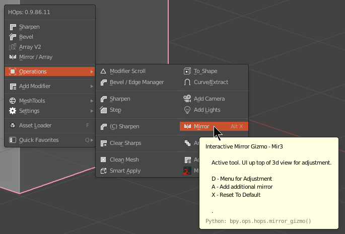

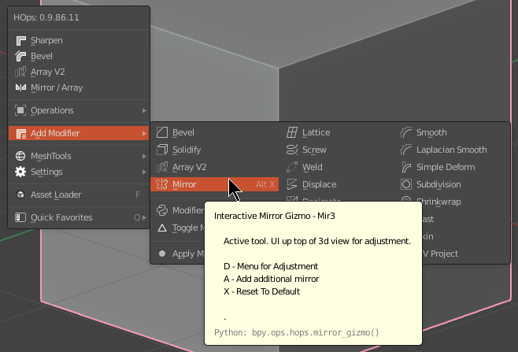

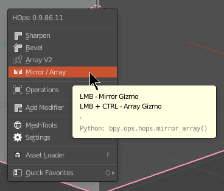

Also at the top of hopstool.

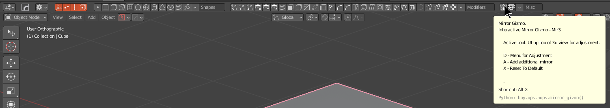

The hops button also has a button for mirror.

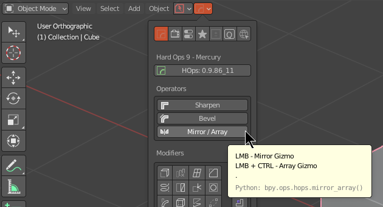

# Understanding Mirror

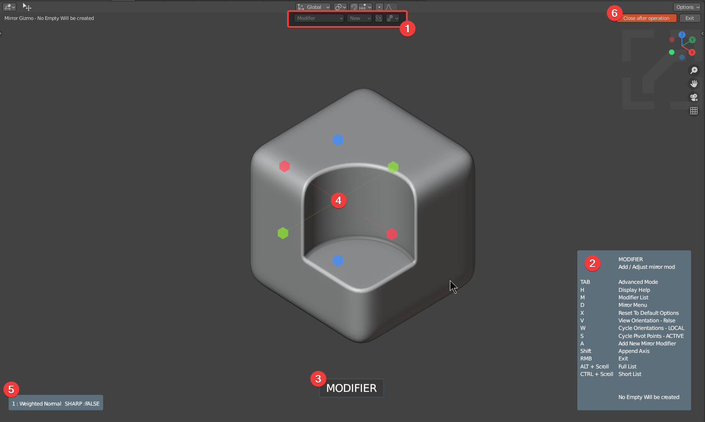

1. The top area contains the basic UI (this screenshot is in simple mode)
  - mirror mode list
  - modifier being edited (new if no mirror is present)
  - simple / advanced mode toggle
  - advanced preferences for mirror

2. Help panel. Lists hotkeys.
  - details active mirror settings
  - notifies user of empty creation
  - indicative of simple / advanced mode

3. Notification
  - notifications will display for the following
    - empty creation
    - mirror state via list scroll on alt
    - mirror state via short list scroll on ctrl
    - W for orientation change
    - S for origin change

4. Mirror handles
  - Click the axis you want to keep.

5. Modifier List
  - Lists active modifiers on the object

6. Close After Operation / Exit Button
  - clicking an axis will mirror said axis
    - normally this closes mirror. Close after operation toggles that.
    - alternative holding shift on click will keep mirror active
  - Exit - closes mirror

___

# Mirroring Boolean Meshes

Booleans require manifold meshes so modifier mirroring is recommended. Bisect can split the mesh which can cause issues with subsequent cuts.

To see in action what has taken place it could be best to do a modifier scroll to analyze the stack.

# Adding An Addition Mirror (A)

Add New Mirror : **A**

An additional mirror can be added with **A**

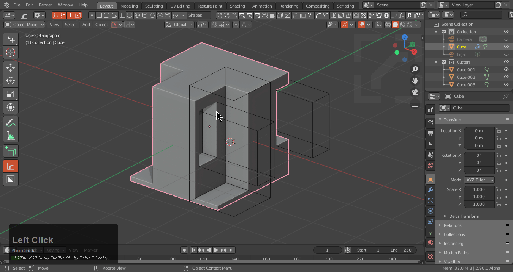

While I just mirrored and exited the mirror sorting of last mirror is now based on Z rather than the X before.

> Notice that I am able to go back into the mirror and press X to reset to modifier which also allows me to modify the active mirror rather than adding an additional one.

# Modifying An Existing Mirror

As the previous gif showed, resetting to modifier will allow for easily modifying the modifier of mirror.

If I wanted to additively also mirror on X I can press the hotkey alt + X to bring up mirror, press X to reset and adjust the axis being mirrored.

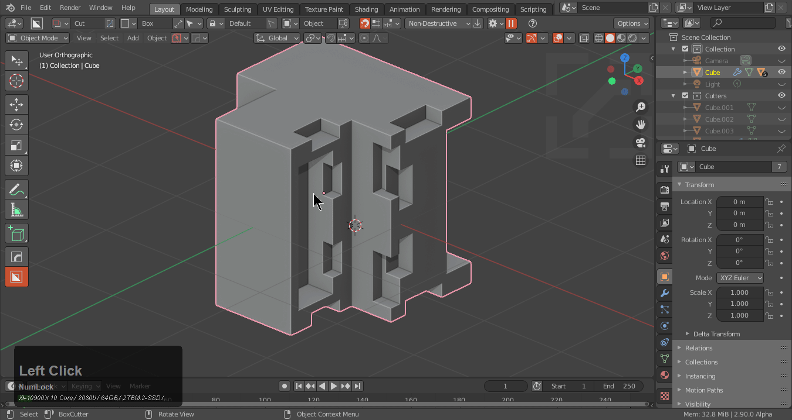

# View Mirror (V)

Pressing V during mirror will change the alignment to view while keeping the initial settings for orientation and mode.

For example adding a new mirror would be pressing **A** then pressing **V** to change to view and choosing the axis I want to mirror to.

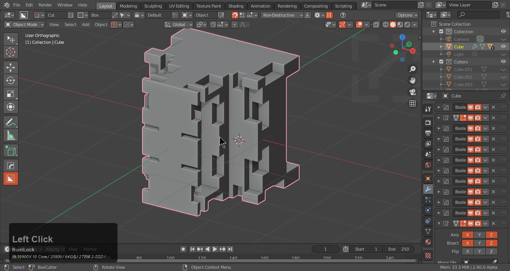

> Not pressing A would have just modified the existing mirror which is not the result I wanted to achieve.

# Empty Creation

> Mirror settings can be reset to default using **X**

When using any mirror settings not using the default will use an empty to create the desired mirror. The 3d view will notify you of empty creation when it is going to happen.

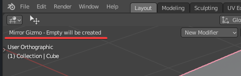

The help **H** will display info to if an empty will be created.

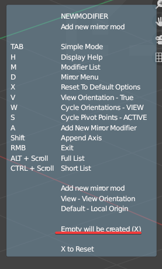

Mirror only has a parameter for mirror object as a modifier so to extend the functionality empties had to be employed.

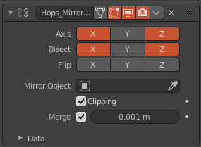

# Symmetry vs ModApply

> One and done symmetry solutions. These will mirror to the other side without a leftover mod or empty.

Symmetry is ideal for high poly sculpt mirroring via symmetry.

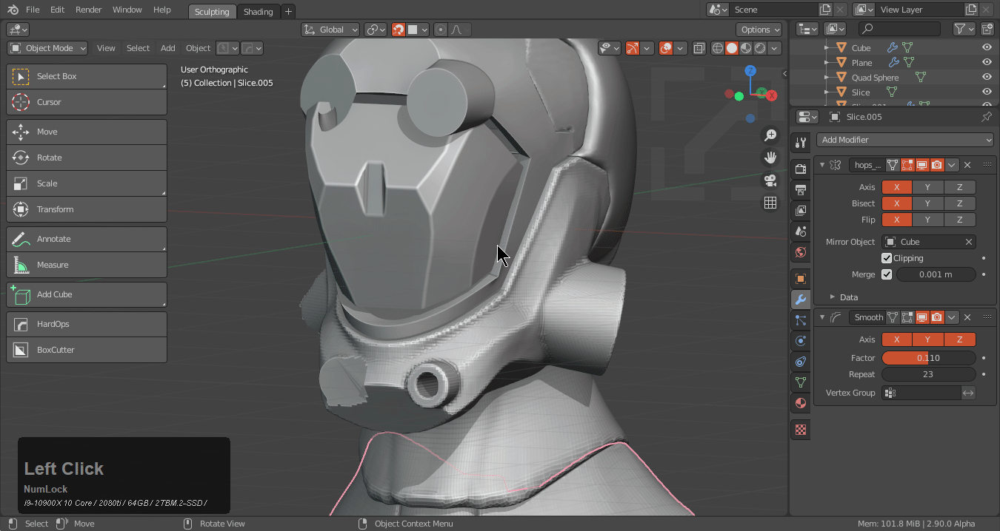

Mod and apply is faster and also treats normals better and will result in less issues with shading. I have recently began using this in place of symmetry and the differences are subtle but is recommended for all.

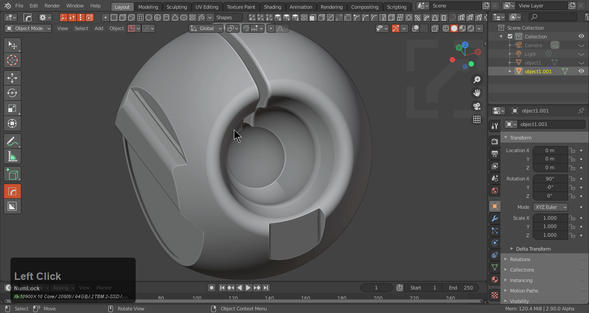

____

# To_Mirror - Mirror Across

Selecting two meshes will let you mirror object B across object A.

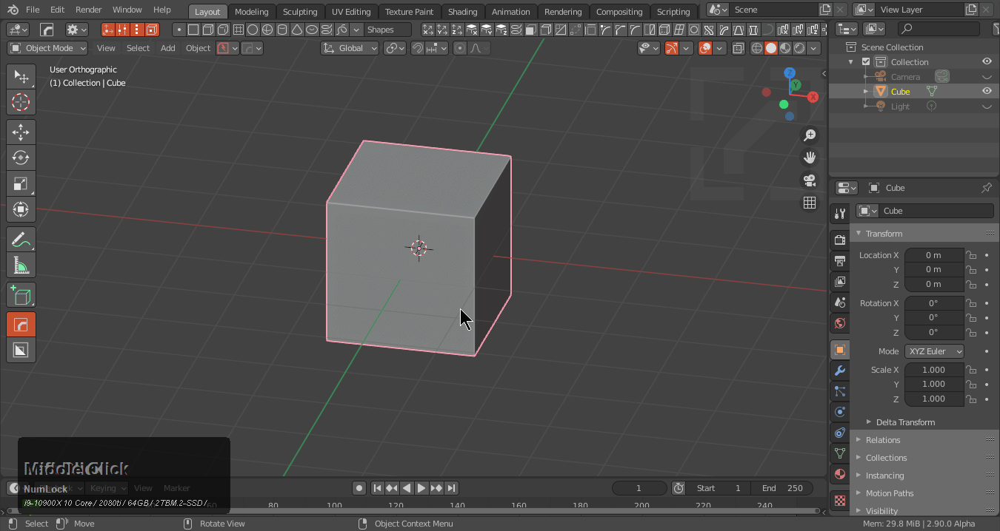

> Notice that the mirror mod still allows for me to to_mirror even with the 2nd object deselected after the initial setup.

# To_Mirror - Multiple Mesh Support

To_mirror can also allow for mirroring multiple meshes across an active selection.

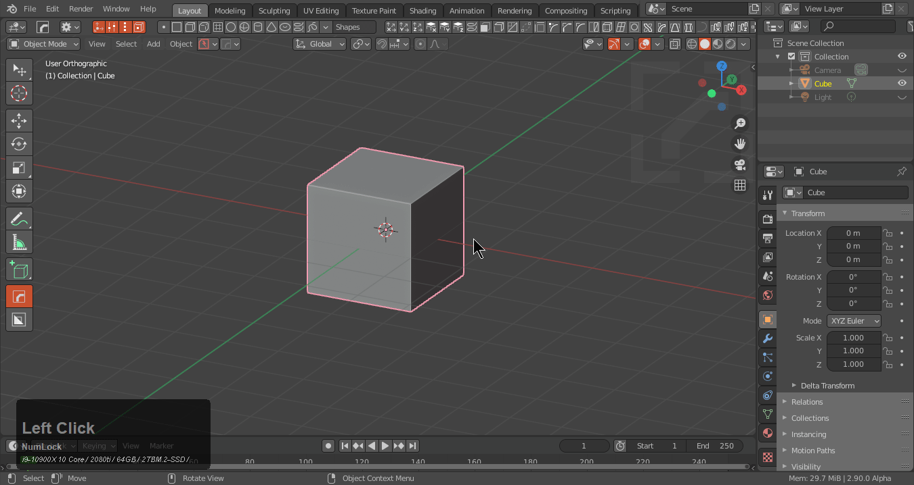

One could even do multi-mirroring using view if desired.

> All consolidated to one empty.

___

# View Align - ModApply / Symmetrize

View align can be used with setting up the view for mirroring which can come in handy for symmetrical modelling and subsequent mirroring.

____

## Orientation

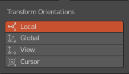

# Local (default)

Local utilizes the local object orientation. This is default and will not create an empty when used.

# Global

Utilizes the world orientation and will create an empty.

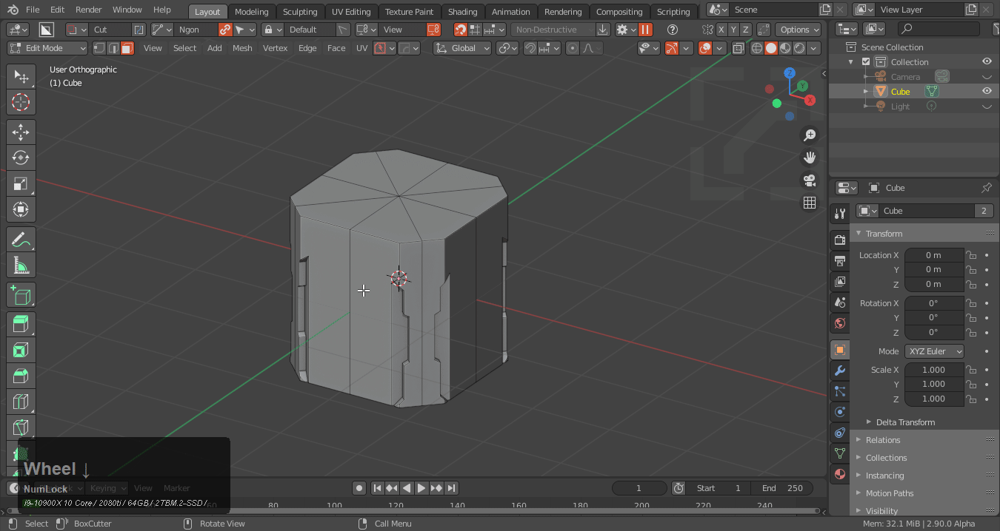

> The origin of the object was used however the rotation was according to the world in the above example.

# View (see view)

Utilizes view for orientation and will create an empty.

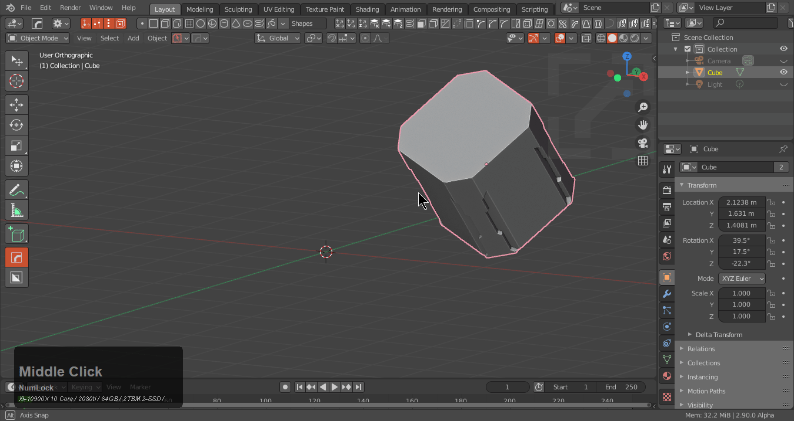

# Cursor

Utilizes the orientation of the 3d cursor.

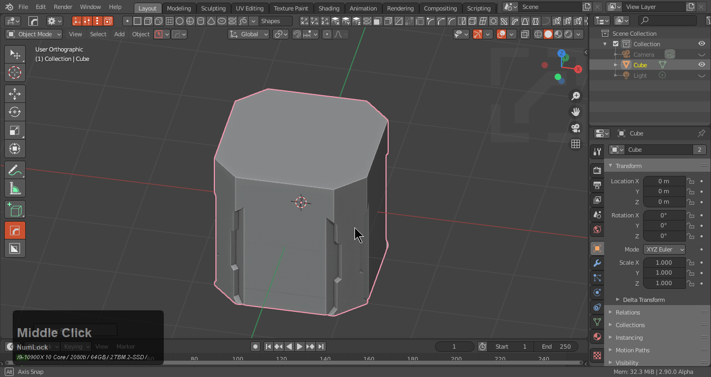

> Origin is the position of the cursor which was not used in the above example.

____

## Pivot Point

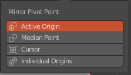

# Active Origin (default)

Utilizes active origin of the selection (default)

# Median Point

Utilizes area where meshes are calculated to meet. (Typically used for multi-selection)

> This one is rarely used but exists in case it is needed.

# Cursor

Utilizes 3d cursor for origin.
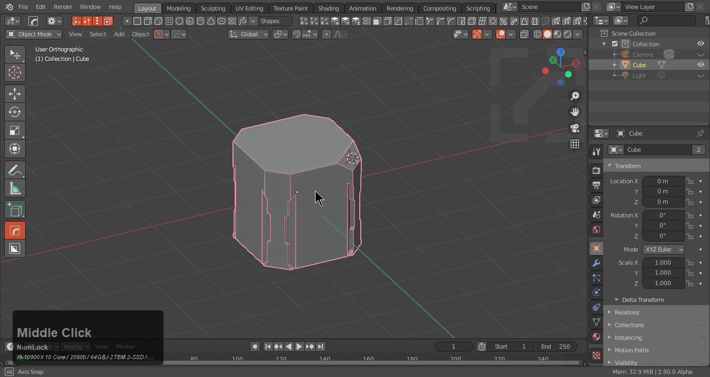

> When used in conjunction with cursor it behaves more as expected.

# Individual Origins

Utilizes the individual origin of each object of the selection.
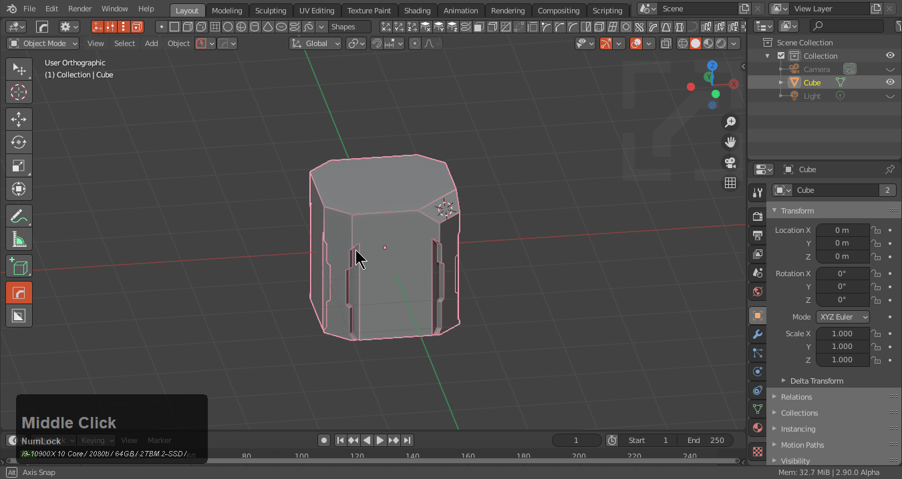

> Notice that the active object was not mirrored. This is due to a pref for including active object in selection.

> An empty was not created during this.

___

## Mirror Preferences

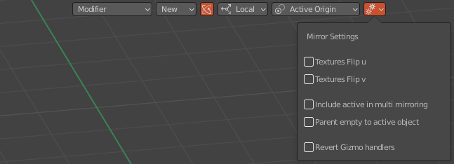

Mirror contains the following quick options.

Textures flip U / V - useful for decals with decalmachine and parallax shaders
**Include Active In Multi Mirroring** - includes active selection in multi mirroring
Parent Empty to Active Object - allows for moving the object with the empty in tow simplifying the process

# Include Active In Multi Mirroring

This one is an option users will need to be aware of because the times in which it is needed and not is interchangeable and varies as work is progressed through.

This example shows mirroring without active being included.

And with active being taken into account for mirroring with individual origins.
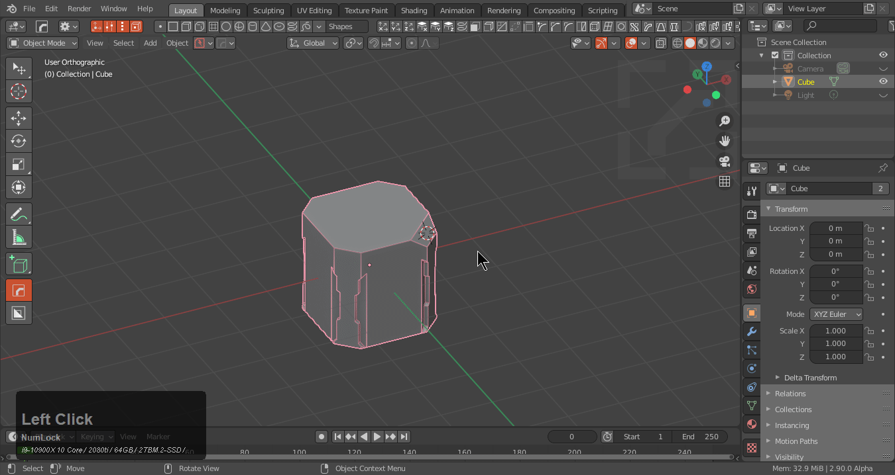

____
