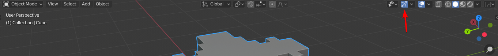
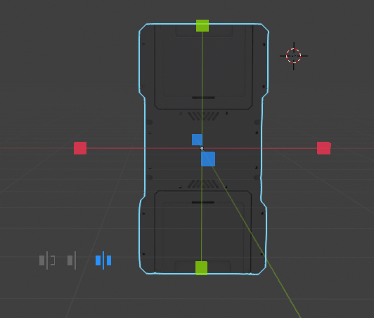
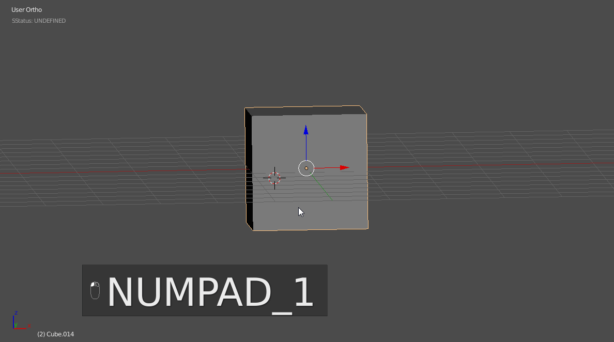
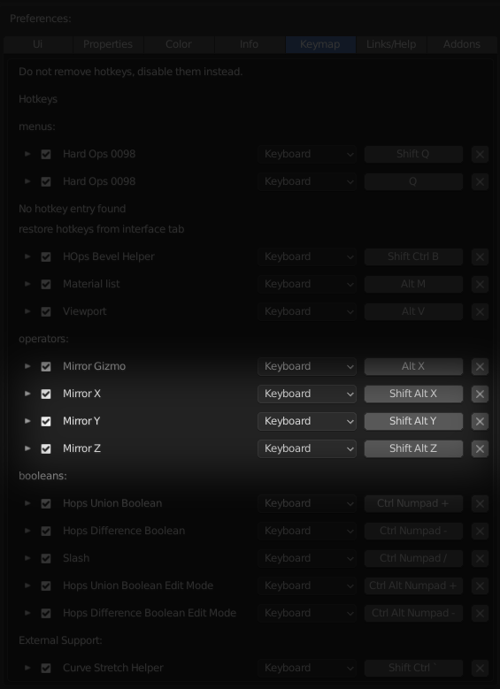
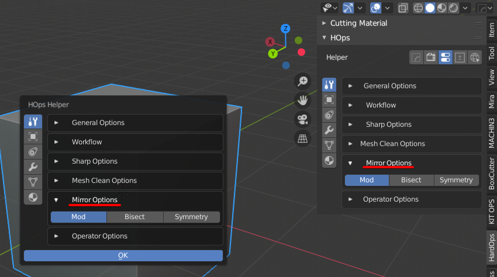
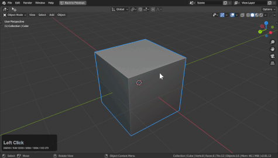

### Interactive Mirror

**Gizmos must be enabled to use the mirror gizmo!**

> Mirroring is important  when it comes to keeping a mesh symmetrical however in
Boolean workflows having bisecting mirror modifiers isn't ever ideal. With the new modifier option in 2.8 mirroring is better than ever with booleans.

The mirror tool can be brought up with <kbd>Alt</kbd> + <kbd>X</kbd>

The axis clicked on is the one intended to be kept. Shift clicking will use multiple axis.

 

When the mirror tool comes up there are 3 options.

The options are as follows.

# Modifier -
This will add a modifier bisect mirror to the mesh. This will keep it manifold for boolean operations while performing as if it has been split and joined. This is essential for bmesh boolean operations and can handle many more cuts than the previous system which required the mirror be at the start of the stack.

# Bisect -
Splits the mesh and deletes half. Then adds a mirror modifier. This one is classic.
I use this for character blockins and traditional modelling. It is not useful for booleans but is immensely useful in general modelling up to that point. When adding this it is important to be mindful of the object no longer being watertight. Therefore boolean issues will occur.

 > As the image shows using this one can result in errors during the boolean operation.

# Symmetrize -
This one is one and done mirroring. It will mirror in the moment and not a second longer. No modifier is left behind and is the remnant of the classic symmetrize workflow. This is the consolidation of all our mirror efforts into one easy to use tool. I use symmetrize with offset modelling where I want to compare one side to the other at stage and with sculpting. This is one tool I can't live without.

> As the modifier stack in the n panel shows no mirror was created while symmetrizing. Making it the fastest way to mirror one side to the other.

# Using Multiple Axis

During interactive mirror pressing shift will add the axis clicked to the list and keep the operation going. This allows users to select more than 1 axis to mirror.

### Two Object Interactive Mirror

When 2 objects are selected the mirror will behave differently and allow you to mirror and object from one side of an object to the other or more unusually symmetrize multiple items. I never use the later but it exists as an option.

# Classic Mirror Mirror

Mirror mirror was a classic workflow in Blender during the '79 era. It is activated still with 2 object selection and any of the classic mirror hotkeys.

- <kbd>Shift</kbd> + <kbd>Alt</kbd> + <kbd>X</kbd>
- <kbd>Shift</kbd> + <kbd>Alt</kbd> + <kbd>Y</kbd>
- <kbd>Shift</kbd> + <kbd>Alt</kbd> + <kbd>Z</kbd>

> The above example demonstrates mirror mirror with bisect which without the axial gizmo can sometimes mirror to the wrong side prompting the user to have to move the object. Alternatively the mirror can be adjusted via the <kbd>Ctrl</kbd> + <kbd>~</kbd> helper.

# Classic Mirror system

The classic mirror system still exists and has hotkeys.

- <kbd>Shift</kbd> + <kbd>Alt</kbd> + <kbd>X</kbd>
- <kbd>Shift</kbd> + <kbd>Alt</kbd> + <kbd>Y</kbd>
- <kbd>Shift</kbd> + <kbd>Alt</kbd> + <kbd>Z</kbd>

It correlates with the mirror options in the helper area in the <kbd>N</kbd> panel or - <kbd>Ctrl</kbd> + <kbd>~</kbd> helper.

Users can set the mirror prior to use and use the abovementioned hotkeys to perform the operation quickly without delay. The mirror gizmo offers the same functionality and is interactive.

# So what does the N panel options do?

These connect to the mirror gizmo when live via <kbd>Alt</kbd> + <kbd>X</kbd> or when using the classic mirror system.

> As you can see during the gizmo it changes the options so its possible to use this as an override.
