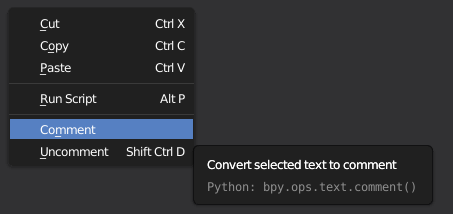
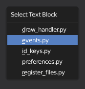

****
Misc
****

Select Whole String
===================

When the cursor is inside of a string declaration and you press ``ctrl Y`` the
whole string will be selected. This function is currently limited to the case
when the string is only in one line.

Comment and Uncomment
=====================

I extended the right click menu in the text editor to enable you to comment
the selected code lines out more quickly.

Switch Active Text Block
========================

You can change the active text block with the ``ctrl TAB`` shortcut more quickly now.
It opens a small menu with all the text blocks that are currently inside the file.

Correct Whitespace Inconsistency
================================

This operator can be found in the *Format* menu. It does the same as
*Convert to Spaces/to Tabs* but it chooses what to do automatically based on
the *Tabs as Spaces* property in the *Properties* panel.
