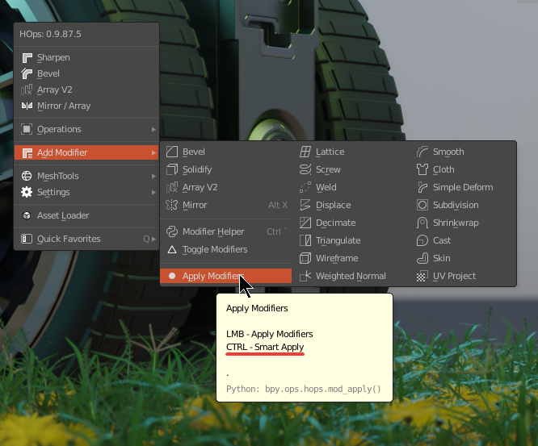
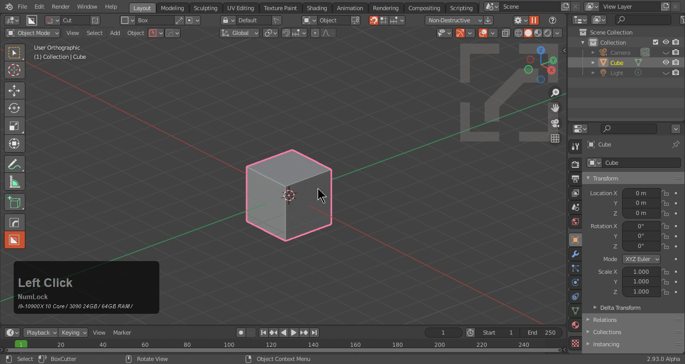
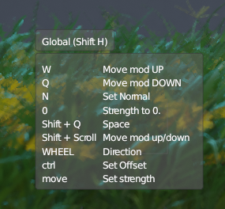
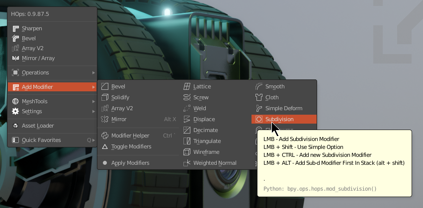

### HOPS Modifiers

With the introduction of Hard Ops 0098 a modifier system was added. This allows for procedural creation using hardOps and expanded modifier control. It was expanded further with the [hopsTool](hopsTool.md)

Currently the list has the following:

  - Bevel
  - Solidify
  - Array
  - Mirror
  - Lattice
  - Screw
  - Weld
  - Displace
  - Decimate
  - Triangulate
  - Wireframe
  - Weighted Normal
  - Smooth
  - Cloth
  - Simple Deform
  - Subdivision
  - Shrinkwrap
  - Cast
  - Skin
  - UV Project

  And then the custom versions of modals modified for hops:

  - Spherecast
  
    > subdivision x 3 + cast mod set to sphere and 1

  - Radial Array
  
    > displace + array + driver for radial array w/ live update

Then apply modifiers. Which does just that. Applies modifiers. But always read the tooltip. 

___

# Why custom mod options? Aren't the built in ones good enough? 

They are perfect however our aim was to expand on their start behaviors to more optimally use them on the fly without technical interruption.

___

## Modifiers

<iframe width="560" height="315" src="https://www.youtube.com/embed/5H1axV3ZYOk" frameborder="0" allow="accelerometer; autoplay; clipboard-write; encrypted-media; gyroscope; picture-in-picture" allowfullscreen></iframe>

___
# [Bevel](bwidth.md)

See [Bevel](bwidth.md)

Bevel needs no introduction but in case you need one it adds a bevel mod to the mesh which and give a nice rounding or filleting. Bevel is easily accessed from the Q menu

During the modal <kbd>H</kbd> shows help options.

The bwidth page goes more in depth on the topic.

<iframe width="560" height="315" src="https://www.youtube.com/embed/yVrcjQjTXho" frameborder="0" allow="accelerometer; autoplay; clipboard-write; encrypted-media; gyroscope; picture-in-picture" allowfullscreen></iframe>

<iframe width="560" height="315" src="https://www.youtube.com/embed/rGt4fSQt2lo" frameborder="0" allow="accelerometer; autoplay; clipboard-write; encrypted-media; gyroscope; picture-in-picture" allowfullscreen></iframe>

<iframe width="560" height="315" src="https://www.youtube.com/embed/vqQS3EgCsFE" frameborder="0" allow="accelerometer; autoplay; clipboard-write; encrypted-media; gyroscope; picture-in-picture" allowfullscreen></iframe>

___

# [Solidify](tthick.md)

See [Solidify](tthick.md)

Solidify also called tThick sometimes for menu reasons will add thickness to the model. It is useful for adding thickness to boolshapes.

There is also an H help panel.

[Solidify / Tthick is also useful](tthick.md) for boolean operations.

___

# Array

Array will allow users to add or modify an array modifier on an object.

Array also works on multiple objects.

Of course press <kbd>H</kbd> for help.

Array also supports the use and control of more than one array.

<iframe width="560" height="315" src="https://www.youtube.com/embed/E--wAN9Rlug" frameborder="0" allow="accelerometer; autoplay; clipboard-write; encrypted-media; gyroscope; picture-in-picture" allowfullscreen></iframe>

___

# [Mirror](mirror_symmetry.md)

Mirror brings up the interactive mirror gizmo that offers multiple ways to mirror.
For more information see [Mirror](mirror_symmetry.md).

[This also has the hotkey <kbd>Alt</kbd> + <kbd>X</kbd>.](hotkeys.md)

Videos on the topic have been prepared.

<iframe width="560" height="315" src="https://www.youtube.com/embed/mzauyPLRRrc" frameborder="0" allow="accelerometer; autoplay; clipboard-write; encrypted-media; gyroscope; picture-in-picture" allowfullscreen></iframe>

<iframe width="560" height="315" src="https://www.youtube.com/embed/MFS5mBfmbjw" frameborder="0" allow="accelerometer; autoplay; clipboard-write; encrypted-media; gyroscope; picture-in-picture" allowfullscreen></iframe>

___

# Screw

Screw will allow users to add or modify a spin modifier. The spin modifier is interesting because it can be used for a variety of things outside of lathe. By setting the angle to 0 this will behave like an extrude leading to some interesting results in non destructive asset creation.

This is how I use it on planes to make cylinoids.

It can also be used in conjuction with displace to create quick springs on the fly.

Press <kbd>H</kbd> for help during the screw modal.

___

# Displace

Adds a displace modifier on the model. It is used to move geometry while preserving the initial origin point.

It is also a part of the [radial array](circular.md).

Press <kbd>H</kbd> to help.

___

# Simple Deform

Adds a simple deform that can be toggled between twist, taper, and deform.

Press <kbd>H</kbd> for help.

___

# Cast

Adds or modifies a cast modifier set to sphere, cube or cylinder. Typically I use this on sphere for spherecast.
Users can scroll the wheel to change the result.

Press <kbd>H</kbd> for help.

___

# Decimate

Adds a decimate modifier to the mesh. We set this to 5 degrees which results in a non destructive form of clean mesh.

The gif below shows the difference on planar surface. It can be tricky in action and is [recommended to sort wisely.](sorting.md)

<kbd>Ctrl</kbd> + click to add an additional one in the modifier stack.

___

# Weighted Normal

Adds a weighted normal modifier to the selected object(s).

In blender shading is always a struggle especially with edgeflows going wild from modifier and boolean based modelling. Weighted normal is generally put at the end of the stack and can be useful for improving shading.

It's subtle in most cases but can be a lifesaver on more complex models.

<kbd>Ctrl</kbd> + click to add an additional one in the modifier stack.

<iframe width="560" height="315" src="https://www.youtube.com/embed/pwWEUD4k2Wg" frameborder="0" allow="accelerometer; autoplay; clipboard-write; encrypted-media; gyroscope; picture-in-picture" allowfullscreen></iframe>

___

# Subdivision

Adds a subdivision modifier to the selected object(s).

This is similar to <kbd>Ctrl</kbd> + <kbd>1</kbd> to add a subdivision modifier.

<kbd><kbd>Ctrl</kbd></kbd> + click to add an additional one in the modifier stack.

___

# Triangulate

Adds a triangulate modifier to the selected object(s).

___

# Lattice

Adds a lattice modifier and lattice to the selected object(s).

This is intended to fit to the bounds of the object so it is unparented in the event adjustments must be made.

<kbd>Ctrl</kbd> + click to add an additional one in the modifier stack.

___

# Shrinkwrap

Adds a shrinkwrap modifier to the main object while shrinkwrapping it to the secondary object.

___

# Wireframe

Adds a wireframe modifier to the selected object(s).

___

# Cloth

Cloth modifier is new to 987+ but is rapidly becoming an intergal part of the tool. 

<iframe width="560" height="315" src="https://www.youtube.com/embed/bLAabdYG8To" frameborder="0" allow="accelerometer; autoplay; clipboard-write; encrypted-media; gyroscope; picture-in-picture" allowfullscreen></iframe>

When used it will make a vgroup and pin the boundaries of the shape if the mesh is non manfold. This is intended to keep the shape from flying away. Users 

> Cloth was initially added in 986_27 below is it's release log.

<iframe width="560" height="315" src="https://www.youtube.com/embed/xTgaADWszLs" frameborder="0" allow="accelerometer; autoplay; clipboard-write; encrypted-media; gyroscope; picture-in-picture" allowfullscreen></iframe>
___

# Skin

Adds a skin modifier to the selected object(s).

___

## Custom Modifiers

___

# Spherecast

Spherecast was made to turn cubes into sphere. When used spherecast does the following things.

- adds a subdivision modifier level 3
- adds a cast modifier(sphere) factor 1

That's all it takes to turn a cube into a sphere.

___

# [Radial Array](circular.md)

[Radial Array](circular.md) does the following.

- empty with a driver based off of Array
- displace modifier to push the object outside for radius
- array with offset based off of initial empty

for more details see [Radial Array](circular.md).

Hovering over the option shows alternate creation types.

___

# Modifier Modelling

The video below showcases modelling using modifiers manually. This was before hops Modifier support was added.

<iframe width="560" height="315" src="https://www.youtube.com/embed/ivmVWILUzZU" frameborder="0" allowfullscreen></iframe>

<iframe width="560" height="315" src="https://www.youtube.com/embed/videoseries?list=PL0RqAjByAphHoCDKWy6OU4BwB7hTi8lo_" frameborder="0" allow="autoplay; encrypted-media" allowfullscreen></iframe>