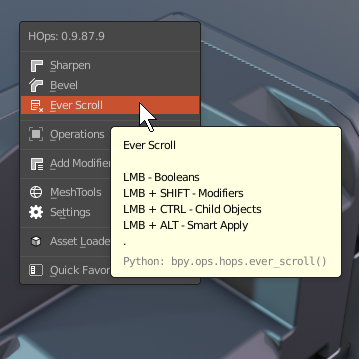
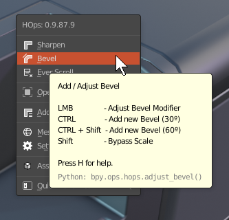
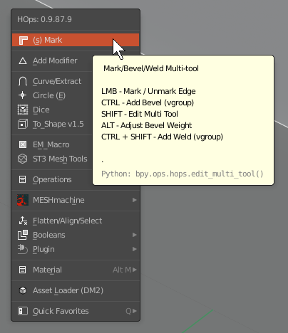
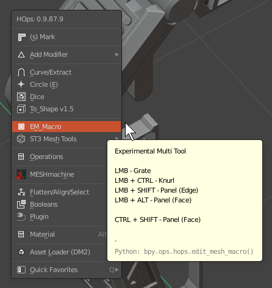

### Understanding Multitools

With the rewrite of HardOps for Blender 2.8 the concept of multitools were added. 

> Multitools were made as special Q menu options. Unfortunately it also has questions worth writing a page about. Functionally they work as intended but customization outside of the guide is considered out of scope at this time and will cause unsatisfactory results. For that reason using them as intended is recommended. 

HOPS continues to be a "currated" path as it has been since the beginning. This means the experience is centered on the UI and interface for getting around. We have been determined to get all options to show up under Q and simplify the experience to the Q system. Multitools expand on that concept of how to get the most out of the Q menu. 

# What is a Multitool?

> Multitools can be found by reading the tooltip. If there are functions attached to alt, ctrl and shift they cannot be mapped manually to keys involving shift, ctrl or alt. 

Below are some examples of multitools contained within Hardops and how they perform. Videos on the topics were also added to show how they were designed to be used. 

## [Sharpen](https://masterxeon1001.com/2019/12/25/hard-ops-00984-update-log/)

[Sharpen](https://masterxeon1001.com/2019/12/25/hard-ops-00984-update-log/) is a good example of a multitool. Multitools compromise most of the top options in HardOps. 

- LMB - Sharpen (Mark Sharp Edges)
- CTRL - [Csharp](csharpen.md) (Apply Modifiers)
- SHIFT - Autosmooth (Interactive Autosmooth Adjustment)
- ALT - Weighted Normals (Assistive with normal shading)
- CTRL + SHIFT - Resharp (Recalculate Sharpening)

<iframe width="560" height="315" src="https://www.youtube.com/embed/XRwo9HDAXvc" title="YouTube video player" frameborder="0" allow="accelerometer; autoplay; clipboard-write; encrypted-media; gyroscope; picture-in-picture" allowfullscreen></iframe>

<iframe width="560" height="315" src="https://www.youtube.com/embed/cz5BgWqGYLA" title="YouTube video player" frameborder="0" allow="accelerometer; autoplay; clipboard-write; encrypted-media; gyroscope; picture-in-picture" allowfullscreen></iframe>

Sharpen was rewritten for this in 984 back on 12-25-2019. It hasn't requried any work since aside from minimal changes like Smart Apply to Sharpen. 

## Everscroll

Another example of a multitool is Everscroll.

<iframe width="560" height="315" src="https://www.youtube.com/embed/HVsfmBJcg_4" title="YouTube video player" frameborder="0" allow="accelerometer; autoplay; clipboard-write; encrypted-media; gyroscope; picture-in-picture" allowfullscreen></iframe>

These tools are capable of launching into different aspects and are used in various ways throughout HardOps for troubleshooting and modifier replay.

## Bevel

Most tools are multitool, containing multiple functions. 

While bevel is not a multitool like sharpen / everscroll it has functions attached to ctrl that would override any hotkey starting with ctrl as the hotkey. 

<iframe width="560" height="315" src="https://www.youtube.com/embed/yVrcjQjTXho" title="YouTube video player" frameborder="0" allow="accelerometer; autoplay; clipboard-write; encrypted-media; gyroscope; picture-in-picture" allowfullscreen></iframe>

<iframe width="560" height="315" src="https://www.youtube.com/embed/yVrcjQjTXho" title="YouTube video player" frameborder="0" allow="accelerometer; autoplay; clipboard-write; encrypted-media; gyroscope; picture-in-picture" allowfullscreen></iframe>

## Mark

Mark in edit mode was made to fullfill many purposes that were excessive to make standalone tools. For that reason Mark exists. 

<iframe width="560" height="315" src="https://www.youtube.com/embed/eO5P-5BbS-A" title="YouTube video player" frameborder="0" allow="accelerometer; autoplay; clipboard-write; encrypted-media; gyroscope; picture-in-picture" allowfullscreen></iframe>

## EM Macro

EM Macro is also a multitool. Grate, Knurl, Panel(edge/face). In a way the consolidation of unused less popular options allows our work to continue and shuffle tools out of rotation while also keeping them available. 

<iframe width="560" height="315" src="https://www.youtube.com/embed/ZYnBDnT5xsY" title="YouTube video player" frameborder="0" allow="accelerometer; autoplay; clipboard-write; encrypted-media; gyroscope; picture-in-picture" allowfullscreen></iframe>

<iframe width="560" height="315" src="https://www.youtube.com/embed/7uWsvdePgIk" title="YouTube video player" frameborder="0" allow="accelerometer; autoplay; clipboard-write; encrypted-media; gyroscope; picture-in-picture" allowfullscreen></iframe>

None of these tools are made to be remapped to a hotkey. They are prime options and aren't intended to be beyond the main menu in most cases. 

> This is due to the tools not being designed to be assigned to multiple hotkeys. Blender tends to attach itself to every hotkey so we aim to keep everything self contained in the Q menu and hotkeys assigned more sparingly.

# Multitool Limitations 

There are a few things to note with multitools:

- MTs launch w/ modifier keys (ctrl, alt, shift, ctrl + shift and alt + shift)
- are unable to be right clicked mapped to a hotkey
- contain multiple functions and calls to other tools within the same tool

Because Multitools launch via modifier keys they are unable to mapped to hotkeys due to the hotkey interfering with the invoke method of the modal / operator. This is why they only work properly from the Q menu. 

> ex: mapping sharpen to alt + S will prompt Weighted Normal by default.

Eventually we may aim to have multitools customizable but that differs from "externally accessible".

<iframe width="560" height="315" src="https://www.youtube.com/embed/XRwo9HDAXvc" title="YouTube video player" frameborder="0" allow="accelerometer; autoplay; clipboard-write; encrypted-media; gyroscope; picture-in-picture" allowfullscreen></iframe>

# What can be done about it? 

Use the tools as presented is the recommended option at this time.

Deviation remains out of scope and unsupported. 

We will have to see what the future holds for development with it or save it for a sequel or future concept with the idea being considered "inapplicable" for this round.  

Our goal is to remain consistent so changing things for individuals must be deeply considered to avoid alienation. 

<iframe width="560" height="315" src="https://www.youtube.com/embed/videoseries?list=PLjqpj14voWsXFPY_K2IWoGfm7xoyu52_G" title="YouTube video player" frameborder="0" allow="accelerometer; autoplay; clipboard-write; encrypted-media; gyroscope; picture-in-picture" allowfullscreen></iframe>

