### Operations Submenu (Object Mode)

## What are Operations?

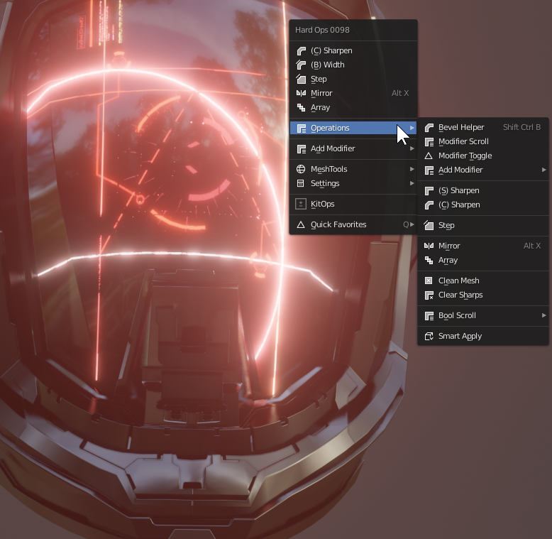

With meshes selected, the first option below the suggested options is the operations menu. This contains most of the options that are special use cases but may or may not pop up in the first options of the main menu.

<iframe width="560" height="315" src="https://www.youtube.com/embed/DPoXrep8WQ4" frameborder="0" allowfullscreen></iframe>

---

## Bevel Helper

Pressing <kbd>Ctrl</kbd> + <kbd>Shift</kbd> + <kbd>B</kbd> brings up the bevel helper. This is a helper designed for making bevel management easier.
It is also located in the Operations submenu.

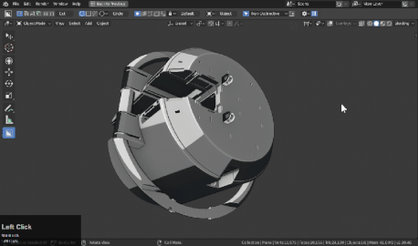

In the helper you can adjust every bevel present on a model.

As you can see the presets / full properties are also available

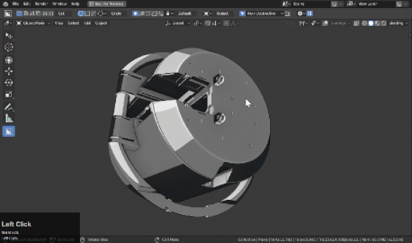

---

## Modifier Scroll

Whenever you are working a modifier based workflow being able to roll through the history is important. By locating troublesome areas you can better continue without issue.

Pressing <kbd>L</kbd> during modal will loop.

There are also options to apply modifiers during this phase but applying mods midway is risky and not recommended in procedural creation.

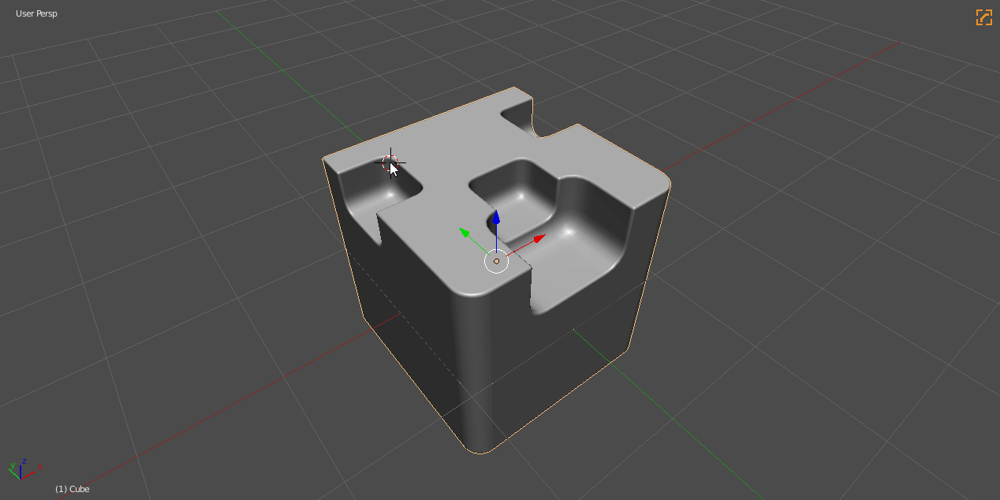

---

## Modifier Toggle

Toggles all mods off / on.

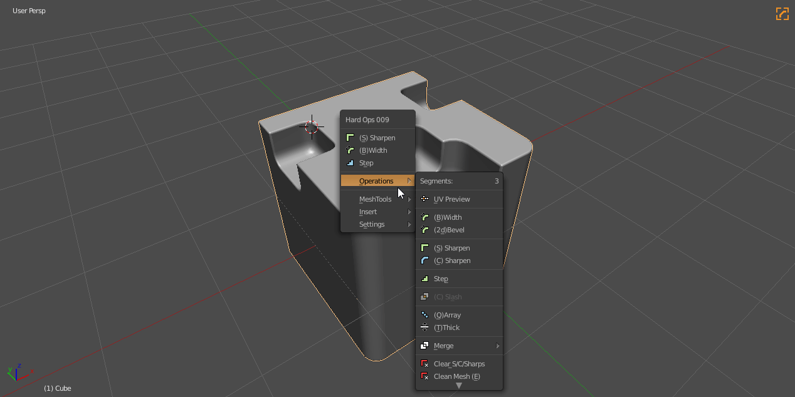

---
## sSharpen

see [ssharpen](ssharpen.md)

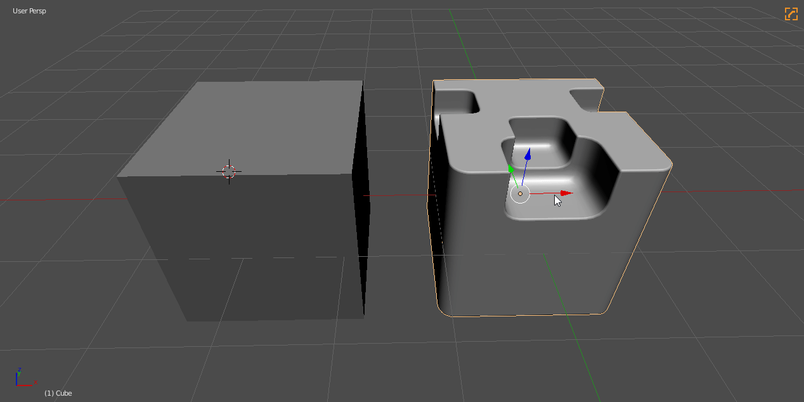

sSharpen is the smooth operator of Hard Ops. It simply sets up the mesh for hard surface. Can also do recalulation for sharp edges and can mark them as sharps / crease / seam / bevel weight when needed.

---

## cSharpen

see [csharpen](csharpen.md)

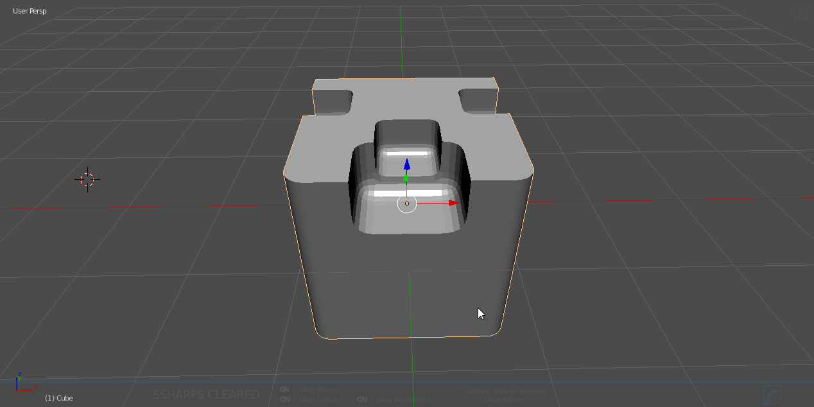

cSharpen is the complex version of sSharpen. It does all that sSharpen does with the added bonus of adding bevels and applying boolean modifiers.

---

## step

see [step](step.md)

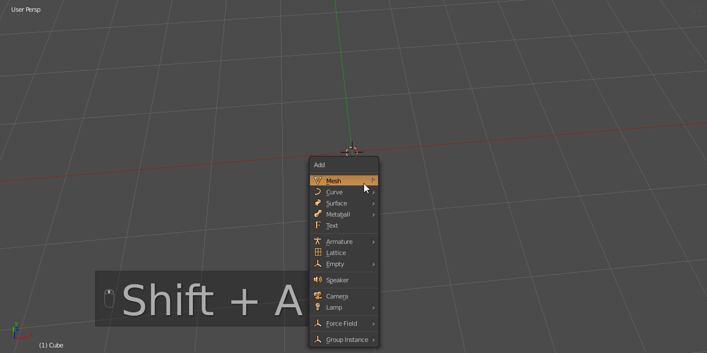

Step will bake the bevels into the mesh while also adding another bevel modifier. This is part of the Hard Ops detailing workflow. The non destructive variant is also now in hardOps in the form of multi-bevel sorting and can even be done in hopsTool.

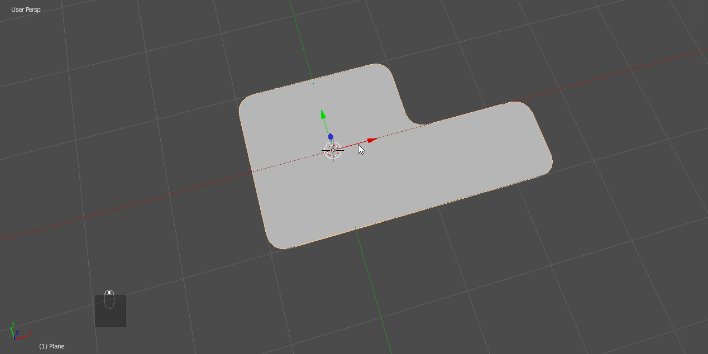

---

## Mirror

[Mirror is the latest attempt by us to streamline all our mirroring struggles into 1 tool.](mirror_symmetry.md)

It even supports multi-object.

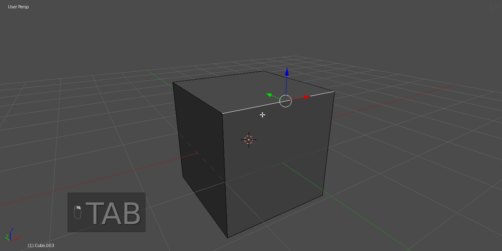

---

## Array

Array is the upgraded version of Qarray going in the same direction as mirror but is still a work in progress.
When launched it will bring up a gizmo for user interaction. It is important to make sure gizmos are not disabled before starting.

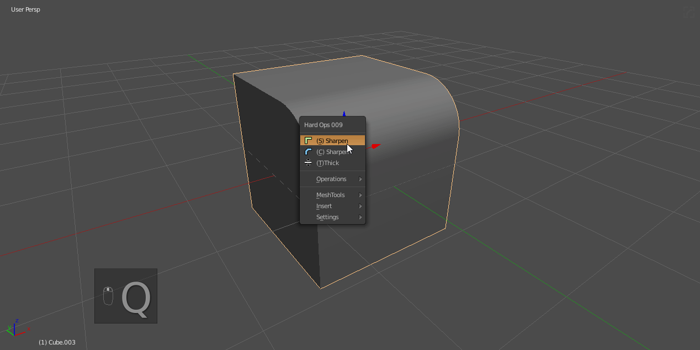

> An active tool is a tool that remains open as a state until it is ended. The array gizmos will persist across object selections and sessions until exited. To exit Array you can right click or press W to exit it like any other active tool. Also escape for array also works.

Using array from the modifier options uses the classic modal array and operations and main menu uses the active tool version.

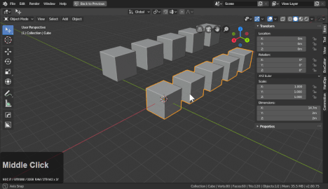

---

## Clean Mesh

Clean mesh is a function made to do the following:

  - dissolve useless edges
  - remove useless points
  - removes doubles

When using booleans the mesh can have errors that I call "spinals" that are useless edges created to assist boolean operations. The more of these edges the greater the risk for boolean errors and issues. This will assist users in keeping the mesh clean for operations going forward.

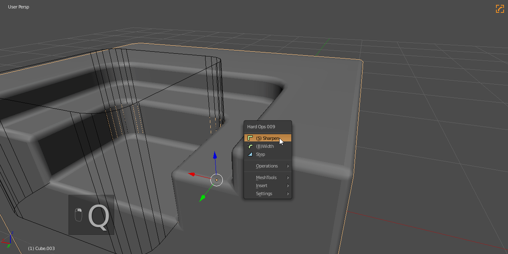

---

## Clear Sharps

see [Clear s/C/sharps](clearssharps.md)

Clears a mesh from sharp information and resets the sstatus back to undefined.

Does the following:

  - remove ssharps
  - resets sstatus
  - removes bevel / solidify  modifier
  - removes autosmooth
  - removes smooth shading

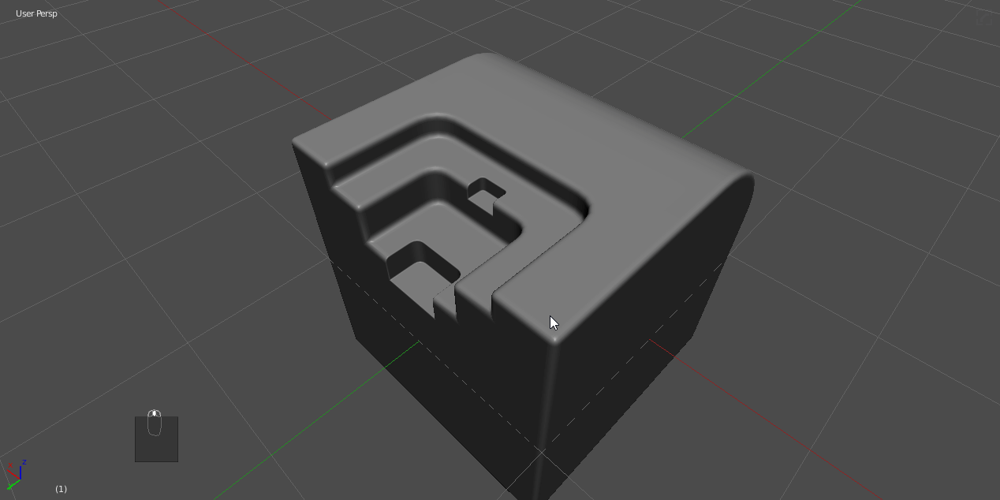

---

## Bool Scroll

These options allow users to scroll through booleans in order to troubleshoot or rebuild the boolean part of the process.

# Object Scroll

Object Scroll – allows for cycling of boolean shapes that remain live on a model via boolean modifier object fields.

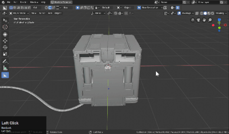
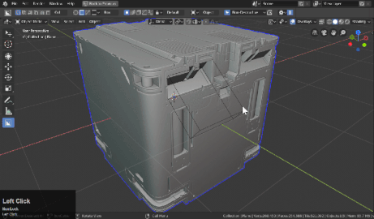

# Cycle Booleans

Cycle Booleans – allows for cycling of each boolean modifier present on a model individually. It also support restacking certain modifiers.

# Additive Scroll

Additive Scroll – allows for replay of boolean history on a model using the modifier stack.

---

## Smart Apply

Smart apply was an idea I had for making it easier to apply models and move on with different workflows and export. Right now it’s simple but we hope to improve it immensely in the future and make it the one stop shop for applying modifiers and converting to mesh within Hard Ops.

If the mesh is csharp: it applies only booleans.

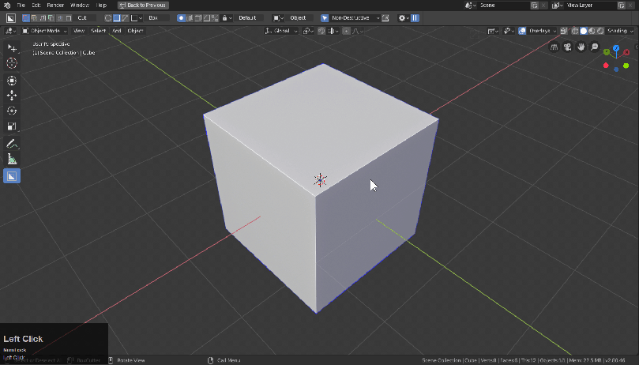

If the mesh is undefined: it converts it to mesh.

