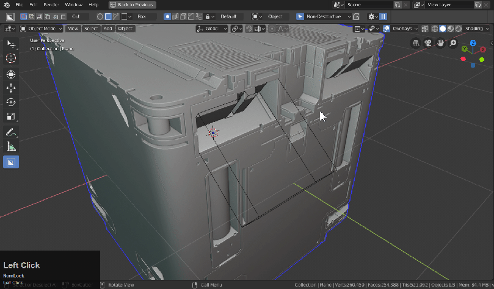
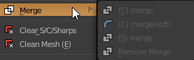
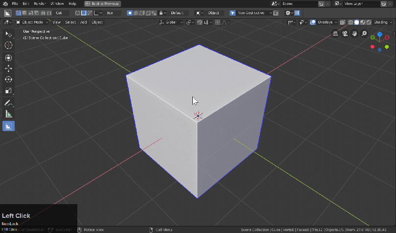

### Operations Submenu (Object Mode)

## What are Operations?

With meshes selected, the first option below the first 3 options is the operations menu. This contains most of the options that are special use cases but may or may not pop up in the first 3 options of the main menu.

Some of these options are slightly different versions of their counterparts for example 2d bevel is simply a version of Clean Mesh(E) and (B)Width on vertices. There are also some special options here for managing sharps and even doubling/halving bevels present on meshes.

<iframe width="560" height="315" src="https://www.youtube.com/embed/DPoXrep8WQ4" frameborder="0" allowfullscreen></iframe>

---
## UV Preview

Displays the UVs present on a mesh in the 3d view.

Sometimes going into the UV image editor just to preview uvs is excessive and this operator now displays the uvs in the 3d view allowing you to quickly see them and then fade away.

> Tip: If the mesh has no UVs you can quickly uv it with Q >> meshtools >> x unwrap

---
## bWidth

Adjusts the bevel amount on a mesh. Also supports multiple meshes.

Intended to adjust the bevels on a csharp mesh, however if the mesh is undefined it will add a simple bevel modifier.

The mesh on the left is undefined so when it received a bevel it is set to angle / clamp lock. The object on the right though has been set to weight / clamp unlock.

It is generally recommended to have the mesh in a cSharp state to use bWidth hence it being an important option in the big 3 q menu.

---
## 2dBevel

When used 2d bevel does the following:

  - cleanmesh(E) basically disolves any edges / points that are not needed for the shape.
  - bevels each remaining vert creating a rounded version of the shape

***This tool is intended to be used ONLY ON 2D PLANES - not 3d objects***

The important thing to note is that in order for this to work there can be no useless points or edges. Otherwise the tool does not work correctly.

Here is an example of using this bevel with useless geo present.

2dBevel will always try to remove the extra points.

see [2d bevel](2dbevel.md)

---
## sSharpen

see [ssharpen](ssharpen.md)

sSharpen is the smooth operator of Hard Ops. It simply sets up the mesh for hard surface. Can also do recalulation for sharp edges and can mark them as ssharp when needed.

---
## cSharpen

see [csharpen](csharpen.md)

cSharpen is the complex version of sSharpen. It does all that sSharpen does with the added bonus of adding bevels and applying boolean modifiers.

---
## step

see [step](step.md)

Step will bake the bevels into the mesh while also adding another bevel modifier. This is part of the Hard Ops detailing workflow.

---
## cSlash

see [cSlash](cslash.md)

cSlash is a cutter. This option requires 2 meshes selected and intersecting. Also this option is best used from the context sensitive Q menu.

This tool is the combination of rebool and cslice with additional functionality extending it's original usage.

---
## qArray

see [modals](modals.md)

qArray is simply intended to add an array modifier and allow the user to move the mouse to determine offset. Also is capable of handling more than 1 array at once and as with all modals has an h for help hotkey.

---
## tThick

see [modals](modals.md)

tThick is intended to add thickness to an object via solidify. tThick can also deal with offsets and it useful for mech creation. As with all modals, it has an h for help hotkey.

---
## Merge

see [inserts](inserts.md)

Merge options are for dealing with subset inserts. These are best handled from the main menu context sensitive Q options. No override functions exist. These are intended purely to merge subset formatted objects to meshes.

- cMerge (hard merge)
- cMerge(soft) (hard merge / without modifiers being applied)
- sMerge - soft merge. merge while keeping everything live for adjustment
- remove merge - removes merge from mesh and allows insert to be reused

---
## Clear s/C/sharps

see [Clear s/C/sharps](clearsharps.md)

Clears a mesh from sharp information and resets the sstatus back to undefined.

Does the following:

  - remove ssharps
  - resets sstatus
  - removes bevel / solidify  modifier
  - removes autosmooth
  - removes smooth shading

---
## Clean Mesh(E)

Clean mesh is a function made to do the following:

  - dissolve useless edges
  - remove useless points
  - removes doubles

When using booleans the mesh can have errors that I call "spinals" that are useless edges created to assist boolean operations. The more of these edges the greater the risk for boolean errors and issues. This will assist users in keeping the mesh clean for operations going forward.

---
## Material Link

Makes all materials single user and removes duplicate.00x materials from objects.

This can be useful for dealing with inserts that have placeholder mats. Select all and use the option and the 00x entries will be consolidated.

---
## Bevel Multiplier

Doubles the bevel's width on all beveled objects selected when running this operator.

Also has an F6 with a checkbox for using as a bevel divider which is also useful.

And here is an alternative use case of using the F6 to divide which works better in most cases.

Shift + R can also repeat the effect afterwards if you need to increase it even more.

---
## Sharps Manager

This tool is used to convert sharp edges into something else more useful in Hard Ops.

A typical use case would be. After applying a level of subvision: bevel marks and creased edges are removed. But sharps are left behind. This can convert sharps back into ssharps without using csharp/ssharp.

Most of the time I use this: while hold shift I will select sharps on one side and shift drag on the other side to select everything.

The lower options are for specific use cases even I have never experienced.
