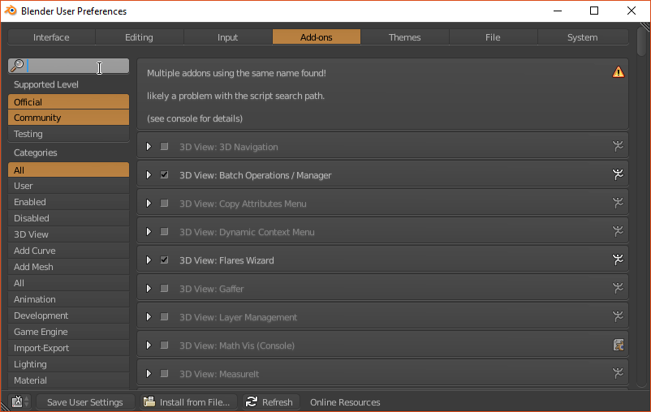
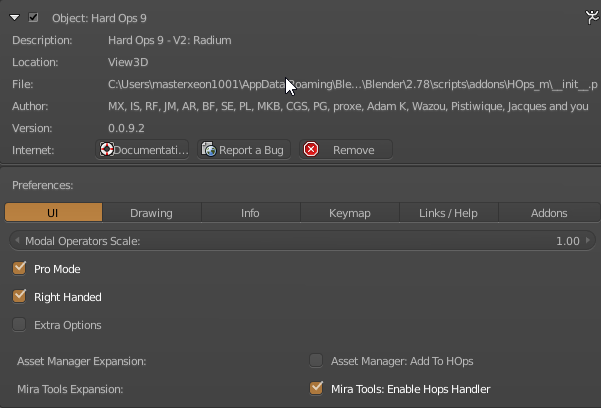
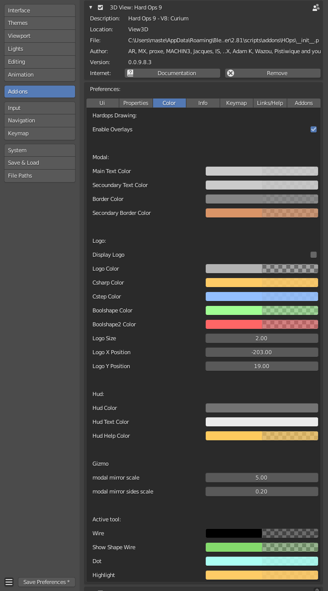
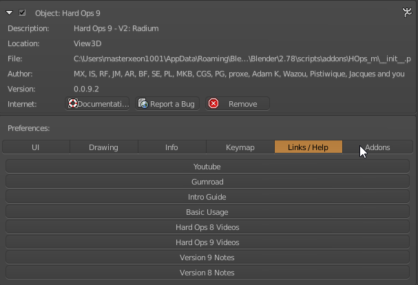
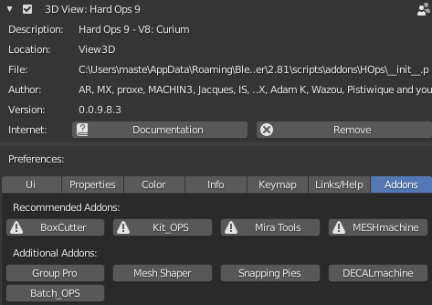
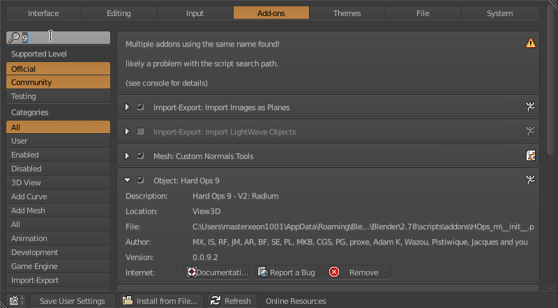

### Preferences

After enabling Hard Ops a series of preferences will be shown. For the most part nothing has to be configured before usage unless you use an alternate key config or don't have a ~ key.

---

### UI Tab

Below is a description of the following options.

- Modal Scale: determines the mouse distance for movement. Useful for scale modelling or large scale operations. Also located in the misc tab of the HOPS helper.

- Popup DPI Factoring: uses the dpi for scaling of popups and helpers. No need to adjust this if the ctrl + ~ helper displays correctly.

- Helper popup: has the helper show up with an ok button. This prevents the window from leaving when the cursor leaves the window.

- Bevel helper popup: has the helper show up with an ok button. This prevents the window from leaving when the cursor leaves the window.

- Use Kitops popup: has the helper show up with an ok button. This prevents the window from leaving when the cursor leaves the window.

---

### Drawing Tab

The drawing tab contains options that determine how the drawing system of Hard Ops displays.

Enable Tool Overlays: enables HOPS drawing in the 3d viewport. This should always be enabled.

The rest are colors for tools and systems.

---

### Info Tab

Just info for goofs. Maybe time to update this area.

---

### Keymap

Keymap shows all the hotkeys that are associated via hard coding with HOPS.

> If you need to remove a hotkey it is recommended to uncheck it at the left instead of clicking the x on the right. That could cause you to permenantly lose the hotkey.

This screen is more for reference than adjustments. The hotkeys can be unpredictable when edited externally.

---

### Links

Links contains buttons to assist users with locating documentation. Tutorials and sometimes exclusive content. These links sometimes change between updates and usually contains links for assisting users.

### Add-Ons

In the creation of Hard Ops there has come many tools that accentuate the workflow or provide essential functions outside the scope of Hard Ops. These options also change periodically depending on support amounts and integration.

>The only external tool required is Looptools which is in blender by default.
   

The way the addons are detected is the naming.      

>Running the following line in the script editor of blender will show all enabled add ons and their name in the system. This can help with troubleshooting.    

 **bpy.context.user_preferences.addons.keys()**        

        

If the naming is not exact this will cause issues. Just rename the .py to resolve the issue.        

The naming is as follows.       

- [Boxcutter](https://gumroad.com/l/BoxCutter/)     
- [kitops](https://gumroad.com/l/kitops)     
- [mira_tools](http://blenderartists.org/forum/showthread.php?366107-MiraTools)     
- [meshmachine](https://www.blendermarket.com/products/MESHmachine)
- [Group Pro](https://gumroad.com/l/GroupPro/)
- [bms](https://gumroad.com/l/bezier_mesh_shaper)
- [power_snapping_pies](https://github.com/mx1001/power_snapping_pies)
- [DECALmachine](https://gumroad.com/l/DECALmachine/)       
- [Batch Operations](https://gumroad.com/l/batchops)      

Also the above texts are hyperlinks to their locations.

It is recommended to check them out and use them as you see fit or worth.
