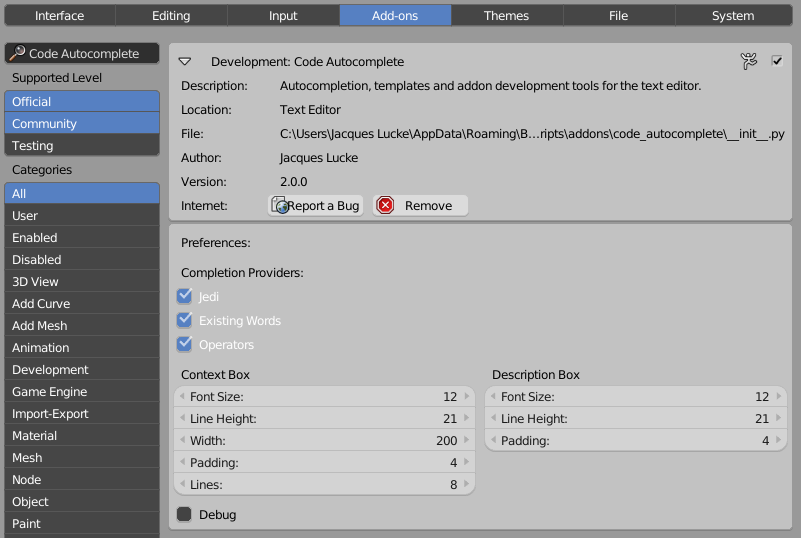

***********
Preferences
***********

There are a few settings you can change to customize the addon.
The *Completion Providers* are functions that take your code and cursor information
and try to find suggestions for you. Currently there three main completion providers:

    1. **Jedi**:
        The Jedi autocompletion library analyses your python code and all the files
        you import to give you the best suggestions possible. Unfortunally, due
        to the dynamics of the python programming language this does not work
        in all cases.
    2. **Existing Words**:
        This will collect all the words that are in the current text block and
        allows you to rewrite eg. names you previously wrote faster and with less
        spelling mistakes.
    3. **Operators**:
        Whenever you want to call a blender operator using ``bpy.ops.`` this completion
        provider helps you and saves time because you don't have to look up the
        correct parameter names online in the api.

Beside these providers you get multiple properties to change the appearance of
the **context and description box** in the text editor. The settings should be pretty
self explanatory.

The **Debug** property is only for me if I want to activate some additional print
statements in the addon which help me to track down bugs.

