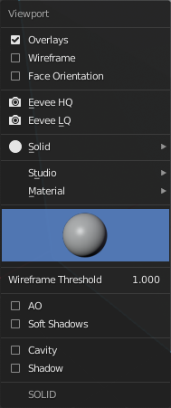
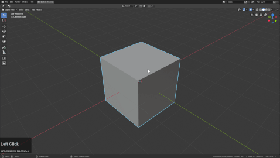

### Rendersets

With the addition of eevee we wanted to add something to make rendering easier.

Pressing <kbd>Alt</kbd> + <kbd>V</kbd> will bring up the viewport submenu.

- overlays - turns overlays off and on (minimal mode)
- wireframe - shows all wireframes in the 3d view.
- face orientation - shows normal orientation / useful for fixing geo

- eevee HQ - high quality viewport preset
- eevee LQ - low quality viewport preset

- solid / lookdev / wireframe / rendered viewport toggle

- studio / matcap / flat shading toggle

- Wireframe threshold (needs to be at 1 for wireframe showcase)

- ao - ambient occlusion - viewport self shadowing.
- soft shadows - softens shadows from lights in lookdev and render

- cavity - cavity display on modal. Helps surfaces read better
- shadow - shadows cast in solid view.

# Eevee HQ / LQ changes

Here you can see that Eevee HQ sets up the solid view as well as the render.

The difference in lookdev and render is immense and toggling it can speedup performance in a pinch while allowing users to jump back in time for presentation.

# Accessing presets via the mini helper / n panel.

There is also a mini button in the corner as well as the n panel for locating and adjusting these settings as well. Our goal was to get you to render from the 3d view without properties.

