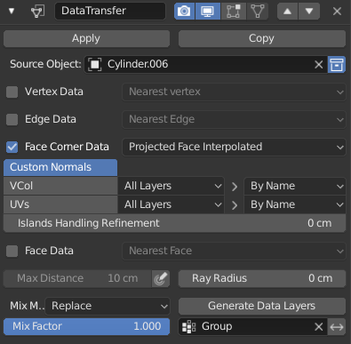

### Shading Options

> Shoutout to AR for the examples for this topic.

When performing a boolean on a curved surface a result similar to above is the expected result.

Alternatively I could try adding isolation loops for the boolean but the shading is still less than perfect. When bevel is added to the mix the shading issues multiply. In the below example you can see how minimal work gives minimal result.

# Solution 1: Manual Cleanup

The art of manual cleanup is an art indeed and with clever usage of

- J >> connect 2 verts
- Ctrl + T >> triangulate selection (not the whole mesh)

> As you can see the result is passable but not perfect. This is the solution used most of the time due to versatility and still being able to work and design.

# Solution 2: More Geo

With more geo booleans will cut better than ever but with more geo comes more responsibility. Too much geo will limit the bevel modifier and make the result heavier than initially planned. However adding more geo is the easiest way to ensure booleans cut smoothly and predictably.

> As the example shows the result can look quite good but too much geo will cause issues with the bevel being added. So this method can be useful to a smaller degree than 38k verts on a cylinder to ensure a smooth cut.

# Solution 3: Normal Transfer

[Normal transfer was first popularized by Machin3, It was after seeing his workflow that NT became part of our workflow as well. ](https://blendermarket.com/products/MESHmachine)

A few notes about this workflow

- booleans must be applied
- no live bevel (unless it can be first)

And then for the modifier portion.

- a group for the isolated area of normal projection
- a mesh (stashed) for recalling the desired normals

When dealing with the normals this way the groups will need to be accurate. For this example there was an edge split applied but when remerged I had to use an inset to get the shading right. That can be shown in the gif below.

[For more information on this workflow I recommend checking out MeshMachine.](https://blendermarket.com/products/MESHmachine)

<iframe width="560" height="315" src="https://www.youtube.com/embed/5hvusH1QrRc" frameborder="0" allow="accelerometer; autoplay; encrypted-media; gyroscope; picture-in-picture" allowfullscreen></iframe>
