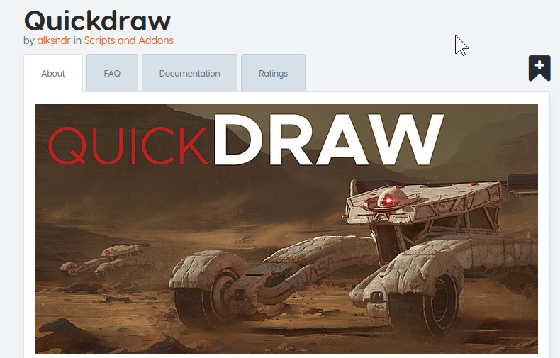

## SketchOps

# What is sketchOps?

When 2.8 added grease pencil sketch support it became apparent a few additions would be needed to make it usable for rapid concepting.

Below is a video of that in action.

<iframe width="560" height="315" src="https://www.youtube.com/embed/dtv3YsNr6Z8" frameborder="0" allowfullscreen></iframe>

> We have plans to expand on this idea in the future however for now [Quickdraw by: alksndr is sufficient for grease pencil shape exploration.](https://www.blendermarket.com/products/quickdraw)

