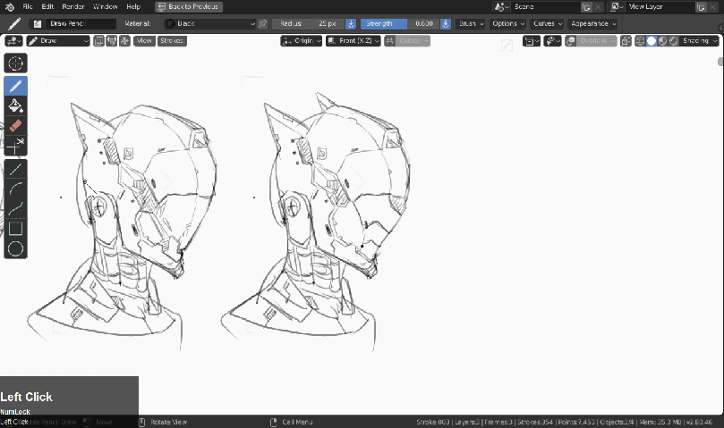
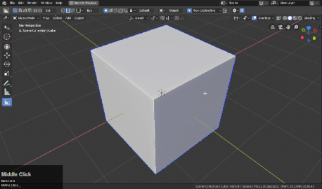
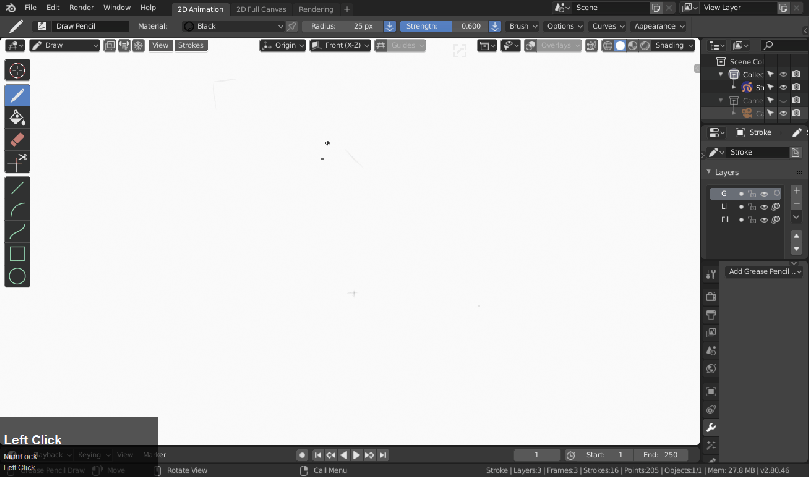

## SketchOps

# What is sketchOps?

When 2.8 added grease pencil sketch support it became apparent a few additions would be needed to make it usable for rapid concepting.

Below is a video of that in action.

<iframe width="560" height="315" src="https://www.youtube.com/embed/dtv3YsNr6Z8" frameborder="0" allowfullscreen></iframe>

> We have plans to expand on this idea in the future however for now [Quickdraw by: alksndr is sufficient for grease pencil shape exploration.](https://www.blendermarket.com/products/quickdraw) We at TeamC support and recommend his product. 

# Grease Pencil Support

In addition to having the helper fully support materials and modifiers for grease pencil we also added a couple of new operators.

In the <kbd>Q</kbd> menu the following have been added.

- Copy / Move – just makes a copy and moves the object during draw. Comes in handy for making quick variants in a row.

- Surface Offset – allows for drawing on the surfaces of objects easier.

- Mirror Gizmo – Press <kbd>Alt</kbd> + <kbd>X</kbd> to mirror. (symmetry not supported yet)

