### Ssharpen overview

Ssharpen does the following things.

- set shading to smooth from flat
- enables autosmooth / sets angle to 60
- marks edges as crease / sharp / seam / bevel weight based off of sharp parameter.

For more information on how ssharpen came about see [sharpening](sharpening.md).

After using ssharpen there is a F6 menu where you can adjust parameters and make changes post operation. However this is antiquated and could possibly [crash in Blender 2.8](https://builder.blender.org/download).

The classic F6 menu is shown below.

Additive mode will made ssharpen add new sharp edges
  - unchecking it will make it recalculate the sharps on the mesh
  - this is normally checked by default so manually marked edges won't be overwritten

  Additive mode on. Notice how edges I mark in edit mode remain marked.

  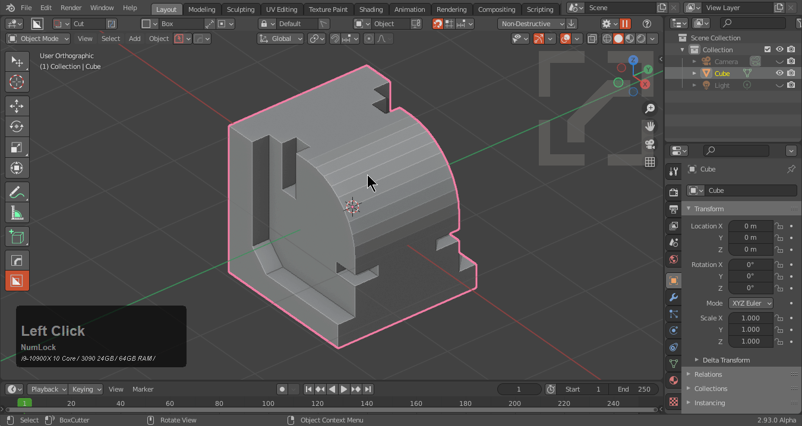

  Additive mode off. Recalculated and marked based off of angle. Sometimes this is useful.

  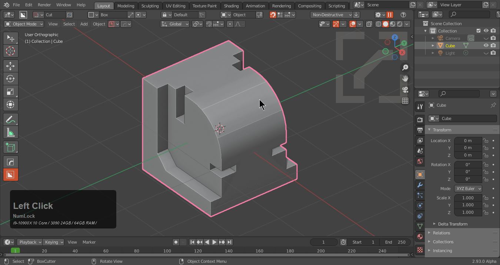

The global toggle on by default ensures the options set here will be repeated next time. Uncheck this to use these setting only once this instance. This remains on by default and we rarely turn it off if ever.

So in short ssharp is all the processes mentioned above combined into one tool for quick hard surface smoothing. This is considered soft smoothing. The majority of time. The edges I mark are marked for a reason. But if you ever need to recalculate all the option is there for you.

There is also a video on this topic specifically.

<iframe width="560" height="315" src="https://www.youtube.com/embed/5lzfHQBel0o" frameborder="0" allowfullscreen></iframe>

---

## Ssharp In Action

When ssharp is used the mesh receives the above mentioned things. There is also an F6 menu for adjusting the behavior.

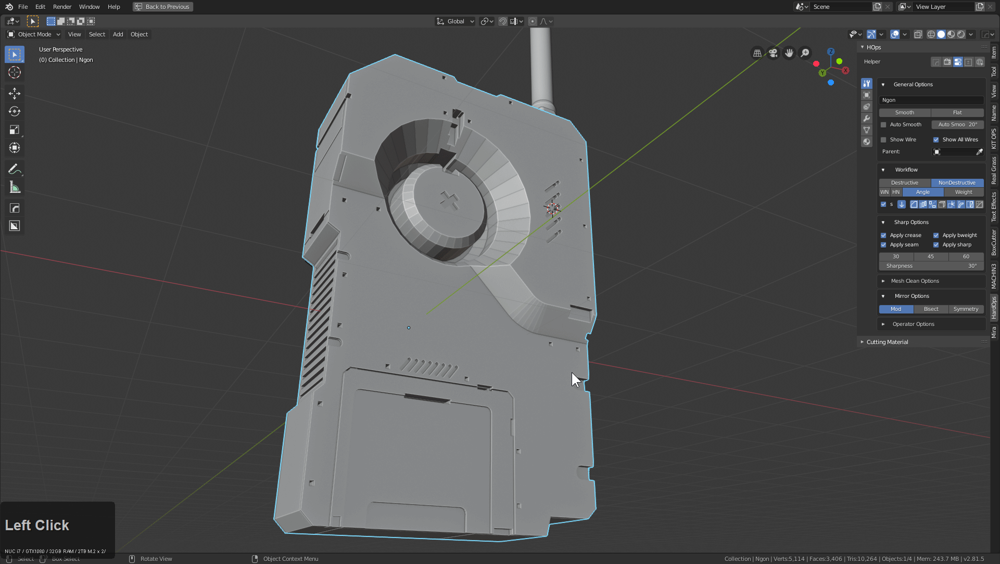

> It is not recommended to change the sharpness or the autosmooth angle from the F6 menu. It is preferred to modify this from the outside in the T panel or the HOPS helper.

The only parameter to go into in the F6 is the Additive mode.

Additive mode is checked by default and basically makes the ssharps not overwrite previous ssharps and their levels.

Unchecked this will remove all ssharps and mark them again which can be useful in some situations. But in the below case you can see at 60 the remarking was not so successful.

Additive mode being off can also have annoyances which is why this is an alternate behavior. For example to fix shading sometimes certain edges must be marked. Having them recalucated will cause shading issues without manual fixes.

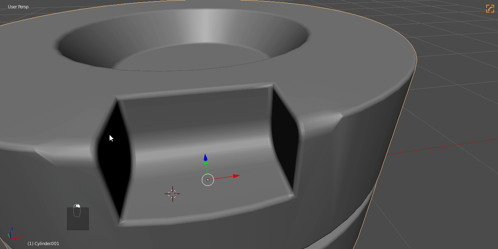

---

## Inside Out Sharpening

Over the course of using SSharpen on thousands of parts it has become apparent that using the lower left menu that no longer floats to change parameters can sometimes be risky and a one way trip to the desktop in some cases. Because of this we put the ssharpening parameters outside in various panels to experiment with adjusting the behavior in advance to try and maintain stability.

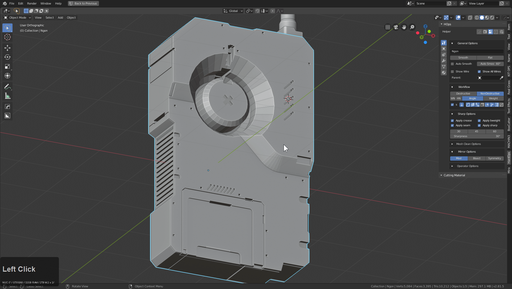

Working this way can be more risky however with complex meshes so for that reason the ssharpening paramerters are located outside of the operator.

It formerly was like this in 2.79

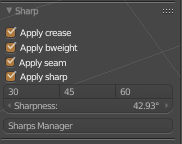

As of now these options are in the [helper](helper.md) / N panel and hopsMini helper.

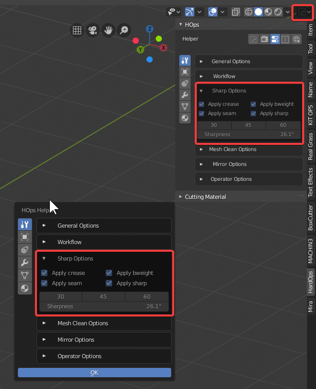

The 30 / 45 / 60 buttons are presets for degress. Even this has a purpose. For example if you are cutting a bevelled mesh with 3 segments into another mesh. It will get caught at 30. However at 45 the sharpening is optimized to behave better.

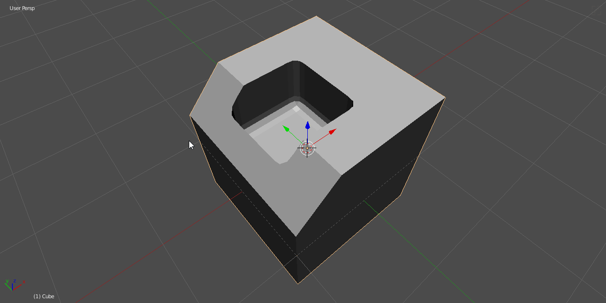

In the example I had to go back and do edit mode sharpening on those two edges at the top but the interior was sharpened correctly instead of being caught at 30 degrees. I tend to use this option on higher values than 30 past blocking in.

> Seam may not be a good option to have checked when you begin UVing for obvious reasons.

---

## Why Ssharpen

>> Sharpen also is ran in edit mode with Set Sharp if nothing is selected. Otherwise it just marks / unmarks the selection. This can be handy for using ssharpen without exiting edit mode.

If you were to ssharpen manually you would have to click smooth, set autosmooth, go in edit mode select sharps based off of angle then mark as crease / sharp / seam / bevel weight. For simplicity we call that marking ssharp. To do this manually would put unwanted wear on your keyboard not to mention and uncountable amount of additional clicks.

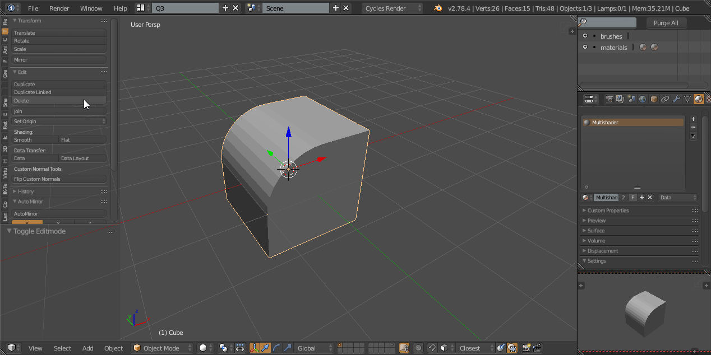

> SSharpen does not add a bevel modifier or any modifier of any kind. It only smooths the object and marks edges.
As a result we feel it is the softer of the duo ssharpen/scharpen

---

## SSharpen Usage

Ssharpen can be used to update the ssharpening on a mesh after mesh operations like edit mode changes or manually applying modifiers. In the below example the blue marked edges represent the ssharp edges.

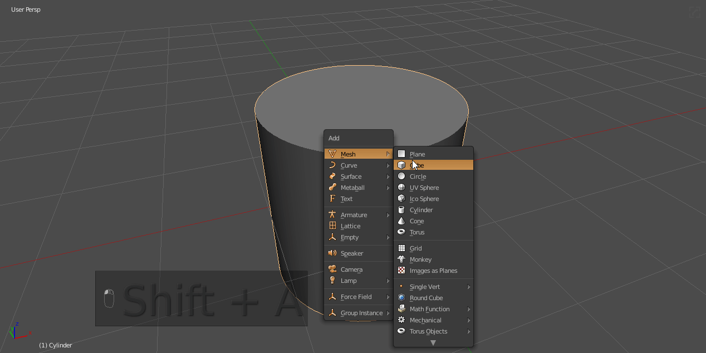

Ssharpen can also be used as an updater for [Csharpen](csharpen.md) **in weight**. Once a mesh is in a Csharp state (bevelled) you can use ssharpen to get update bevel weights.
This is the secondary use of ssharpen.

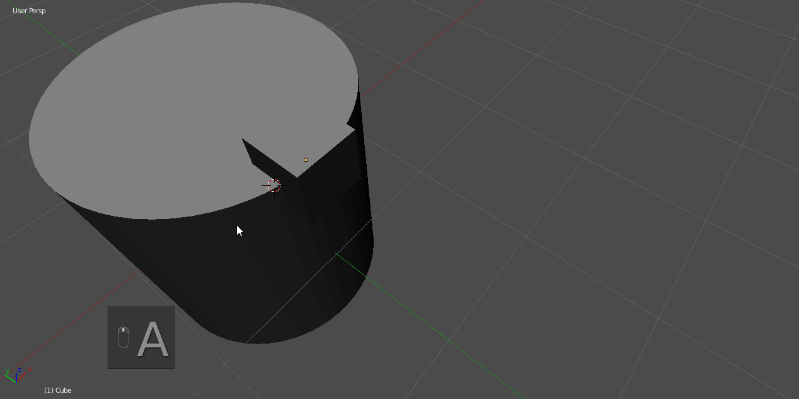

Ssharpen also can be used in subdivision blocking and for many other things that require marking edges.

>Q: I mean the name. Why the name?

>A: Well it was initially called soft sharpen so we just shortened it. Its must better than replacing it with " click smooth, set autosmooth, go in edit mode select sharps based off of angle then mark as crease / sharp / seam / bevel weight"

---

## Ssharpen Extra Uses

# Subdivision Rebasing
Sometimes the right marking of an edge can be the difference between smoothing a cylinder or turning it into a mess.

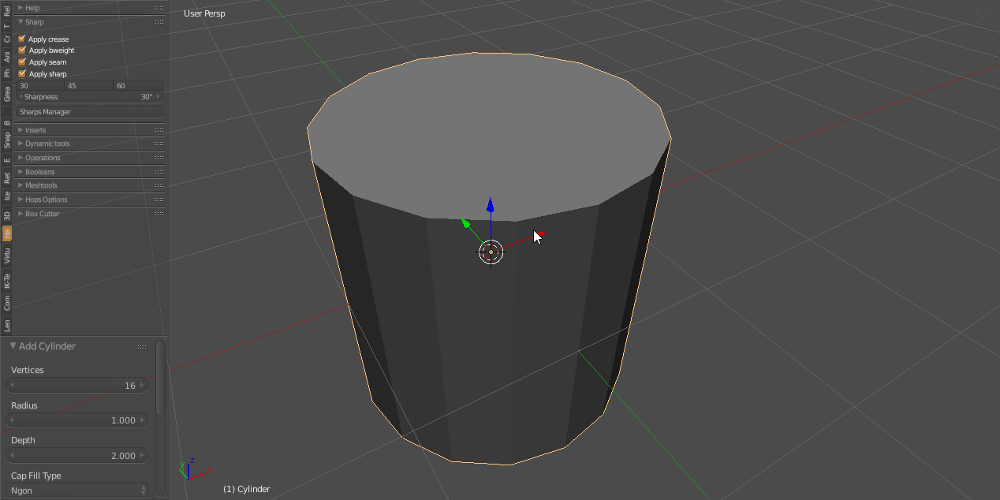

This was something I discovered by accident but found to be quite essential.
If you put a subsurf on the default cylinder you lose the form, but with the creasing in the right area you can prevent the form from collapsing and add roundness to the are a you intend.

# Mark Seams For Quick Selections
When utilized with the seams checkbox in either the helper or the tpanel, you can make face selections in edit mode with L (select linked)

This is utilized for material assignment or face extraction.

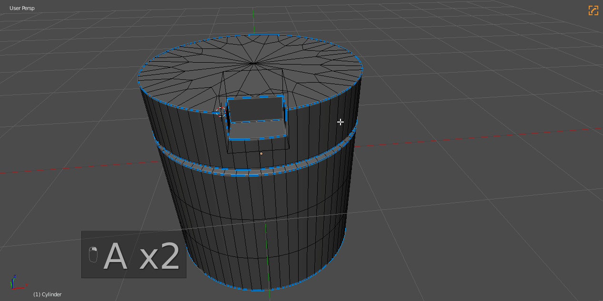

---

### sSharpen use cases

- calculating ssharps on meshes

- recalculating ssharps on meshes

Recalculation is done via the F6 menu that is available after running the operator.

---

### SSharpen F6 options

1. sharpness
   * edge angle to witch sharpening is applied - default 30

2. auto smooth angle
   * value for autosmoouth angle for selected object - default

3. additive mode
   * ON - apply defined sharpness and keeps other already existing sharp edges
   * OFF - clears all sharp edges before applying its own sharpness

2. global
  * ON - ensures the options set here will be repeated next time
  * OFF - uncheck this to use these setting only once this instance.

  This remains on by default and we rarely turn it off if ever.

---

## Removing Csharp / Ssharp marks / modifiers from meshes

See [Clear s/c Sharps](clearssharps.md)
