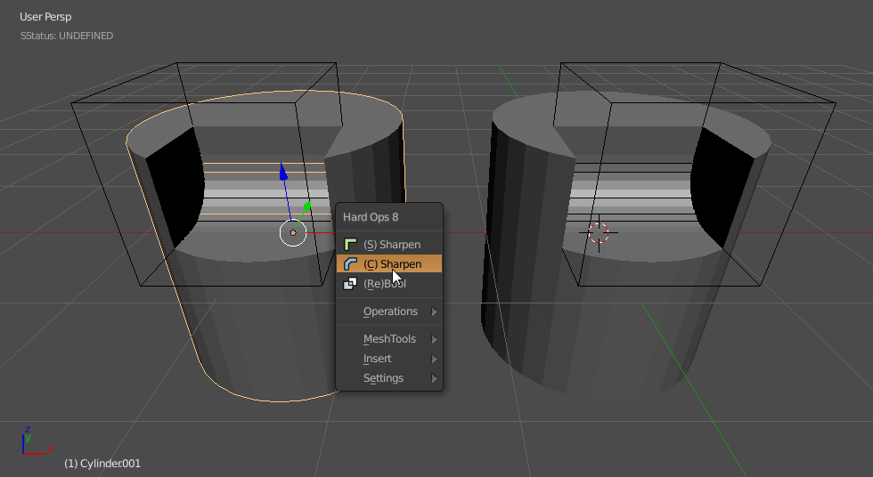

## Ssharpen

>Ssharpen is the base of the sharpening system and is a foundational element of Hard Ops. The idea of Ssharpen came through the collaborations of myself and AR which also was the base of Csharpen as well.

People always ask what is the difference between the ssharpen and csharpen.

Ssharpen is a calculator. It also sets the mesh up for hard surface modelling.
In short. Ssharpen

    - goes into edit mode unhides the mesh and deselects all.
          selects sharps edges via select >> sharp edges.
    - edges are marked with bevel,sharp,crease
    - autosmooth is activated at a 60 degree angle

So this merely sets up a mesh for hard surface rendering and helps it look better in the 3d view and rendering. This is a rather non-destructive operation and doesn't affect the mesh negatively. To best understand Ssharpen try doing it manually on a simple cylinder.

Here is an example of the process.

Alternatively. Here is ssharpen in action.

<iframe width="560" height="315" src="https://www.youtube.com/embed/rXRZeuQpvsg" frameborder="0" allowfullscreen></iframe>

Now to see what Csharpen is since Ssharpen is one of the steps involved.
[Csharpen](csharpen.md)

So here I will ssharpen one object and csharpen the other. The left object doesnt have the boolean applied so therefore it remains live however the right object is now already ready for the next cutting and additional work.

> They both have their time and place however they are not interchangable since the behavior is very different.

- [Sharpening Basics](sharpening_basics)
