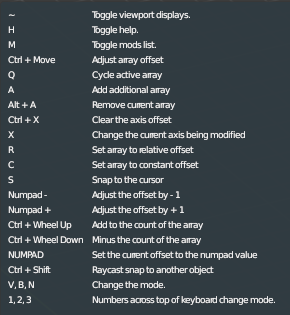
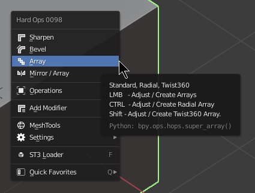
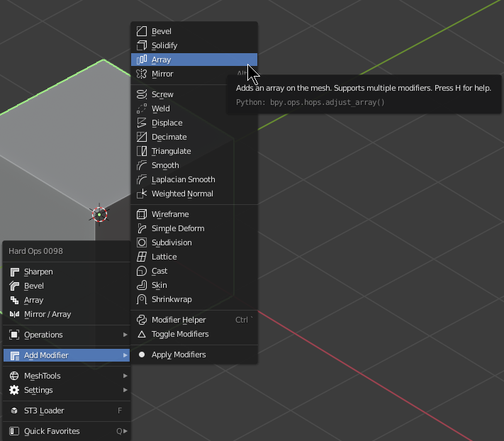
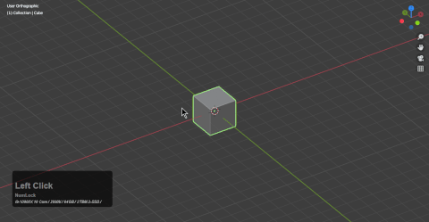
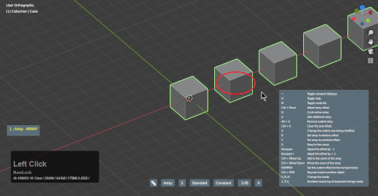
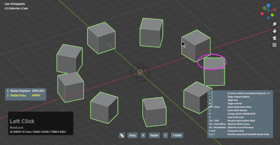
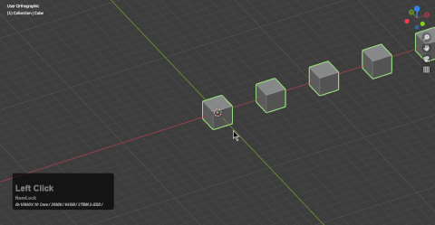
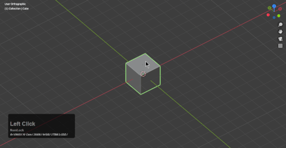

### Array(ST3)

# About Array ST3

ST3 array was added to hardOps as of version 985. This array aims to re-approach the array workflow in hardOps.

Fun fact: ST3's first contribution to hops was ST3 array [codename: super array]

> The circle gizmo is not clickable and serves as a debug to assist with mouse position and axial understanding. LMB in the 3d view will close the modal. Testing found the circle to be better than nothing and for that reason exists as a placeholder for widgets.

Array (ST3) currently contains the following.

- 1 - standard array
- 2 - radial array
- 3 - twist 360

> H will display help during the modal and in expanded mode.

# Locating Array

> Hovering over a tool shows a tooltip giving more insight to tool usage.

# Classic Array

Classic array continues to exist for users wishing to regress to classic.

# Using ST3 Array

Array ST3 is the first modal to support both fast mode and an expansive mode.

Ctrl + mouse mode adjusts array. Wheel roll adjusts count.

2 - change to radial array

3 - change to twist360 array

To regress from radial / twist to standard array the hotkey of alt + A will have to be used when transitioning into standard from the other two. This is due to additional mods being created that require deletion.

# ST3 Expansive Mode

Tab during Array ST3 will open unto expanded mode.

> Expanded mode is a prototype system aiming to reduce hotkey usage. In the future we aim to make this a new style of working for users with disability or usability issues.

In expanded mode the help is intended to be interactive as well. At some point we aim to implement quick behaviors to make this mode more essential. At the current time we wanted to provide a degree of familiarity.

