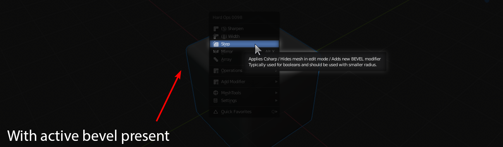
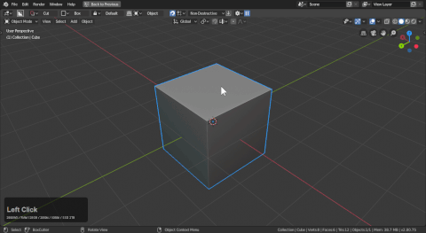
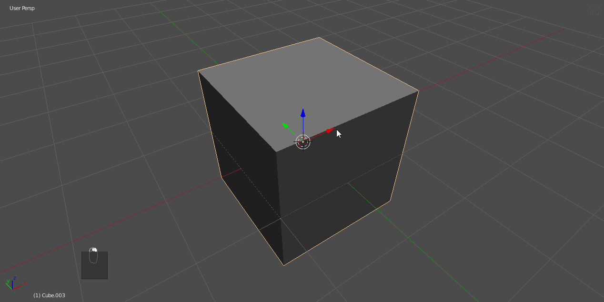
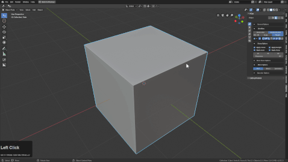
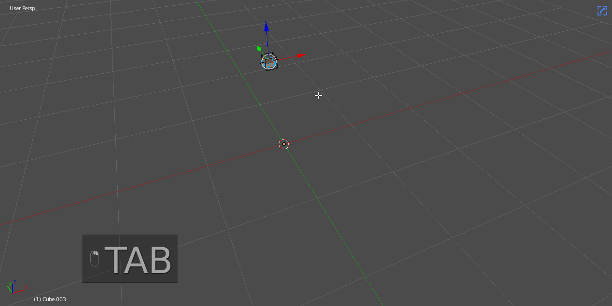
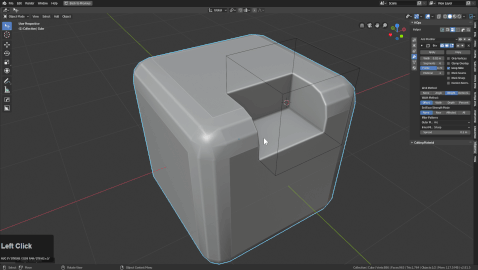

### Step

# Locating step

Step is located in the <kbd>Q</kbd> menu after a mesh has an active boolean modifier.

In the following example you can see how csharp is capable of making step an option due to bevel being present.

# What is step?

step is the evolution of the earlier cstep and sstep workflow. At this point it is exclusive to the weight workflow. When using angle you can stack bevels all you'd like. However there is also a non-destructive variant to play with as well.

In short, Step will bake the bevels currently on the mesh while adding another bevel modifier. Also the mesh will receive the sstatus Cstep.

This does a few things that might stun users.

- applies the active bevel mod
- adds another bevel modifier leaving the mesh unaffected initially
- and hides the mesh in edit mode

This results in the bwidth not responding due to the bevels being unactivated.

The moment you cut it is now on another level but to update the markings you must csharpen.

## Non-Destructive stepping

Using the [hopsTool](hopsTool.md) you can stack up bevels easily in the viewport.

There are 3 bevel icons.
- corner bevel (intended for planes and vertice beveling
- chamfer (bevel w/ 1 segment)
- rounded bevel (3 segments default angle 30 / <kbd>Ctrl</kbd> + click angle 60)

To showcase each in action.

In this mode holding <kbd>Ctrl</kbd> shows modifier dots. LMB clicking one shows the modifier information.

Levels can be added very quickly this way.

Also working this way is possible using the <kbd>Q</kbd> menu add modifier system.
A few things to note:

- first bevel can be an angle 30 or 60
- second bevel cannot be an angle 30 or else it will catch the first bevel
- bevels from here on are 60 and above to keep simplicity.

The gif shows me adjusting bevels that aren't showing to set up levels I did moments later. Also the shading was incorrect due to not holding shift as well as <kbd>Ctrl</kbd> to set it to 60 and not 30. But this is a good example of how the angles can work against you if you aren't mindful.

## step use cases

Step is used in situations where you want to apply a larger bevel and begin working in a smaller bevel width. The workflow is always decrementing and is currently only one destructively.

After using step on the mesh a cube was cut into using the multi select boolean menu in <kbd>Q</kbd> while also using Csharpen to mark the new area.

In this workflow step bakes and csharp / sharp are used for the same uses they initially have with regular sharpening.
You are also able to keep using to work down to lower and lower levels to continuously detail the object.

## step technical understanding

The way this works is something we call hidden boolean behavior.

When a mesh is hidden and a boolean is applied the mesh visible is only the new mesh created by the boolean modifier. Therefore we are able to isolate and sharpen the mesh after hiding the previous mesh.

This is important to know because in edit mode the mesh will be hidden. To see it press (alt + H).

Also the bevels(if 3 segments) being applied can be caught on regular sharpening if the threshold of the angle is less than 60 without the mesh hidden.

This is important to know because if you have used hard ops this may have happened to you. It may require you to unhide to cause this issue but ssharpening with a bevel too low would cause this issue.

Your bevels get bevelled. For this reason the sharp menu in the modifier helper (<kbd>Ctrl</kbd> + <kbd>~</kbd>) exists.

Changing the angle to 45 or greater will resolve this issue with low segments.

